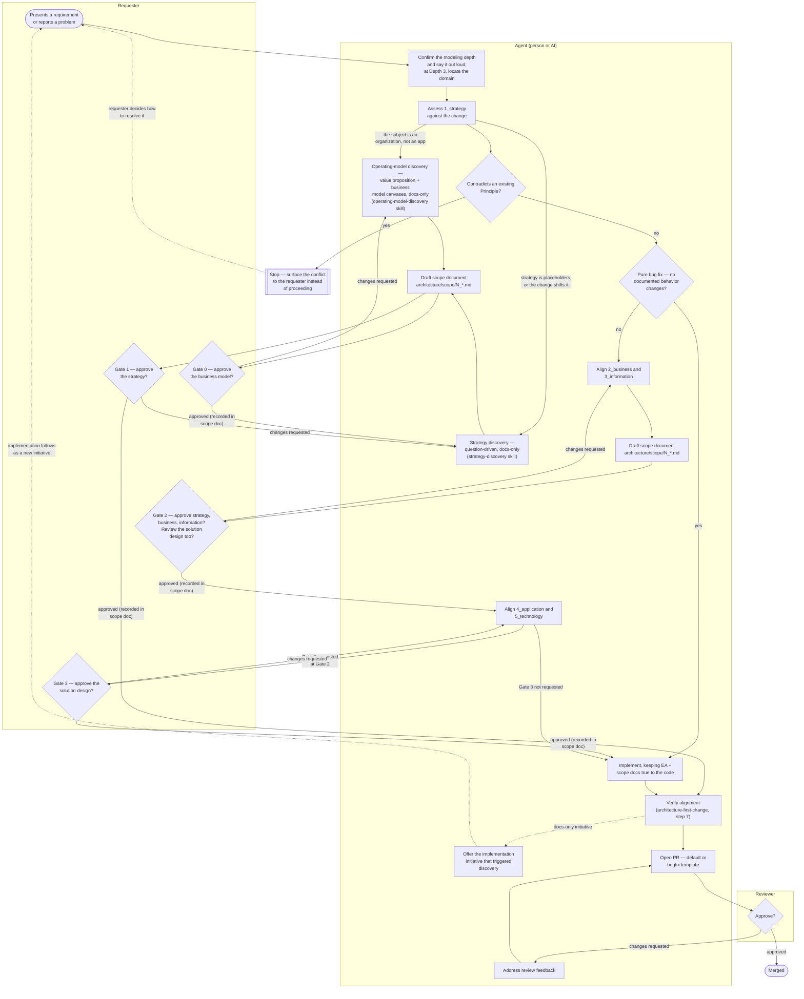

# Contributing

## The working method: EA first

This repo practices **architecture-first development**: strategy and
business architecture are validated before information, application, and
technology — and all of it before code. The full process is described in
[architecture/scope/README.md](./.claude/skills/project-bootstrap/templates/architecture/scope/README.md); in short, for any change in
requirements:

0. **Know the depth you're working at.** `CLAUDE.md` declares the project's
   [modeling depth](./.claude/skills/project-bootstrap/templates/architecture/README.md#modeling-depth) — one application
   (1), one organization (2), or several business lines each modeled as a
   [domain](./.claude/skills/project-bootstrap/templates/architecture/domains/README.md) (3). It decides how much of the
   ladder below applies and which gates you'll pass. At Depth 3, also name
   which domain owns the change, and whether it touches another domain's
   exposed services — if it does, that domain's Requester approves too.
1. **Align the EA** — walk [architecture/](./.claude/skills/project-bootstrap/templates/architecture/README.md) top-down
   (`1_strategy` → `5_technology`), updating the affected documents. If
   the strategy layer is still template placeholders, or the change shifts
   the strategy itself (a new/changed stakeholder, driver, goal, or
   principle), the initiative becomes **strategy discovery** first — a
   docs-only, question-driven initiative ending at **Gate 1 — Strategy**
   (see the `strategy-discovery` skill); implementation follows as a
   separate initiative. If the subject is an **organization** rather than
   an application, it starts one step earlier still, at
   [`0_business-design/`](./.claude/skills/project-bootstrap/templates/architecture/0_business-design/README.md) — a value
   proposition canvas per segment and a business model canvas per product,
   approved at **Gate 0 — Business model**, from which the strategy and
   business layers are then derived (see the `operating-model-discovery`
   skill).
2. **Document the scope** — add the next-numbered initiative document to
   [architecture/scope/](./.claude/skills/project-bootstrap/templates/architecture/scope/README.md).
3. **Pass the gates** — before any code, the requester approves the
   strategy, business, and information changes (**Gate 2 — Business**),
   and chooses whether to also review the solution design before it is
   coded (**Gate 3 — Solution design**, optional, aimed at technically
   inclined requesters). Approvals are recorded in the scope document's
   Approvals table.
4. **Implement** — keeping docs and code in sync in the same change set.

Bug fixes that change no documented behavior can go straight to step 4 —
they pass no gates. Agent-oriented guidance for the same process lives in
`.claude/skills/`.

## Actors in this process

The process has three roles. Nothing here assumes a human fills the middle
one — an AI agent (e.g. Claude Code, guided by `.claude/skills/`) and a
person follow exactly the same steps, in the same order, against the same
documents:

- **Requester** — whoever wants something to change: a stakeholder, a
  product owner, a bug reporter. Presents a requirement or a problem, not a
  solution or a diff — and **grants the gate approvals**: the business
  model (Gate 0, when an organization is being modeled), the strategy
  (Gate 1, when discovery is triggered), the strategy/business/information
  changes before any code (Gate 2), and optionally the solution design
  (Gate 3). Business sign-off precedes development, the way a business
  reference group approves before building starts.
- **Agent** — whoever executes the process: a contributor or an AI agent.
  Walks the EA layers, stops at each gate until the requester approves,
  writes the scope document, implements, verifies alignment, and opens the
  PR. "Agent" here names the role, not a specific tool — the process
  doesn't change based on who or what fills it.
- **Reviewer** — approves or requests changes on the PR, confirms any open
  questions the requester needed to weigh in on, checks that the gate
  approvals this change required are recorded in the scope document, and
  merges.

## Process flow

How a requirement gets from "someone wants a change" to "merged," and
where each actor's responsibility starts and ends:



Every arrow into the Agent subgraph is a decision the agent makes
explicitly and records — a "no change" verdict on an EA layer, a "pure bug
fix, no scope document" statement, a gate approval written into the scope
document's Approvals table, an open question logged for the requester —
never a silent skip. See `architecture-first-change` for the full step-by-step
version of this same flow, `strategy-discovery` for the discovery branch,
and `operating-model-discovery` for the company track that precedes it.

## Pull requests

Pull requests use one of two templates, chosen by what kind of change this
is:

- **`.github/pull_request_template.md`** (default) — for anything that adds
  or changes documented behavior. The body links the scope document, gives
  every EA layer a verdict, and describes **all** changes on the branch
  (`git diff main...HEAD`), not just the latest commit.
- **`.github/PULL_REQUEST_TEMPLATE/bugfix.md`** — for pure bug fixes that
  change no documented behavior: what broke, the root cause, the fix, and
  the regression coverage added, instead of a scope document and EA table.
  Pick it explicitly when opening the PR (GitHub's "Preview" template
  picker, or `?template=bugfix.md` on the compare URL); if the fix turns
  out to touch documented behavior after all, use the default template
  instead.

Either way, the description is kept updated as the branch grows — see the
`pr-description` skill.

## Development workflow

<!--
  TEMPLATE — replace with the project's real workflow once a stack is
  chosen. Keep the shape: an install step, a dev-loop command, and the
  exact commands CI runs (so a contributor can reproduce a CI failure
  locally verbatim). For example:

  ```bash
  npm install
  npm run dev
  ```

  Before pushing (CI runs exactly these):

  ```bash
  npm run lint && npm run typecheck && npm test && npm run build
  ```
-->

## Definition of done

A change is done when:

- the project's verification commands (lint, typecheck, tests, build, or
  whatever this stack defines) pass;
- the affected EA documents ([architecture/](./.claude/skills/project-bootstrap/templates/architecture/README.md)) still
  describe the system as it now is — services, rules, data objects, and
  their realizations (or explicit "Pending") are up to date;
- the initiative's scope document reflects what was actually delivered,
  and its Approvals table records every gate the change required (Gate 2
  at minimum for any change in documented behavior; Gate 1 for a
  strategy-discovery initiative; Gate 0 and Gate 1 for an operating-model
  discovery; Gate 3 if the requester opted in);
- cross-links resolve and diagrams render;
- any new interpretation of a requirement is recorded as an open question
  with its adopted interpretation (see the `scope-doc` skill).
