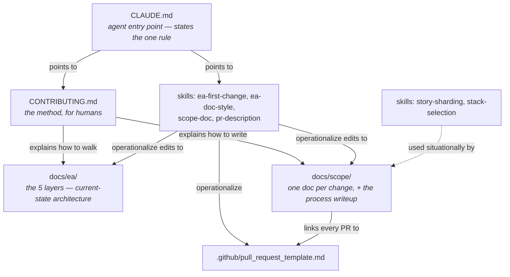

# archreator

An **EA-first project template**: the enterprise-architecture guidelines,
Claude Code skills, and procedural scaffolding that every new project should
start from, distilled from two working projects
([`junta_usatama`](https://github.com/roanboc/junta_usatama), a Next.js +
Supabase app, and [`fractal-tree-generator`](https://github.com/roanboc/fractal-tree-generator),
a static TypeScript web app + CLI) that independently converged on the same
method. This repo carries no application code — it's the starting point you
copy, not a library you install. It's registered as a **GitHub template
repository**, so starting a new project from it is a two-click operation
(see below).

## Quick start: create a new project from this template

1. **Generate the new repo.** On GitHub, click **"Use this template" →
   "Create a new repository"** at the top of this repo (or
   `gh repo create <new-repo-name> --template roanboc/archreator`). This
   gives the new repo its own clean git history — no shared ancestry with
   archreator, no accidental push-back into it — because every downstream
   project immediately diverges (real stakeholders, real stack, real code)
   and there's nothing to keep in sync afterward. Clone it and you're
   working in a full copy of everything described below.

   Don't have admin rights here, or don't want to use GitHub's template
   feature? A one-off copy works identically:
   `npx degit roanboc/archreator my-new-project` (or clone +
   `rm -rf .git && git init`).

2. **Work through the first-commit checklist**, in order, before writing
   any application code:
   1. Fill in this file (`README.md`) and [`CLAUDE.md`](./CLAUDE.md) with
      the real project name, description, layout, and commands — they're
      both full of `<placeholder>` markers to replace.
   2. Write [`docs/ea/1_strategy/1_motivation.md`](./docs/ea/1_strategy/README.md)
      first — stakeholders, drivers, goals, and the Principles that will
      later gate every change — then work down through the
      [EA layers](./docs/ea/README.md) as far as current understanding
      goes. A layer with nothing to say yet still gets its README's table
      row acknowledged as "not started"; don't just skip the folder.
   3. If no technology stack is chosen yet and this is a small app, use the
      `stack-selection` skill instead of re-deriving one from scratch, then
      record the choice in `docs/ea/5_technology/1_technology-services.md`.
   4. Decide the documentation language once (English is the default
      throughout this template) and note the choice in `CLAUDE.md` — see
      the `ea-doc-style` skill.
   5. Delete [`docs/scope/open-questions.md`](./docs/scope/open-questions.md)
      if there's no external stakeholder who needs a running index of
      unconfirmed interpretations; otherwise keep it and start filling it
      in as questions come up.
   6. Write scope document `1_...md` in [`docs/scope/`](./docs/scope/README.md)
      for the initial build — retrospectively if the build is already
      underway — so the initiative index isn't empty on day one.

From here on, every further change to the project follows the same process
these files describe (next section) — there's no separate "template mode"
to graduate out of.

## The method, in one paragraph

**Strategy and business architecture are validated before any other
layer.** A change in requirements is never coded directly: it is aligned
top-down through five numbered ArchiMate layers
(`docs/ea/1_strategy` → `2_business` → `3_information` → `4_application` →
`5_technology`), recorded in a scope document (`docs/scope/`), and only then
implemented. Every EA element names the code artifact that realizes it (or
is marked "Pending"), so the architecture stays verifiable against the code
at any time. Full write-up: [CONTRIBUTING.md](./CONTRIBUTING.md) and
[docs/scope/README.md](./docs/scope/README.md).

## How everything fits together

Everything in this repo hangs off one entry point. Read top-to-bottom the
first time; after that, jump straight to whichever node you need — every
file below links back to its neighbors, so nothing here is a dead end.

| Where                                  | What                                                                                                          |
| --------------------------------------- | ---------------------------------------------------------------------------------------------------------------- |
| [CLAUDE.md](./CLAUDE.md)               | **Start here if you're an agent.** States the one rule (EA-first) and points at the skills that operationalize it |
| [CONTRIBUTING.md](./CONTRIBUTING.md)   | **Start here if you're a person.** The method in prose, the dev workflow, and a definition-of-done checklist    |
| [docs/ea/](./docs/ea/README.md)        | The 5-layer EA skeleton describing the system's **current** state: numbering, ArchiMate-on-Mermaid notation and palette, per-layer analysis order, and a fill-in-the-blank layer view for each of `1_strategy` → `5_technology` |
| [docs/scope/](./docs/scope/README.md)  | One document per **change** to that state: the EA-first process write-up, the initiative index, and the optional [open-questions.md](./docs/scope/open-questions.md) log |
| `.claude/skills/`                       | Six Claude Code skills that turn the method into concrete agent behavior — see the two tables below              |
| [.github/pull_request_template.md](./.github/pull_request_template.md) | PR body shaped to mirror a scope document's EA-alignment table, so the two never drift apart |

Skills are picked up automatically by Claude Code from their
`description:` frontmatter — you don't invoke them by name in normal use,
they surface when their situation applies. The names below are for
reference, not memorization.

**Core process skills** — near-verbatim across both source projects, the
parts worth keeping generic, with project-specific glossaries/rules/diagrams
stripped back to placeholders:

| Skill              | Used for                                                                                                 |
| ------------------- | ----------------------------------------------------------------------------------------------------------- |
| `ea-first-change`  | The process itself: walk the EA layers top-down, write a scope document, implement, verify alignment, write the PR |
| `ea-doc-style`     | Numbering, ArchiMate-on-Mermaid notation, the grounding rule, link conventions for anything under `docs/` |
| `scope-doc`        | The scope-document template and its rules (every layer gets a verdict, deliverables are concrete, out-of-scope matters as much as in-scope) |
| `pr-description`   | PR bodies describe the whole branch, not just the latest commit, and follow the template                 |

**Supporting skills** — reach for these situationally, not on every change:

| Skill               | Used for                                                                                                |
| -------------------- | ------------------------------------------------------------------------------------------------------------ |
| `story-sharding`    | Adapted from [BMAD-METHOD](https://github.com/bmadcode/BMAD-METHOD)'s context-engineered development: when a scope document's work package is too large for one sitting, shard it into small, self-contained story files so an agent or person resuming later never has to re-derive the whole plan from the EA tree |
| `stack-selection`   | A decision framework plus concrete defaults for choosing a stack on a small/solo app: static-only (GitHub Pages/Cloudflare Pages, no backend) vs. needs data/auth (Supabase for managed Postgres + Auth + RLS, Vercel for hosting/CI/CD) — with the reasoning for picking one over the other |

## Keeping a downstream project in sync with the template

Don't: a git submodule/subtree relationship, or trying to keep a downstream
project "pinned" to archreator. The docs here are explicitly placeholders
meant to be overwritten with project-specific content on day one, not a
shared dependency that updates in place.

Do: if the *method itself* improves later (a skill gains a new step, the
layer set changes), pull that specific improvement into each existing
downstream project by hand — treat archreator as the reference copy to
diff against, not a live upstream those projects track automatically.
