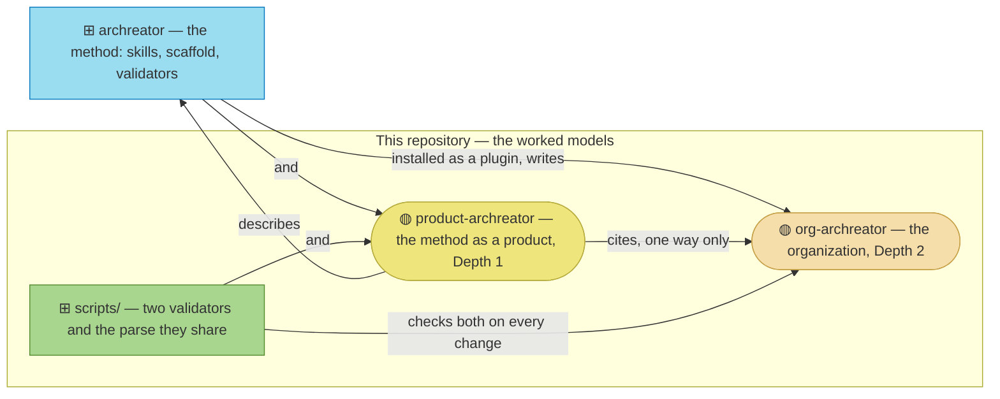

# architecture-archreator

The worked models of the [archreator](https://github.com/roanboc/archreator)
method — the method applied to its own organization and to itself as a
product, so a prospective adopter can read a filled-in model rather than an
empty scaffold.

| Tree | Subject |
| ---- | ------- |
| [`org-archreator/`](./org-archreator/architecture/README.md) | The organization that publishes archreator |
| [`product-archreator/`](./product-archreator/architecture/README.md) | archreator the method, as a product |
| [`scripts/`](./scripts/README.md) | The two validators and the parse they share, one copy for both trees |

The models run on method 0.2. Start at either tree's
`architecture/README.md` — the front door says, per layer, what is modeled,
what is deliberately not, and how far each document has been validated.
Contributions follow [`CONTRIBUTING.md`](./CONTRIBUTING.md).
