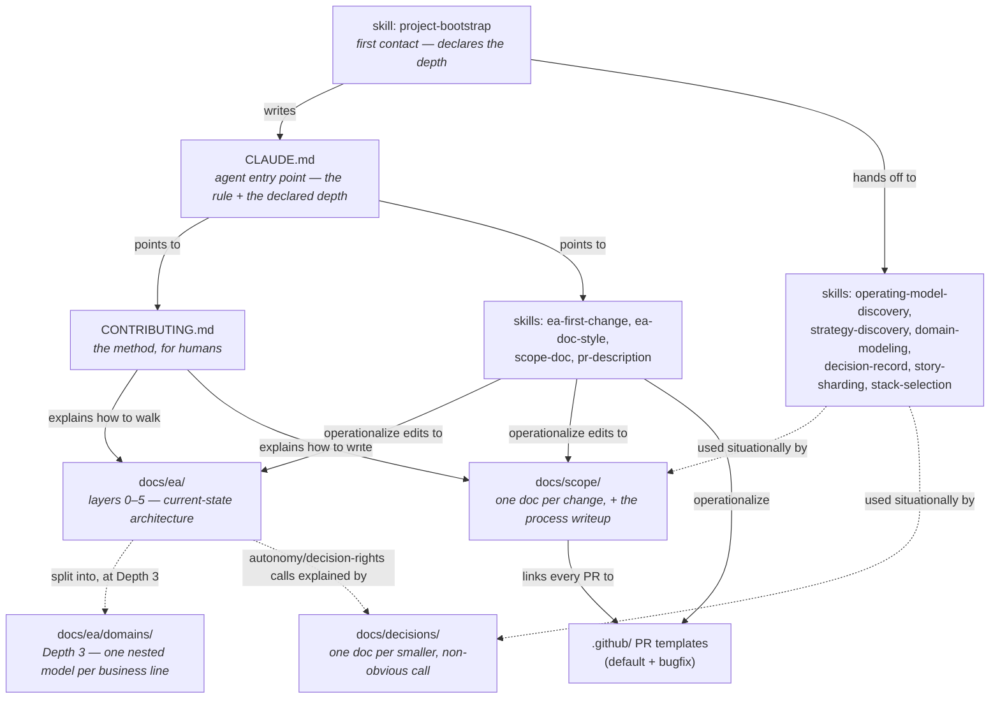

# archreator

**Model how your organization works, so AI can help run it.** archreator
turns a company — or a single application — into a living architecture that
lives in git as markdown: who you serve, what you offer, who does what, and
which system realizes each piece. Humans own the strategy and approve at
explicit gates; AI agents do the modeling and the building in between.

Its distinguishing bet: **an AI is modeled as a member of the organization,
not a tool used by it.** Every actor carries a kind (human, AI, or hybrid),
and every AI actor carries an autonomy level, concrete decision rights, and
a named escalation path. That is what makes an AI-first company something
you can reason about, delegate inside, and eventually hand work to.

> 📖 **See it before you use it.** The live guidance site —
> **<https://roanboc.github.io/archreator/>** — is itself built with this
> method, and one of its own actors is an AI. It's the friendly front door
> to everything below.

## Who this is for

- **Companies mapping how they actually work** — several business lines,
  each with its own customers and economics, that need to be understood
  separately without losing the whole. AI-first organizations get the most
  out of it, but a traditional one is modeled exactly the same way, with
  fewer AI actors.
- **Anyone building a single application** who wants the same discipline at
  a fraction of the weight. The ladder below right-sizes itself — see
  [modeling depth](#one-method-three-depths). A weekend app doesn't get a
  business model canvas.
- **Teams who want a repeatable, human-in-the-loop procedure** where a
  person requests and approves the work and AI agents execute it, following
  exactly the same steps a human contributor would.

## One method, three depths

The six layers describe a weekend app and a twenty-business-line company
alike. What changes is how much gets filled in and which approvals apply —
and **the agent tells you which depth it picked and why**, so you can deepen
or descope at any point:

| Depth | The subject is | You get | Gates |
| ----- | -------------- | ------- | ----- |
| **1 — Application** | one app or tool | a light strategy layer: goals and principles, enough to judge a change against | one, before code |
| **2 — Organization** | a company, department, or service line | value proposition and business model canvases, and the operating model derived from them | four |
| **3 — Enterprise** | several business lines | the above, plus each line modeled as a [domain](./docs/ea/domains/README.md) with its own charter and service contracts | four, plus every affected domain's owner |

Depth is a starting posture, never a ceiling — deepening is a normal
change, not a restart. Full definition:
[docs/ea/README.md § Modeling depth](./docs/ea/README.md#modeling-depth).

## The loop: Requester → Agent → Reviewer

Every change moves through three roles. Nothing here assumes a human fills
the middle one — an AI agent and a person follow the same steps, in the same
order, against the same documents:

| Role | Who | Does |
| ---- | --- | ---- |
| **Requester** | You | Says what should change: a requirement or a problem, not a diff. Approves the strategy and business changes at explicit gates before any code is written. |
| **Agent** | An AI agent (or a person) | Walks the architecture ladder, stops at each gate for your approval, writes a short scope document, implements, and opens a PR. |
| **Reviewer** | You | Reviews and merges. Nothing ships without a human approving it. |

The [worked example's guidance site](https://roanboc.github.io/archreator/)
shows this loop rendered as real, checkable architecture; the
[process flow in CONTRIBUTING.md](./CONTRIBUTING.md) is the full version.

## What's in the box

This repo carries **no application code**: enterprise-architecture
guidelines, twelve Claude Code skills that turn the method into agent
behavior, and the documentation scaffolding a project starts from.

## Quick start

Two ways in. Both end up in the same place — the skills drive the process
either way.

### Option A — install the plugin (recommended, works on an existing project)

```shell
/plugin marketplace add roanboc/archreator
/plugin install archreator@archreator
```

Then just say what you want to model. The `project-bootstrap` skill takes it
from there: it asks what the project is, picks a modeling depth, tells you
which one it picked, and writes the scaffold into your repository.

This is the better path for a project that already exists, and the only one
where `/plugin update` later brings method improvements to you instead of
you hand-porting them.

### Option B — generate a repository from the template

On GitHub, click **"Use this template" → "Create a new repository"** (or
`gh repo create <new-repo-name> --template roanboc/archreator`). This gives
the new repo its own clean history — no shared ancestry with archreator, and
nothing to keep in sync, because every downstream project immediately
diverges into real stakeholders, a real stack, and real code.

No admin rights, or don't want GitHub's template feature? A one-off copy
works identically: `npx degit roanboc/archreator my-new-project`, or clone
and `rm -rf .git && git init`.

Then open the project and let `project-bootstrap` run. If you'd rather do it
by hand, that skill is also the checklist:

1. Fill in `README.md` and [`CLAUDE.md`](./CLAUDE.md) with the real project
   name, description, layout, and commands, and **declare the modeling
   depth** in `CLAUDE.md`.
2. Decide the documentation language once (English is the default) and note
   it in `CLAUDE.md` — see the `ea-doc-style` skill.
3. Delete what you didn't inherit: [`example/`](./example/README.md) and
   [`meta/`](./meta/README.md) are archreator's own material, there to read
   on GitHub rather than to carry.
4. Keep [`docs/scope/open-questions.md`](./docs/scope/open-questions.md)
   only if there's a stakeholder who can't be consulted synchronously; keep
   [`docs/decisions/`](./docs/decisions/README.md) only if the project will
   make enough architecture-significant calls to justify a log. Delete
   either otherwise — both can come back later.
5. Let discovery write the strategy. `strategy-discovery` for an
   application, `operating-model-discovery` for an organization (canvases
   first at Gate 0, strategy derived from them at Gate 1). Don't hand-write
   [`docs/ea/1_strategy/1_motivation.md`](./docs/ea/1_strategy/README.md) —
   the discovery conversation is what makes the gate mean something.
6. If no technology stack is chosen yet and this is a small app, use
   `stack-selection` rather than re-deriving one.

Discovery produces the project's first scope document in
[`docs/scope/`](./docs/scope/README.md), so the initiative index isn't empty
on day one. From there, every further change follows the same process these
files describe — there's no separate "template mode" to graduate out of.

## Who approves, and where

Three roles, and only one of them needs to be technical:

| Role | Who | Needs a terminal? |
| ---- | --- | ------------------ |
| **Requester** | says what should change; approves at the gates | **No.** In the conversation, or by replying to a pull-request comment |
| **Agent** | walks the layers, drafts, implements, opens the PR | it's the AI |
| **Reviewer** | approves and merges | some |

A non-technical stakeholder never installs anything. Someone technical sets
the repository up once; the Requester participates in the discovery
conversation and grants the gates — in Claude Code on the web, or as a reply
on the PR, which doubles as the durable record. See `ea-first-change`
§ Where a gate happens.

## Why this isn't TOGAF, or another documentation framework

**archreator models to implement, not to document.** That single choice
explains most of what follows, and it is where it parts company with the
better-known frameworks.

TOGAF is a **process** framework: the ADM tells you how to run an
architecture practice, phase by phase, and its output is a deliverable set —
architecture definition documents, roadmaps, compliance assessments. It is
genuinely good at governing a large practice. But its artifacts describe the
architecture; nothing in them has to correspond to anything that exists.

ArchiMate is a **modeling language**, maintained by the same body, and its
elements denote real things: an «Application Component» is a module, a
«Business Process» is something a person or an agent actually does, a «Node»
is something that runs. archreator takes the language and skips the process
framework, because the goal is a model you build against — not a governance
artifact you file.

**The grounding rule is what makes that stick.** Every element names the
artifact that realizes it — a module path, a team, a written procedure — or
is explicitly marked "Pending — future initiative". A model where every row
must point at something real cannot quietly decay into decoration, and it
fails loudly when it tries. That rule is the difference between a diagram of
your company and an executable description of it.

| | Produces | Kept true by | Where archreator differs |
| - | -------- | ------------ | ------------------------ |
| **TOGAF / ADM** | A phased practice and a deliverable catalogue | Review boards, process compliance | No phases and no catalogue — six layers, four gates, and the model itself as the deliverable |
| **[ArcKit](https://github.com/tractorjuice/arc-kit)** | Governance artifacts: risk registers, DPIAs, traceability matrices, compliance packs | Citation traceability between documents | Traceability runs **down into the implementation**, not sideways across the paperwork. Excellent if audit evidence is the goal; archreator's goal is working systems |
| **[BMAD](https://github.com/bmad-code-org/BMAD-METHOD)** | One project's PRD, architecture, and story files | Context engineering inside a project | The model outlives any project. BMAD's story sharding is borrowed wholesale for the one part where it genuinely applies |
| **C4** | Four zoom levels of software structure | Diagrams as code | C4 starts where archreator's layer 4 does. Layers 0–2 are where an organization lives, and that's the part that decides what the software should be |

The practical test: open any document under `docs/ea/` and try to check it
against the repository or against the people doing the work. If you can't,
either the element is wrong or it is marked Pending — and both are failures
the process is designed to surface rather than absorb.

## The method, in one paragraph

**Strategy and business architecture are validated before any other
layer.** Nothing is coded directly: a change is aligned top-down through
numbered ArchiMate layers — starting at
[`docs/ea/0_business-design/`](./docs/ea/0_business-design/README.md) when
the subject is an organization, then `1_strategy` → `2_business` →
`3_information` → `4_application` → `5_technology` — recorded in a scope
document (`docs/scope/`), and only then implemented. Validation is explicit:
the Requester approves at named gates before development — the business
model (Gate 0), a new or shifted strategy (Gate 1), the
strategy/business/information changes before any code (Gate 2), and
optionally the solution design (Gate 3) — the way a business reference group
signs off before building starts, with each approval recorded in the scope
document. Every element names the artifact that realizes it — a team, a
written procedure, a module — or is marked "Pending", so the architecture
stays verifiable at any time. Full write-up:
[CONTRIBUTING.md](./CONTRIBUTING.md) and
[docs/scope/README.md](./docs/scope/README.md).

### Modeling an organization

When the subject is an **organization**, the architecture itself is the
deliverable and other projects consume it as the shared source of truth.
Layer 0 comes first: a **Value Proposition Canvas** per customer segment
(who they are, the job they're doing, their pains and gains, and what
relieves them) and a **Business Model Canvas** per product (the nine blocks
— partners, activities, resources, channels, revenue, cost). Those canvases
are approved at Gate 0, and the strategy and business layers are then
*derived* from them block by block rather than invented alongside them. The
`operating-model-discovery` skill runs that track.

### Modeling business lines as domains

Past a certain size one shared model stops helping: a company's business
lines have different customers, different economics, and different people
saying yes. At [Depth 3](./docs/ea/domains/README.md), each becomes a
**domain** — modeled as though it were an organization in its own right,
with its own layers, its own goals, and a **charter** naming the services it
exposes to everyone else. The same shape repeats at every level, so a
business line can be understood on its own terms without being flattened
into the enterprise's.

A domain's exposed services are its contract: changing one needs the
consuming domains' Requesters too, while everything internal stays the
owning domain's business. That boundary is what keeps a large model from
turning into a single document nobody can change safely. The
`domain-modeling` skill runs that track, including the test for whether
something deserves to be a domain at all.

### Modeling a single application

An application project skips layer 0 and keeps a light strategy layer —
goals and principles, enough to judge a change against — with one gate
before code. That's Depth 1, and it is deliberately cheap:
[`example/`](./example/README.md) is one.

## See it applied

Two models in this repository are real, not illustrative.

[`meta/`](./meta/README.md) is **archreator modeled with archreator** — the
method pointed at its own author, at Depth 1. It is where to look for what a
filled-in strategy, business, application, and technology layer reads like,
and for what dogfooding actually surfaces: a Pending component with two
business rules depending on it, and a plain statement of how many rules CI
enforces.

[`example/`](./example/README.md) is a small, real application built by
following this process — the project's own guidance site, published at
**https://roanboc.github.io/archreator/**. It answers
"what does a filled-in `docs/ea/` look like for one app", and specifically
"what does an AI actor look like in the business layer": one of its actors
is an AI, the **Copilot**, that drafts guidance content at an explicit
autonomy level with explicit decision rights, alongside the human **Pilot**
who drives the design and merges its work.

Both live in their own subfolders with their own docs, deliberately separate
from this repo's intentionally blank scaffold. They are there to **read, not
to inherit** — delete both when you start a project.

There is deliberately **no fictional worked example**. One existed and was
removed: a made-up company demonstrates the notation but proves nothing about
whether the method survives contact with a real business, and it has to be
maintained alongside every change to the method. Real projects are the test.
The cost is that [Depth 3](./docs/ea/domains/README.md) — domains, charters,
the federation rule — is documented but undemonstrated until a real project
reaches that size.

## How everything fits together

Everything in this repo hangs off one entry point. Read top-to-bottom the
first time; after that, jump straight to whichever node you need — every
file below links back to its neighbors, so nothing here is a dead end.



| Where                                  | What                                                                                                          |
| --------------------------------------- | ---------------------------------------------------------------------------------------------------------------- |
| [CLAUDE.md](./CLAUDE.md)               | **Start here if you're an agent.** The one rule (EA-first), the project's declared modeling depth, and every skill in one table |
| [CONTRIBUTING.md](./CONTRIBUTING.md)   | **Start here if you're a person.** The method in prose, the actors in the process (Requester / Agent / Reviewer) with a process-flow diagram, the dev workflow, and a definition-of-done checklist |
| [docs/ea/](./docs/ea/README.md)        | The layered EA skeleton describing the subject's **current** state: the [depth ladder](./docs/ea/README.md#modeling-depth), numbering, ArchiMate-on-Mermaid notation and palette (including the human/AI/hybrid actor convention), per-layer analysis order, and a fill-in-the-blank layer view for each of `1_strategy` → `5_technology`. Plus [`0_business-design/`](./docs/ea/0_business-design/README.md) — the canvases, filled in when the subject is an organization |
| [docs/ea/domains/](./docs/ea/domains/README.md) | **Depth 3 only.** One nested model per business line, each with a charter naming what it exposes, plus the split test and the federation rule governing cross-domain change |
| [docs/scope/](./docs/scope/README.md)  | One document per **change** to that state: the EA-first process write-up, the initiative index, and the optional [open-questions.md](./docs/scope/open-questions.md) log |
| [docs/decisions/](./docs/decisions/README.md) | Optional log of smaller, non-obvious calls that don't rise to a full scope document — most often *why* an AI actor's autonomy level or decision rights were set the way they were |
| [`.claude/skills/`](./.claude/skills/README.md) | Twelve Claude Code skills that turn the method into concrete agent behavior — see the two tables below. Also the root of the installable plugin |
| [`meta/`](./meta/README.md) | archreator's own development record — the [value and UX review](./meta/reviews/1_value-and-ux-review.md) and the scope documents for changes to the method itself. Read it, don't inherit it |
| [.github/pull_request_template.md](./.github/pull_request_template.md) + [PULL_REQUEST_TEMPLATE/bugfix.md](./.github/PULL_REQUEST_TEMPLATE/bugfix.md) | Two PR bodies — one shaped to mirror a scope document's EA-alignment table, one for pure bug fixes that skip it — so the PR and the docs never drift apart |

Skills are picked up automatically by Claude Code from their
`description:` frontmatter — you don't invoke them by name in normal use,
they surface when their situation applies. The names below are for
reference, not memorization.

**Core process skills** — written to be generic: no project-specific
glossaries, rules, or diagrams baked in, only placeholders for a downstream
project to fill in:

| Skill              | Used for                                                                                                 |
| ------------------- | ----------------------------------------------------------------------------------------------------------- |
| `project-bootstrap` | **First contact.** Turns a fresh copy into *this* project: names it, declares the modeling depth out loud, prunes what wasn't inherited, and hands off to discovery |
| `ea-first-change`  | The process itself: confirm the depth, locate the domain, assess the strategy (handing off to `strategy-discovery` when it's new or shifting), walk the EA layers top-down, stop at the Requester's approval gates, write a scope document, implement, verify alignment, write the PR |
| `ea-doc-style`     | Numbering, ArchiMate-on-Mermaid notation (including the human/AI/hybrid actor convention), the grounding rule, link conventions for anything under `docs/` |
| `scope-doc`        | The scope-document template and its rules (every layer gets a verdict, deliverables are concrete, out-of-scope matters as much as in-scope) |
| `pr-description`   | PR bodies describe the whole branch, not just the latest commit, and follow the template                 |

**Supporting skills** — reach for these situationally, not on every change:

| Skill               | Used for                                                                                                |
| -------------------- | ------------------------------------------------------------------------------------------------------------ |
| `operating-model-discovery` | The company track: when the subject is an organization rather than an app, question-driven discovery of a value proposition canvas per customer segment and a business model canvas per product, ending at the business-model gate (Gate 0) — then handing off to `strategy-discovery`, which derives the EA from the approved canvases instead of re-asking |
| `strategy-discovery` | Question-driven discovery of the strategy layer and key business elements with the Requester — triggered by `ea-first-change` when the strategy is still template placeholders (a project's first real initiative) or a change shifts it; a docs-only initiative ending at the strategy approval gate (Gate 1) |
| `domain-modeling`   | Depth 3: whether a business line deserves to be a domain at all (a five-part test), how to write its charter, how element IDs are namespaced across domains, and the federation rule — changing an exposed service needs the consuming domains' Requesters too |
| `restate-current-state` | Compacts the model so it describes today: shipped "Pending"s get their realizing artifact, superseded elements move to a Retired table, resolved open questions are archived, and stale decision records are marked superseded. Merged scope documents are never rewritten — they are the record of what was approved when |
| `decision-record`   | A short, durable rationale for a single consequential call that's smaller than an initiative — most often why an AI actor's autonomy level or decision rights were set the way they were |
| `story-sharding`    | Adapted from [BMAD-METHOD](https://github.com/bmadcode/BMAD-METHOD)'s context-engineered development: when a scope document's work package is too large for one sitting, shard it into small, self-contained story files so an agent or person resuming later never has to re-derive the whole plan from the EA tree |
| `stack-selection`   | A decision framework plus concrete defaults for choosing a stack on a small/solo app: static-only (GitHub Pages/Cloudflare Pages, no backend) vs. needs data/auth (Supabase for managed Postgres + Auth + RLS, Vercel for hosting/CI/CD) — with the reasoning for picking one over the other |

## Keeping a project in sync with the method

Three things ship here with different lifecycles, and only one of them wants
to stay in sync:

| | Keep in sync? | How |
| - | -------------- | --- |
| **The method** — the skills | **Yes** | Install the plugin (Option A) and run `/plugin update`. This is the reason the plugin path exists |
| **The scaffold** — layer READMEs, `CLAUDE.md`, `CONTRIBUTING.md`, document templates | No | It is seed content you overwrite with your own architecture on day one, not a shared dependency |
| **archreator's own material** — `example/`, `meta/` | No | Read it here on GitHub; delete it from your project |

If you took the template path (Option B) and the method improves later,
either install the plugin alongside it, or hand-port the specific
improvement — treat archreator as the reference copy to diff against. What
**not** to do either way is a git submodule or subtree relationship, or
pinning your project to archreator: your scaffold diverges immediately and
permanently, so there is nothing coherent for it to track.
