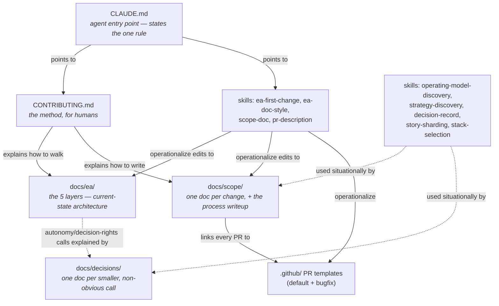

# archreator

**Build with AI without losing the plot.** archreator is a GitHub template
for people who want to move at vibe-coding speed while keeping a human in
control: *you* request what you want and approve the result, AI agents do
the building in between, and every change is aligned through a short
architecture ladder before any code is written — so moving fast never turns
into a pile of confident nonsense.

> 📖 **See it before you use it.** The live guidance site —
> **<https://roanboc.github.io/archreator/>** — is itself built with this
> method, and one of its own actors is an AI. It's the friendly front door
> to everything below.

## Who this is for

- **Vibe coders and AI-first builders** who love describing what they want
  and letting an agent build it — but have been burned by drift,
  contradictions, and code nobody can explain a week later.
- Anyone who wants a **repeatable, human-in-the-loop procedure** where the
  person requests and approves the work and AI agents execute it — following
  exactly the same steps a human contributor would.

## The loop: Requester → Agent → Reviewer

Every change moves through three roles. Nothing here assumes a human fills
the middle one — an AI agent and a person follow the same steps, in the same
order, against the same documents:

| Role | Who | Does |
| ---- | --- | ---- |
| **Requester** | You | Says what should change: a requirement or a problem, not a diff. Approves the strategy and business changes at explicit gates before any code is written. |
| **Agent** | An AI agent (or a person) | Walks the architecture ladder, stops at each gate for your approval, writes a short scope document, implements, and opens a PR. |
| **Reviewer** | You | Reviews and merges. Nothing ships without a human approving it. |

The [worked example's guidance site](https://roanboc.github.io/archreator/)
shows this loop rendered as real, checkable architecture; the
[process flow in CONTRIBUTING.md](./CONTRIBUTING.md) is the full version.

## What's in the box

This repo carries **no application code** — it's the starting point you
copy, not a library you install: enterprise-architecture guidelines, Claude
Code skills, and the procedural scaffolding every new project should start
from. It's registered as a **GitHub template repository**, so starting a new
project from it is a two-click operation (see below).

## Quick start: create a new project from this template

1. **Generate the new repo.** On GitHub, click **"Use this template" →
   "Create a new repository"** at the top of this repo (or
   `gh repo create <new-repo-name> --template roanboc/archreator`). This
   gives the new repo its own clean git history — no shared ancestry with
   archreator, no accidental push-back into it — because every downstream
   project immediately diverges (real stakeholders, real stack, real code)
   and there's nothing to keep in sync afterward. Clone it and you're
   working in a full copy of everything described below.

   Don't have admin rights here, or don't want to use GitHub's template
   feature? A one-off copy works identically:
   `npx degit roanboc/archreator my-new-project` (or clone +
   `rm -rf .git && git init`).

2. **Work through the first-commit checklist**, in order, before writing
   any application code:
   1. Fill in this file (`README.md`) and [`CLAUDE.md`](./CLAUDE.md) with
      the real project name, description, layout, and commands — they're
      both full of `<placeholder>` markers to replace.
   2. Write [`docs/ea/1_strategy/1_motivation.md`](./docs/ea/1_strategy/README.md)
      first — stakeholders, drivers, goals, and the Principles that will
      later gate every change — then work down through the
      [EA layers](./docs/ea/README.md) as far as current understanding
      goes. The `strategy-discovery` skill's question themes double as the
      interview script for this step; an agent asked for the first real
      change will run it automatically and stop for your approval of the
      strategy (Gate 1) before building anything. A layer with nothing to say yet still gets its README's table
      row acknowledged as "not started"; don't just skip the folder.

      **Modeling an organization rather than an app?** Start one step
      earlier, at
      [`docs/ea/0_business-design/`](./docs/ea/0_business-design/README.md),
      and let the `operating-model-discovery` skill run the canvases
      first — the strategy layer is then derived from them at Gate 1
      instead of written from scratch.
   3. If no technology stack is chosen yet and this is a small app, use the
      `stack-selection` skill instead of re-deriving one from scratch, then
      record the choice in `docs/ea/5_technology/1_technology-services.md`.
   4. Decide the documentation language once (English is the default
      throughout this template) and note the choice in `CLAUDE.md` — see
      the `ea-doc-style` skill.
   5. Delete [`docs/scope/open-questions.md`](./docs/scope/open-questions.md)
      if there's no external stakeholder who needs a running index of
      unconfirmed interpretations; otherwise keep it and start filling it
      in as questions come up. Same choice for
      [`docs/decisions/`](./docs/decisions/README.md): delete it if there
      won't be enough architecture-significant, non-obvious calls (an AI
      actor's autonomy level, a library choice) to justify a standalone
      log; otherwise keep it.
   6. Write scope document `1_...md` in [`docs/scope/`](./docs/scope/README.md)
      for the initial build — retrospectively if the build is already
      underway — so the initiative index isn't empty on day one.

From here on, every further change to the project follows the same process
these files describe (next section) — there's no separate "template mode"
to graduate out of.

## The method, in one paragraph

**Strategy and business architecture are validated before any other
layer.** A change in requirements is never coded directly: it is aligned
top-down through five numbered ArchiMate layers
(`docs/ea/1_strategy` → `2_business` → `3_information` → `4_application` →
`5_technology`), recorded in a scope document (`docs/scope/`), and only then
implemented. Validation is explicit: the requester approves at named gates
before development — the business model when a whole organization is being
modeled (Gate 0), a new or shifted strategy (Gate 1), the
strategy/business/information changes before any code (Gate 2), and
optionally the solution design (Gate 3) — the way a business reference
group signs off before building starts, with each approval recorded in the
scope document. Every EA element names the code artifact that realizes it
(or is marked "Pending"), so the architecture stays verifiable against the
code at any time. Full write-up: [CONTRIBUTING.md](./CONTRIBUTING.md) and
[docs/scope/README.md](./docs/scope/README.md).

### Modeling a company, not just an app

The five layers assume the subject is a system. When the subject is an
**organization** — where the architecture itself is the deliverable, and
other projects consume it as the shared source of truth — the process
starts one layer earlier, at
[`docs/ea/0_business-design/`](./docs/ea/0_business-design/README.md): a
**Value Proposition Canvas** per customer segment (who they are, the job
they're doing, their pains and gains, and what relieves them) and a
**Business Model Canvas** per product (the nine blocks — partners,
activities, resources, channels, revenue, cost). Those canvases are
approved at Gate 0 and the strategy and business layers are then *derived*
from them, block by block, rather than invented alongside them. The
`operating-model-discovery` skill runs that track;
[`example-company/`](./example-company/README.md) shows the result.

## See it applied: a worked example

[`example/`](./example/README.md) is a small, real project bootstrapped
from this template and built by following the exact process above — the
template's own guidance site, published at
**https://roanboc.github.io/archreator/**. It's the answer to "what does a
filled-in `docs/ea/` actually look like," and specifically to "what does an
AI actor look like in the business layer" — one of its business actors is
an AI — the **Copilot** — that drafts guidance content, modeled with the
human/AI/hybrid actor notation from `ea-doc-style`, at an explicit autonomy
level and decision rights, alongside the human **Pilot** who drives the
design and reviews and merges its work.

It lives in its own subfolder, with its own `README.md`/`CLAUDE.md`/
`docs/ea/`/`docs/scope/`, deliberately kept separate from this repo's own
(intentionally blank) scaffold — cloning this template still hands you a
clean slate; `example/` is there to read, not to inherit.

[`example-company/`](./example-company/README.md) is the second worked
example, and it has no application at all: a small AI consultancy that also
sells AI products, modeled end-to-end from two value proposition canvases
and two business model canvases down through a derived strategy and
business layer. It's the answer to "what does modeling a *company* look
like", and it deliberately carries two AI actors at different autonomy
levels — a delivery copilot the consultancy uses internally, and the agent
embedded in the product it sells.

## How everything fits together

Everything in this repo hangs off one entry point. Read top-to-bottom the
first time; after that, jump straight to whichever node you need — every
file below links back to its neighbors, so nothing here is a dead end.

| Where                                  | What                                                                                                          |
| --------------------------------------- | ---------------------------------------------------------------------------------------------------------------- |
| [CLAUDE.md](./CLAUDE.md)               | **Start here if you're an agent.** States the one rule (EA-first) and points at the skills that operationalize it |
| [CONTRIBUTING.md](./CONTRIBUTING.md)   | **Start here if you're a person.** The method in prose, the actors in the process (requester / agent / reviewer) with a process-flow diagram, the dev workflow, and a definition-of-done checklist |
| [docs/ea/](./docs/ea/README.md)        | The 5-layer EA skeleton describing the system's **current** state: numbering, ArchiMate-on-Mermaid notation and palette (including the human/AI/hybrid actor convention), per-layer analysis order, and a fill-in-the-blank layer view for each of `1_strategy` → `5_technology`. Plus [`0_business-design/`](./docs/ea/0_business-design/README.md) — the value proposition and business model canvases, filled in only when the subject is a whole organization |
| [docs/scope/](./docs/scope/README.md)  | One document per **change** to that state: the EA-first process write-up, the initiative index, and the optional [open-questions.md](./docs/scope/open-questions.md) log |
| [docs/decisions/](./docs/decisions/README.md) | Optional log of smaller, non-obvious calls that don't rise to a full scope document — most often *why* an AI actor's autonomy level or decision rights were set the way they were |
| [`.claude/skills/`](./.claude/skills/README.md) | Nine Claude Code skills that turn the method into concrete agent behavior — see the two tables below |
| [.github/pull_request_template.md](./.github/pull_request_template.md) + [PULL_REQUEST_TEMPLATE/bugfix.md](./.github/PULL_REQUEST_TEMPLATE/bugfix.md) | Two PR bodies — one shaped to mirror a scope document's EA-alignment table, one for pure bug fixes that skip it — so the PR and the docs never drift apart |

Skills are picked up automatically by Claude Code from their
`description:` frontmatter — you don't invoke them by name in normal use,
they surface when their situation applies. The names below are for
reference, not memorization.

**Core process skills** — written to be generic: no project-specific
glossaries, rules, or diagrams baked in, only placeholders for a downstream
project to fill in:

| Skill              | Used for                                                                                                 |
| ------------------- | ----------------------------------------------------------------------------------------------------------- |
| `ea-first-change`  | The process itself: assess the strategy (handing off to `strategy-discovery` when it's new or shifting), walk the EA layers top-down, stop at the requester's approval gates, write a scope document, implement, verify alignment, write the PR |
| `ea-doc-style`     | Numbering, ArchiMate-on-Mermaid notation (including the human/AI/hybrid actor convention), the grounding rule, link conventions for anything under `docs/` |
| `scope-doc`        | The scope-document template and its rules (every layer gets a verdict, deliverables are concrete, out-of-scope matters as much as in-scope) |
| `pr-description`   | PR bodies describe the whole branch, not just the latest commit, and follow the template                 |

**Supporting skills** — reach for these situationally, not on every change:

| Skill               | Used for                                                                                                |
| -------------------- | ------------------------------------------------------------------------------------------------------------ |
| `operating-model-discovery` | The company track: when the subject is an organization rather than an app, question-driven discovery of a value proposition canvas per customer segment and a business model canvas per product, ending at the business-model gate (Gate 0) — then handing off to `strategy-discovery`, which derives the EA from the approved canvases instead of re-asking |
| `strategy-discovery` | Question-driven discovery of the strategy layer and key business elements with the requester — triggered by `ea-first-change` when the strategy is still template placeholders (a project's first real initiative) or a change shifts it; a docs-only initiative ending at the strategy approval gate (Gate 1) |
| `decision-record`   | A short, durable rationale for a single consequential call that's smaller than an initiative — most often why an AI actor's autonomy level or decision rights were set the way they were |
| `story-sharding`    | Adapted from [BMAD-METHOD](https://github.com/bmadcode/BMAD-METHOD)'s context-engineered development: when a scope document's work package is too large for one sitting, shard it into small, self-contained story files so an agent or person resuming later never has to re-derive the whole plan from the EA tree |
| `stack-selection`   | A decision framework plus concrete defaults for choosing a stack on a small/solo app: static-only (GitHub Pages/Cloudflare Pages, no backend) vs. needs data/auth (Supabase for managed Postgres + Auth + RLS, Vercel for hosting/CI/CD) — with the reasoning for picking one over the other |

## Keeping a downstream project in sync with the template

Don't: a git submodule/subtree relationship, or trying to keep a downstream
project "pinned" to archreator. The docs here are explicitly placeholders
meant to be overwritten with project-specific content on day one, not a
shared dependency that updates in place.

Do: if the *method itself* improves later (a skill gains a new step, the
layer set changes), pull that specific improvement into each existing
downstream project by hand — treat archreator as the reference copy to
diff against, not a live upstream those projects track automatically.
