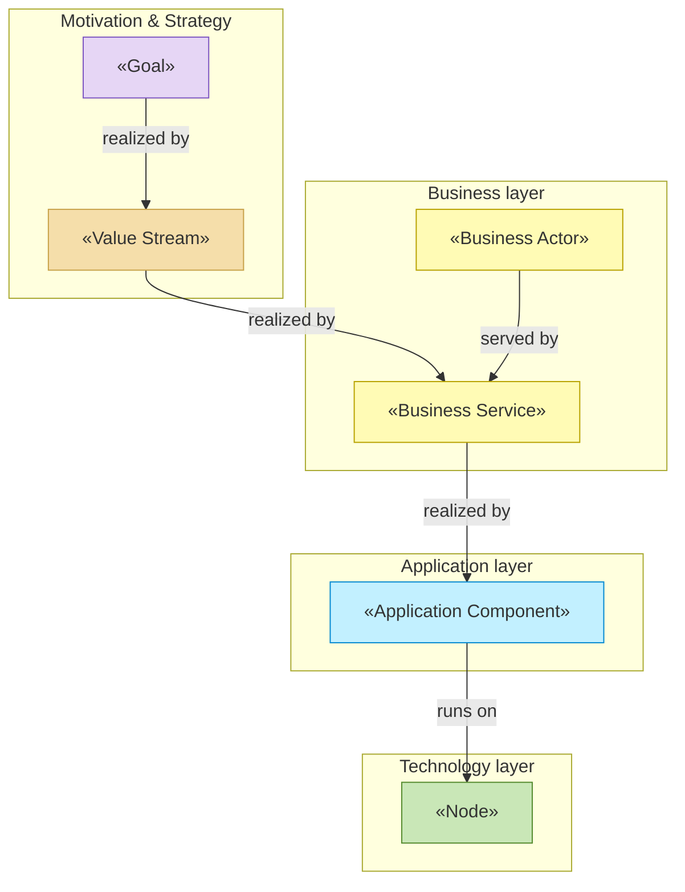

# Enterprise Architecture — <Project Name>

_[← Repository README](../../README.md) · [Scope documents](../scope/README.md)_

This folder is the **primary documentation of the system**, organized as an
ArchiMate-layered enterprise architecture. Every element is grounded in the
implemented solution: entries name the page, module, or pipeline file that
realizes them (or are marked explicitly **"Pending — future initiative"**),
so the architecture can be verified against the code at any time.

Folders and files carry a numeric prefix giving the order in which they are
assessed. **Any change in requirements is aligned through these layers in
this order — strategy first, technology last — and captured in a
[scope document](../scope/README.md) before implementation starts** (see
[CONTRIBUTING.md](../../CONTRIBUTING.md) and the `ea-first-change` skill in
`.claude/skills/`).

## Layers, in assessment order

| #   | Layer                                       | ArchiMate viewpoint      | Answers                                                                       |
| --- | -------------------------------------------- | ------------------------ | ------------------------------------------------------------------------------ |
| 0   | [0_business-design/](./0_business-design/README.md) | _none — business design input_ | Who are the customers, what do they need, and how does each offering pay? |
| 1   | [1_strategy/](./1_strategy/README.md)       | Motivation + Strategy    | Why does this exist? Who cares? What capabilities and value stream?           |
| 2   | [2_business/](./2_business/README.md)       | Business layer           | Who does what? Which services are offered, through which processes?          |
| 3   | [3_information/](./3_information/README.md) | Passive structure (data) | What information exists, where does it live, how does it flow?               |
| 4   | [4_application/](./4_application/README.md) | Application layer        | Which software services and components realize the business services?       |
| 5   | [5_technology/](./5_technology/README.md)   | Technology layer         | What runs it all — runtimes, tooling, build, hosting, deployment?            |
| —   | [domains/](./domains/README.md)             | _the same layers, nested_ | Which business lines own their own model, and what they expose to each other |

Layer `0` is the odd one out: it holds no ArchiMate elements at all, only
the Value Proposition and Business Model canvases the architecture is
**derived** from. It is filled in only when the initiative is modeling an
organization rather than building a single application — see
[0_business-design/](./0_business-design/README.md), which carries the
block-by-block mapping into layers 1 and 2. An application project leaves
the folder empty and starts at layer 1.

## Modeling depth

The same six layers describe a weekend application and a company with twenty
business lines. What changes is **how much of them gets filled in, and which
gates apply** — not which folders exist. Every project declares one of three
depths in `CLAUDE.md`:

| Depth | The subject is | `0_business-design/` | `1_strategy/` | `domains/` | Gates |
| ----- | -------------- | -------------------- | ------------- | ---------- | ----- |
| **1 — Application** | one application; no organization is modeled | not used | light — goals and principles, enough to judge a change against | not used | 2, and 3 if requested |
| **2 — Organization** | one organization, sharing one model | canvases per segment and product | full | not used | 0–3 |
| **3 — Enterprise** | several business lines, each owning its own model | per domain that needs one | full, at the enterprise level and per domain | [the domain tree](./domains/README.md) | 0–3, plus the consuming domains' Requesters on any cross-domain contract change |

Rules that make the ladder work:

- **The agent declares the depth out loud** and says why, at
  `ea-first-change` Step 1a. A Requester told "I'm treating this as Depth 1 —
  one application, light strategy layer; say the word if you want the
  organization modeled properly" can correct it in a sentence.
- **Depth is a starting posture, never a ceiling.** Deepening is its own
  initiative — Depth 1 → 2 makes the organization the subject and fills the
  canvases; Depth 2 → 3 splits the model into domains. Descoping collapses
  the tree. Both are the Requester's call, recorded like any other change.
- **Every depth still gets all six layer folders.** A layer with nothing to
  say yet is marked "not started" in its README's table, not deleted — an
  unfilled layer is a known gap, a missing folder is an unknown one.
- **Depth is about the subject, not the effort.** A large application is
  still Depth 1. A two-person consultancy modeling how it works is Depth 2.

Files inside each layer folder are numbered the same way; each layer README
explains its own analysis order. Delivered initiatives (ArchiMate
Implementation & Migration viewpoint) are documented per initiative in
[../scope/](../scope/README.md), not here — the EA describes the **current**
(or **target**, while unimplemented) state; scope documents describe the
**changes** that produce it.

## Notation conventions

ArchiMate has no native Mermaid profile — no element icons, no standard
shapes. These documents encode ArchiMate semantics onto Mermaid flowcharts
with four devices, and this section is the **single source** for all of them.

### 1. Node labels: identifier first, description second

```
<glyph> [«Stereotype»] <ID><br><description>
```

`✦ «Capability» CAP1<br>Business understanding`, then `✦ CAP2<br>Model
stewardship` for the next one. A reader scanning for `CAP1` finds it in the
same place on every node, and the description gets a line to itself.

**The glyph rides on every node; the «stereotype» word appears once** — on the
first node of each type in a diagram, dropped on the rest. A glyph costs one
character and can afford to be everywhere; the word costs a line and teaches
nobody anything on its thirteenth repetition.

### 2. Element glyphs

A glyph identifies the element type at a glance, which matters most in a
**single-layer view** where the layer colour distinguishes nothing. Some
depict the ArchiMate icon; the rest only distinguish, and a document's
legend says which is which.

| Layer | Glyphs |
| ----- | ------ |
| Motivation | `◍` Stakeholder · `✳` Driver · `⌕` Assessment · `◎` Goal · `◉` Outcome · `⚑` Principle |
| Strategy | `✦` Capability · `▤` Resource · `◈` Value · `➤` Course of Action · `⇉` Value Stream |
| Business | `⚇` Actor · `⚉` Role · `▣` Product · `⬭` Business Service · `⊸` Business Interface · `❒` Contract · `⧉` Collaboration · `⚙` Business Process |
| Information | `▦` Data Object |
| Application | `⊞` Application Component · `⬮` Application Service · `⊸` Application Interface |
| Technology | `⬒` Node · `⬯` Technology Service · `⎔` Artifact |
| Canvas (VPC) | `◍` Customer Segment · `⚙` Job · `✖` Pain · `✔` Gain · `▣` Product · `⊖` Pain Reliever · `⊕` Gain Creator |
| Canvas (BMC) | `⧉` Key Partner · `⚙` Key Activity · `▤` Key Resource · `⊸` Channel · `⇄` Customer Relationship · `▲` Revenue Stream · `▼` Cost |

`⌕` is ArchiMate's Assessment magnifier, `◎` its Goal, `◉` its Outcome, `⊸`
its interface lollipop; `✳` echoes the Driver's steering wheel; `⊖`/`⊕` and
`▲`/`▼` make canvas arithmetic visible. **Unicode only** — glyphs render
everywhere Markdown does, which
[the notation review](../../meta/reviews/2_diagram-notation-icons.md) found
was not true of the alternatives.

Repeats across groups are deliberate: a Key Resource *is* a Resource, a
Channel *is* a Business Interface, and an element that appears in two
documents should look the same in both.

### 3. Element shapes

Within one document each element type takes a distinct Mermaid shape. Shapes
are scoped **per document**, not globally — Mermaid has about a dozen usable
ones and ArchiMate has fifty elements — so each document's legend declares
its own. The assignments below are the defaults; follow them where the
element appears.

| Shape | Mermaid | Default element |
| ----- | ------- | --------------- |
| Stadium | `id([" "])` | Stakeholder, Business Actor, Business Service, Customer Segment |
| Hexagon | `id{{" "}}` | Driver, Course of Action, Job, Key Activity, Collaboration |
| Flag | `id>" "]` | Assessment, Pain |
| Rounded rectangle | `id(" ")` | Goal |
| Rectangle, double bars | `id[[" "]]` | Outcome, Value Stream stage, Gain |
| Parallelogram | `id[/" "/]` | Principle, Contract |
| Rectangle | `id[" "]` | Capability, Business Role, Product, Business Interface, Channel |
| Cylinder | `id[(" ")]` | Resource, Key Resource |
| Rectangle (cont.) | `id[" "]` | Data Object, Application Component, Node |
| Stadium (cont.) | `id([" "])` | Application Service, Technology Service |
| Parallelogram (cont.) | `id[/" "/]` | Artifact |
| Trapezoid | `id[/" "\]` | Value, Pain Reliever, Gain Creator, Revenue Stream |
| Inverted trapezoid | `id[\" "/]` | Cost |

### 4. Layer colour, and the tone ramp inside it

**Layer color** via a `classDef` per layer, approximating the standard
ArchiMate palette:

| Layer                      | class            | Fill             |
| --------------------------- | ---------------- | ---------------- |
| Motivation                  | `motivation`     | violet `#e6d6f5` |
| Strategy                    | `strategy`       | sand `#f5deaa`   |
| Business                    | `business`       | yellow `#fffbb5` |
| Application                 | `application`    | cyan `#c2f0ff`   |
| Technology                  | `technology`     | green `#c9e7b7`  |
| Implementation & Migration  | `implementation` | rose `#ffd6d6`   |

This table is the **single source** for the layer palette; the `ea-doc-style`
skill and every other document point here for the exact fills. Mermaid
`classDef` blocks necessarily inline these hexes per diagram (Mermaid has no
cross-file classDef), but no other prose table restates them.

**In a single-layer view, ramp the layer's hue by element type** — light at
the start of the chain, dark at the end — so type is readable without
hunting for the stereotype. In a **cross-layer** view the flat layer palette
wins instead: there, colour's job is separating motivation from business from
technology, not one motivation element from another.

| Layer | Ramp, light to dark |
| ----- | ------------------- |
| Motivation | Stakeholder `#f4ecfc` → Driver `#e6d6f5` → Assessment `#d8c3f0` → Goal `#c6aae9` → Outcome `#b493e0` → Principle `#a37cd8` |
| Strategy | Resource `#faf0d5` → Capability `#f5deaa` → Value stream stage `#eed4a0` → Value `#e9c987` → Course of Action `#d9ad5c` |
| Business | Actor `#fffbb5` → Role `#f7f099` → Service `#efe57d` → Interface `#e5d95f` → Contract/Collaboration `#d9cc4a` |
| Application | Service `#c2f0ff` → Data Object `#c2f0ff` → Component `#9adcf0` |
| Technology | Service `#c9e7b7` → Artifact `#dcefd0` → Node `#a9d68f` |

Strokes darken with the fill. Text stays `#333` throughout — every fill above
is light enough to carry it in both GitHub themes.

**Two colours override the layer's own.** An `(AI)` actor is drawn in the
Application cyan even inside a business diagram, because a reader should
never mistake it for a person. And an element borrowed from another layer for
context keeps its home layer's colour, shape and glyph, so it is recognisable
as a visitor.

### Drawing rules

- **Diagram first, then the tables and prose that describe it.** Every
  section that has a diagram opens with it.
- **One diagram per section, not one per document.** A single view of a whole
  layer can only be a selection once the layer passes about fifteen elements,
  and a selection that looks complete is worse than several honest parts.
  Sectional diagrams overlap by one rank so a reader can chain them.
- **Each document opens with a "How to read this document" section**: a
  legend diagram showing the element types and how they connect, then the
  glyph / shape / element / ID-prefix table. Layers are self-documenting;
  nobody should need another file open to read one.
- **Dashed edges mean Pending.** Solid is true today.

Relationships are labeled with their ArchiMate name: **serves**,
**realizes**, **assigned to**, **accesses**, **triggers**, **flow**,
**aggregates**, **influences**. Where Mermaid arrowheads can't distinguish
relation types, the label is authoritative.

<!--
  If this project documents in a language other than English, keep a
  stereotype-correspondence table here (translated label → standard
  ArchiMate element name) so the vocabulary stays traceable. See the
  ea-doc-style skill.
-->

## Layered overview

<!--
  TEMPLATE — replace with the project's real stakeholders, goal, value
  stream, business service(s), application component(s), and technology
  node(s) once they're known. Keep the shape (one subgraph per layer, a
  classDef per layer, ArchiMate relationship labels on the edges).
-->



## Reading order

Top-down (recommended for newcomers — the same order as the folder numbers).
If the project modeled an organization, start one step earlier, at
[0_business-design/1_value-proposition-canvas.md](./0_business-design/1_value-proposition-canvas.md)
→ [0_business-design/2_business-model-canvas.md](./0_business-design/2_business-model-canvas.md),
and read the strategy layer as their consequence:
[1_strategy/1_motivation.md](./1_strategy/1_motivation.md)
→ [1_strategy/3_value-stream.md](./1_strategy/3_value-stream.md)
→ [2_business/2_business-services.md](./2_business/2_business-services.md)
→ [3_information/1_data-objects.md](./3_information/1_data-objects.md)
→ [4_application/2_application-components.md](./4_application/2_application-components.md)
→ [5_technology/2_deployment.md](./5_technology/2_deployment.md).

Bottom-up (for developers verifying alignment): start from
[4_application/2_application-components.md](./4_application/2_application-components.md),
which links each component to its source file, then trace upward via the
"realizes" relationships.
