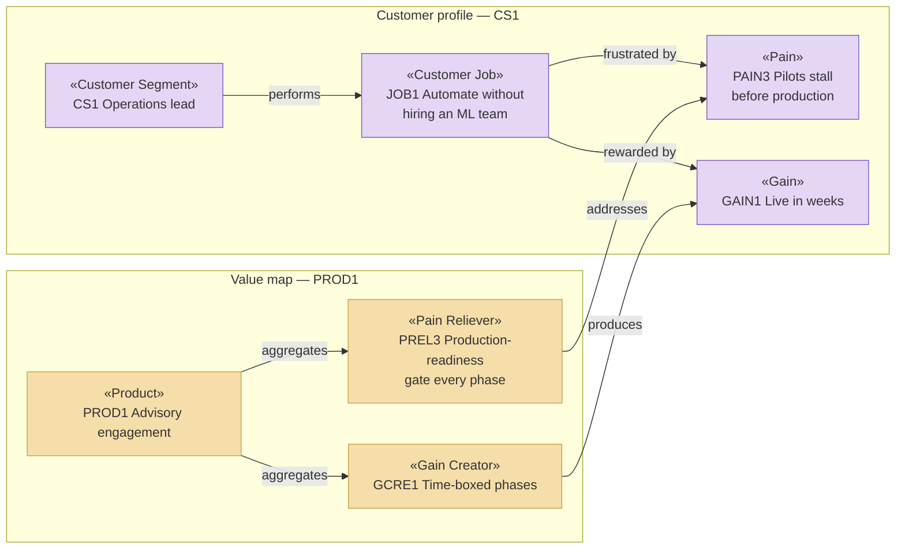

# Business Design Layer — Solvara AI

_[← EA home](../README.md)_

The business model itself: who Solvara AI serves, what those customers are
trying to get done, and how each of the two product lines is delivered and
paid for. Not ArchiMate — these are Strategyzer canvases, and they are the
input everything in layers 1–2 is derived from.

Approved by the Requester at **Gate 0 — Business model** before any
derivation started; see the
[scope document's Approvals table](../../scope/1_model-the-operating-model.md#approvals).

## Analysis order

| #   | Document                                                         | Elements                                                                                  | Question it answers                                     |
| --- | ----------------------------------------------------------------- | ------------------------------------------------------------------------------------------ | --------------------------------------------------------- |
| 1   | [1_value-proposition-canvas.md](./1_value-proposition-canvas.md) | Customer Segments, Jobs, Pains, Gains, Products & Services, Pain Relievers, Gain Creators | Who do we serve, what do they need, and what do we offer? |
| 2   | [2_business-model-canvas.md](./2_business-model-canvas.md)       | The nine BMC blocks, one canvas per product                                                | How is each offering delivered, and how does it pay?      |

Two customer segments (`CS1`, `CS2`) mean two value proposition canvases;
two products (`PROD1`, `PROD2`) mean two business model canvases. The
mapping from these blocks into ArchiMate elements is defined once, in the
[template's layer README](../../../../docs/ea/0_business-design/README.md#from-canvas-to-archimate),
and is not restated here.

## What these canvases exposed

Filling them in surfaced three things that no amount of starting at the
strategy layer would have:

1. **`PROD1`'s cost and revenue scale together.** `COST1` (consultant time)
   rises with `RS1` (fixed fee per phase), and `RES1` is the resource that
   cannot be bought quickly. That structural ceiling — not an ambition to
   grow — is what motivates `PROD2` and `COA1`.
2. **`PROD2` is priced on a different axis from its cost.** `RS3` is per
   seat; `COST4` is per unit of usage. `RS4` exists to close that gap, which
   makes the allowance boundary a business decision rather than a pricing
   detail.
3. **The two lines share every key partner.** `KP1` and `KP2` serve both, so
   a supplier failure is not contained to one product line — recorded as a
   [gap](../../scope/1_model-the-operating-model.md#gap-notes).

## Layer view

One segment and one product shown; the full set is in the two documents
above. The `addresses` and `produces` edges are the fit — every pain and
every gain has one, checked in
[1_value-proposition-canvas.md](./1_value-proposition-canvas.md#fit-check).
