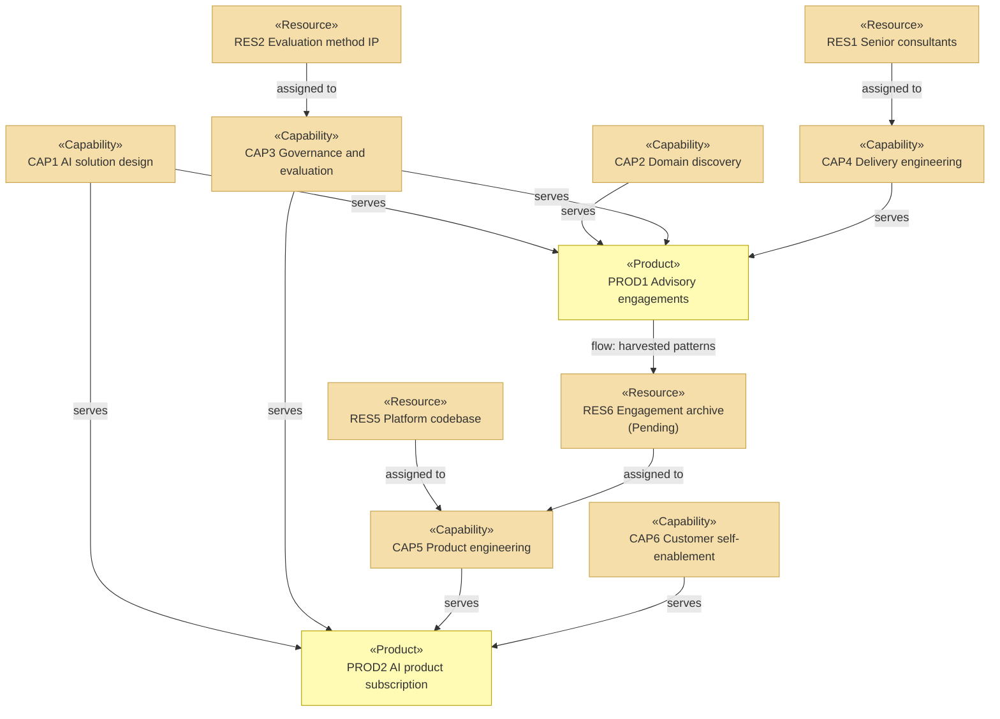

# Capabilities and Resources

_[← Strategy layer](./README.md) · [EA home](../README.md)_

**ArchiMate elements:** Capability, Resource, Course of Action.

Derived from the value maps in
[1_value-proposition-canvas.md](../0_business-design/1_value-proposition-canvas.md)
and the key activities and key resources in
[2_business-model-canvas.md](../0_business-design/2_business-model-canvas.md).

The grounding rule applies differently here than in a software project: an
organization's capabilities are realized by **people, teams, and written
procedures**, not source files. Each row names the one that realizes it, or
is marked pending.

## Capabilities

| ID | Capability | Serves | Source | Realized by |
| --- | --- | --- | --- | --- |
| `CAP1` | **AI solution design** — turning a business process into a system design with the model boundary drawn in the right place | `PREL6`, `GCRE4` | Value maps | Solution Architect (`ACT2`), reference architectures (`RES3`) |
| `CAP2` | **Domain discovery** — extracting how a process actually works from the people who run it | `PREL1`, `GCRE3` | `KA1` | Engagement Lead (`ACT1`), assessment procedure |
| `CAP3` | **Governance and evaluation** — establishing what "correct" means for a system and detecting when it stops being true | `PREL4`, `PREL7`, `GCRE2` | `KA6` | Evaluation method IP (`RES2`) |
| `CAP4` | **Delivery engineering** — getting a designed system into production under supervision | `PREL2`, `PREL3`, `GCRE1`, `GCRE3` | `KA3` | Consultant bench (`RES1`), Delivery Copilot (`ACT3`) |
| `CAP5` | **Product engineering** — building and running the platform the subscription sells | `PREL6`, `PREL7`, `GCRE4` | `KA5` | Platform codebase (`RES5`) |
| `CAP6` | **Customer self-enablement** — letting a customer succeed without a human on our side | `GCRE5` | `KA7` | Product documentation, Product Agent (`ACT4`) |

`CAP1`, `CAP2`, and `CAP3` are the shared base — both product lines depend
on all three. `CAP4` is `PROD1`-only, `CAP5` and `CAP6` are `PROD2`-only.
That split is the operating model in one table: two businesses, one
foundation, and the foundation is where a change is expensive.

## Resources

| ID | Resource | Kind | Source | Used by | State |
| --- | --- | --- | --- | --- | --- |
| `RES1` | Senior consultants | People | `KR`/`PROD1` | `CAP2`, `CAP4` | Constrained — the binding limit on `PROD1` |
| `RES2` | Evaluation method IP | Knowledge | `KR`/both | `CAP3` | Held; documented in the method handbook |
| `RES3` | Reference architectures | Knowledge | `KR`/`PROD1` | `CAP1` | Held |
| `RES4` | Model-provider contracts | Contractual | `KR`/both | `CAP1`, `CAP5` | Held; see `CTR1` |
| `RES5` | Platform codebase | Asset | `KR`/`PROD2` | `CAP5`, `CAP6` | Held |
| `RES6` | Engagement archive — patterns harvested from delivered engagements | Knowledge | `KR`/`PROD2` | `CAP5` | **Pending — future initiative.** Patterns exist in past engagements but are not yet collected into anything `CAP5` can draw on systematically |

`RES6` being pending is the single largest gap in this model. `COA1` below
depends on it entirely, and until it exists the link from `PROD1` to `PROD2`
is an intention rather than a mechanism.

## Courses of action

| ID | Course of action | Responds to | Status |
| --- | --- | --- | --- |
| `COA1` | **Productize the recurring engagement pattern** — harvest what engagements rebuild into `RES6`, and feed it to `CAP5` as the `PROD2` roadmap | `DRV3`, `ASM5` | Chosen; blocked on `RES6` |
| `COA2` | **Stay model-provider neutral** — keep every deliverable substitutable across providers, and negotiate `RES4` from that position | `P3`, `DRV2` | Chosen and in force |

`COA1` is the strategic bet: it is what turns `G3` from an aspiration into a
plan. `COA2` is a constraint accepted knowingly — it costs access to
provider-specific features, and buys negotiating position and customer
trust.

## Capability to product

The `prod1 → res6` edge is the only feedback loop in the model, and the
reason the two product lines belong in one company.
