# Value Stream

_[← Strategy layer](./README.md) · [EA home](../README.md)_

**ArchiMate elements:** Value Stream, and its stage-to-capability mapping.

Derived from the key activities and channels in
[2_business-model-canvas.md](../0_business-design/2_business-model-canvas.md).

## Value streams

| ID | Value stream | Product | Stages |
| --- | --- | --- | --- |
| `VS1` | From a stated problem to a system the customer runs | `PROD1` | `VSS1`–`VSS6` |
| `VS2` | From signup to a workflow that keeps working | `PROD2` | `VSS7`–`VSS11` |

## `VS1` — From a stated problem to a system the customer runs

The advisory stream. Six stages, each with the capability that serves it and
the value that exists at its end.

| # | Stage | Capability | Source | Value at this stage |
| --- | --- | --- | --- | --- |
| `VSS1` | **Qualify** — is this a process worth automating, and are we the right people? | `CAP2` | `CH1`–`CH3` | A go/no-go both sides believe |
| `VSS2` | **Assess** — how does the process actually work, and what would production look like? | `CAP2`, `CAP1` | `KA1` | A costed plan the customer can decide on without committing to the build (`PREL1`) |
| `VSS3` | **Design** — where does the model boundary go, and how will correctness be judged? | `CAP1`, `CAP3` | `KA2` | A design with an evaluation baseline (`P1`) |
| `VSS4` | **Build (supervised)** — get it running on real work, with the customer's people present | `CAP4` | `KA3` | A system in production, not a demo (`OUT1`) |
| `VSS5` | **Hand over** — paired operation until the customer's staff run it alone | `CAP2`, `CAP4` | `KA4` | Staff who operate it unaided (`OUT3`) |
| `VSS6` | **Expand** — the next process, or the pattern harvested for `PROD2` | `CAP3` | — | Either new `PROD1` revenue or an entry in `RES6` |

`VSS6` is where the two product lines meet. A completed engagement either
becomes another engagement or becomes product input — and today only the
first of those actually happens, because `RES6` is pending.

## `VS2` — From signup to a workflow that keeps working

The product stream. Shorter, and deliberately has no stage that requires one
of our people.

| # | Stage | Capability | Source | Value at this stage |
| --- | --- | --- | --- | --- |
| `VSS7` | **Discover** — the builder finds the product and understands what it enforces | `CAP6` | `CH4`–`CH6` | A qualified self-serve signup |
| `VSS8` | **Start** — a project scaffolded from a guardrail template | `CAP5`, `CAP1` | `KA5` | Guardrails in place from day one (`OUT4`) |
| `VSS9` | **Build** — the builder works, the product enforces structure | `CAP5` | `KA5` | Structure that survives growth (`PREL6`) |
| `VSS10` | **Watch** — continuous evaluation flags drift from stated intent | `CAP3` | `KA6` | Drift caught before it compounds (`PREL7`) |
| `VSS11` | **Sustain** — the workflow keeps running without us | `CAP6` | `KA7` | A system that runs without a consultant (`OUT5`) |

## The two streams

```mermaid
flowchart LR
  subgraph ADV["VS1 — Advisory"]
    vss1["«Value Stream Stage»<br>VSS1 Qualify"]:::strategy
    vss2["«Value Stream Stage»<br>VSS2 Assess"]:::strategy
    vss3["«Value Stream Stage»<br>VSS3 Design"]:::strategy
    vss4["«Value Stream Stage»<br>VSS4 Build (supervised)"]:::strategy
    vss5["«Value Stream Stage»<br>VSS5 Hand over"]:::strategy
    vss6["«Value Stream Stage»<br>VSS6 Expand"]:::strategy
  end

  subgraph PRODS["VS2 — Product"]
    vss7["«Value Stream Stage»<br>VSS7 Discover"]:::strategy
    vss8["«Value Stream Stage»<br>VSS8 Start"]:::strategy
    vss9["«Value Stream Stage»<br>VSS9 Build"]:::strategy
    vss10["«Value Stream Stage»<br>VSS10 Watch"]:::strategy
    vss11["«Value Stream Stage»<br>VSS11 Sustain"]:::strategy
  end

  res6["«Resource»<br>RES6 Engagement archive<br>(Pending)"]:::strategy

  vss1 -->|triggers| vss2 -->|triggers| vss3 -->|triggers| vss4 -->|triggers| vss5 -->|triggers| vss6
  vss6 -->|flow: harvested pattern| res6
  res6 -->|serves| vss8
  vss7 -->|triggers| vss8 -->|triggers| vss9 -->|triggers| vss10 -->|triggers| vss11
  vss6 -.->|flow: next process| vss1

  classDef strategy fill:#f5deaa,stroke:#c8a24a,color:#333
```

Read the diagram for the two edges through `RES6`: they are the only thing
connecting the streams, and both are pending. Until `RES6` exists, this is
two businesses sharing an office and a capability base — which is exactly
what the model should say out loud rather than imply otherwise.
