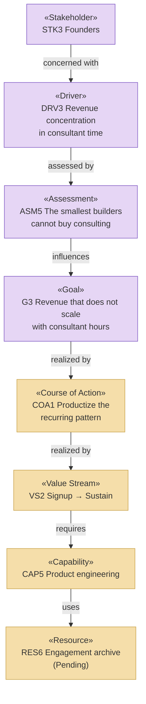

# Strategy & Motivation Layer — Solvara AI

_[← EA home](../README.md)_

Who has a stake in Solvara AI, why it exists, which capabilities it needs,
and how value flows through its two product lines.

**This layer is derived**, not invented: every element traces back to a
block in [0_business-design/](../0_business-design/README.md), approved at
Gate 0 before any of this was written. The one exception is the
**Principles**, which have no canvas source and were discovered directly
with the Requester.

## Analysis order

| #   | Document                                                             | Elements                                                        | Question it answers                                | Source                                                       |
| --- | ---------------------------------------------------------------------| ------------------------------------------------------------------ | ---------------------------------------------------- | -------------------------------------------------------------- |
| 1   | [1_motivation.md](./1_motivation.md)                                 | Stakeholders, Drivers, Assessments, Goals, Outcomes, Principles | Who cares, what pressures them, what must be true?  | `CS1`, `CS2`, `JOB*`, `PAIN*`, `GAIN*` — Principles: none    |
| 2   | [2_capabilities-and-resources.md](./2_capabilities-and-resources.md) | Capabilities, Resources, Courses of Action                      | What must we be able to do, and with what?          | `PREL*`, `GCRE*`, `KR*`, `KA*`                               |
| 3   | [3_value-stream.md](./3_value-stream.md)                             | Value Streams and their stage mapping                            | How does value flow end-to-end?                     | `KA*`, `CH*`                                                 |

## Layer view

The chain from `STK3` to `RES6` is the strategic spine of this business: the
founders' concern about revenue shape produces the product line, and the
product line depends on a resource that does not exist yet. Reading it
top-to-bottom is the fastest way to understand what Solvara AI is betting on
and what could stop it.
