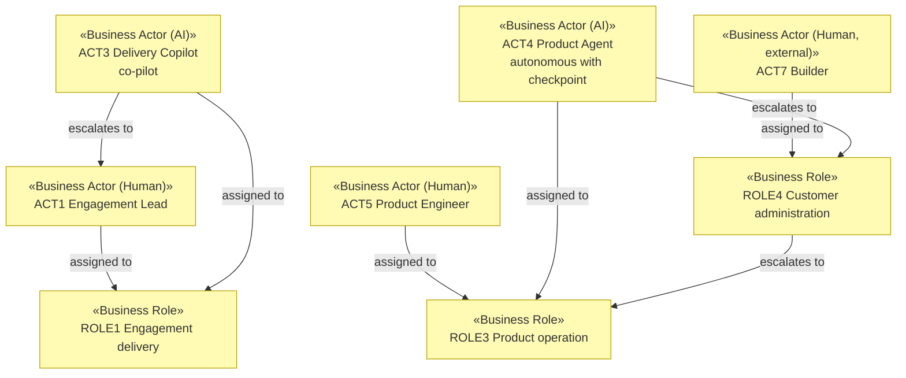

# Business Actors and Roles

_[← Business layer](./README.md) · [EA home](../README.md)_

**ArchiMate elements:** Business Actor, Business Role, Contract, Business
Collaboration.

Notation: `ea-doc-style`'s human/AI/hybrid actor convention — every actor
states its kind, and AI/hybrid actors carry autonomy level, decision rights,
and escalation path. `P2` in
[1_motivation.md](../1_strategy/1_motivation.md) makes the escalation path
mandatory rather than a nicety.

## Internal actors

| ID | Actor | Kind | Role | Autonomy level | Decision rights | Escalation path |
| --- | --- | --- | --- | --- | --- | --- |
| `ACT1` | Engagement Lead | Human | `ROLE1` Engagement delivery | — (human) | Owns engagement scope, phase sign-off, and the production-readiness gate; the only role that can declare a phase complete | — |
| `ACT2` | Solution Architect | Human | `ROLE2` Solution design | — (human) | Owns the model boundary, the evaluation baseline, and provider-substitutability under `P3` | — |
| `ACT3` | **Delivery Copilot** | **AI** | `ROLE1` Engagement delivery | **Co-pilot** — drafts complete work; nothing it produces reaches a customer system without a human approving it | May draft designs, code, evaluation suites, and engagement documentation, and open them for review. May **not** approve a phase, change an evaluation baseline, or touch a customer production system | **`ACT1` Engagement Lead.** Escalates when a draft would change agreed scope, when it cannot meet the evaluation baseline, or when a design would violate `P1` or `P3` |
| `ACT4` | **Product Agent** | **AI** | `ROLE3` Product operation | **Autonomous with checkpoint** — acts in the customer's project without prior approval; the customer is notified and can revert | Within a subscriber's project: may apply guardrail templates, flag drift, open change proposals, and answer product questions. May **not** modify billing, delete customer work, or act outside the project that invoked it | **`ROLE4` Customer Administrator** — the named human on the customer's side. On drift it cannot resolve, escalates to `ROLE3` Product operation internally |
| `ACT5` | Product Engineer | Human | `ROLE3` Product operation | — (human) | Owns the platform codebase (`RES5`), the evaluation harness, and what `ACT4` is permitted to do | — |

The two AI actors sit at **different autonomy levels on purpose**, and the
difference is not about capability:

- `ACT3` works on systems we are accountable for delivering, where a mistake
  reaches a customer's production environment through our hands. A human
  approves before anything lands — co-pilot.
- `ACT4` works inside the customer's own project, where the customer is the
  one accountable and can revert anything. Requiring our approval would make
  the self-serve promise (`GCRE5`, `OUT5`) impossible — so it acts, and the
  customer is the checkpoint.

The autonomy level follows **who bears the consequence and who can undo it**,
not how much we trust the model. A future initiative that raises `ACT3` to
autonomous-with-checkpoint, or lowers `ACT4` to co-pilot, changes that
answer and needs a `decision-record` alongside its scope document.

## External actors

| ID | Actor | Kind | Relationship | Contract |
| --- | --- | --- | --- | --- |
| `ACT6` | Operations Lead (customer) | Human, external | `STK1` — buys and uses `PROD1` | Engagement agreement |
| `ACT7` | Builder (customer) | Human, external | `STK2` — buys and uses `PROD2`; fills `ROLE4` in their own project | `CTR4` |
| `ACT8` | Model/API provider | Organization, external | `KP1` — supplies inference to both lines | `CTR1` |
| `ACT9` | Cloud host | Organization, external | `KP2` — runs `RES5` | `CTR2` |
| `ACT10` | Implementation partner | Organization, external | `KP3` — takes engagement work outside our scope | `CTR3` |
| `ACT11` | App marketplace | Organization, external | `KP4` — distribution channel `CH6` for `PROD2` | Marketplace terms |

## Roles

| ID | Role | Assigned actors | Responsible for |
| --- | --- | --- | --- |
| `ROLE1` | Engagement delivery | `ACT1` (human), `ACT3` (AI) | `VSS1`–`VSS6` — everything from qualification to handover |
| `ROLE2` | Solution design | `ACT2` | `VSS3` — the design and its evaluation baseline |
| `ROLE3` | Product operation | `ACT5` (human), `ACT4` (AI) | `VSS8`–`VSS11` — the platform and what runs inside customer projects |
| `ROLE4` | Customer administration | `ACT7` (external) | The named human `ACT4` escalates to; a subscription without one is not provisioned |

`ROLE1` and `ROLE3` are each filled by one human and one AI actor. The
autonomy and decision-rights columns above are what distinguishes their
authority inside the same role — not a separate role each.

## Contracts and partner dependency

| ID | Contract | Between | Covers |
| --- | --- | --- | --- |
| `CTR1` | Model-provider agreement | Solvara AI ↔ `ACT8` | Inference for both product lines; negotiated under `COA2` to keep providers substitutable |
| `CTR2` | Cloud hosting agreement | Solvara AI ↔ `ACT9` | Runtime for `RES5` |
| `CTR3` | Implementation partner agreement | Solvara AI ↔ `ACT10` | Overflow and out-of-scope engagement work |
| `CTR4` | Subscription terms | Solvara AI ↔ `ACT7` | `PROD2` access, usage allowances (`RS3`, `RS4`), and the `ROLE4` requirement |

`ACT8` and `ACT9` are shared across both product lines — the concentrated
dependency flagged in the
[scope document's gap notes](../../scope/1_model-the-operating-model.md#gap-notes).
`COA2` is what keeps `CTR1` from becoming a single point of failure; there
is no equivalent mitigation for `CTR2` today.

## Actor view

Every AI actor in the diagram has an outgoing escalation edge ending at a
named role. That is `P2` made checkable: an actor with no such edge is a
defect in the model, not a stylistic omission.
