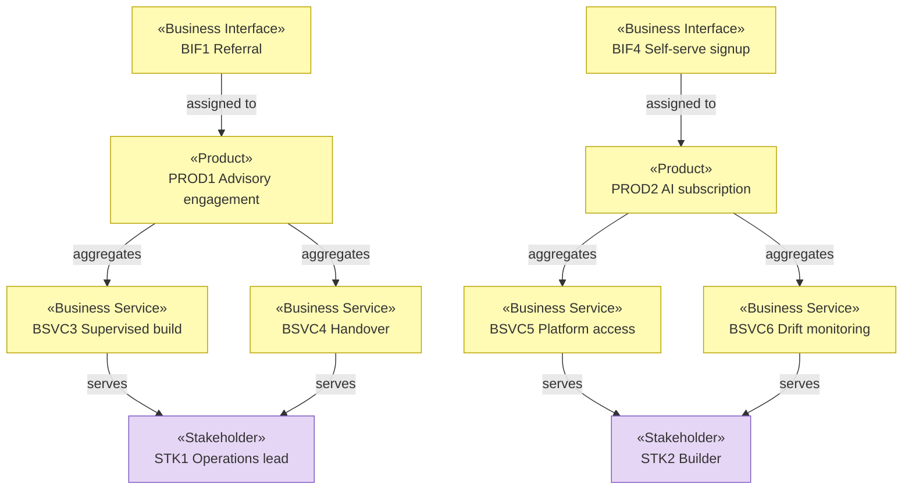

# Products, Services, and Channels

_[← Business layer](./README.md) · [EA home](../README.md)_

**ArchiMate elements:** Product, Business Service, Business Interface,
Value.

Derived from the value propositions, channels, and customer relationships in
[2_business-model-canvas.md](../0_business-design/2_business-model-canvas.md).

## Products

| ID | Product | Value | Segment | Aggregates |
| --- | --- | --- | --- | --- |
| `PROD1` | Advisory engagement | `VP1` — a production-ready process in weeks, with a decision trail and a team able to run it | `STK1` | `BSVC1`–`BSVC4` |
| `PROD2` | AI product subscription | `VP2` — guardrails and architecture discipline out of the box, no engagement needed | `STK2` | `BSVC5`–`BSVC8` |

## Business services

| ID | Service | Part of | Realizes | Realized by |
| --- | --- | --- | --- | --- |
| `BSVC1` | Readiness assessment | `PROD1` | `PREL1` | `CAP2`, assessment procedure; stage `VSS2` |
| `BSVC2` | Solution design | `PROD1` | `GCRE2` | `CAP1`, `CAP3`; stage `VSS3` |
| `BSVC3` | Supervised build | `PROD1` | `PREL2`, `PREL3`, `GCRE1` | `CAP4`; stage `VSS4` |
| `BSVC4` | Handover and enablement | `PROD1` | `GCRE3` | `CAP2`, `CAP4`; stage `VSS5` |
| `BSVC5` | Platform access | `PROD2` | `PREL5`, `PREL6` | `CAP5`, `RES5`; stage `VSS8`–`VSS9` |
| `BSVC6` | Drift monitoring | `PROD2` | `PREL7` | `CAP3`, `CAP5`; stage `VSS10` |
| `BSVC7` | Self-serve onboarding | `PROD2` | `GCRE4`, `GCRE5` | `CAP6`; stage `VSS8` |
| `BSVC8` | Community support | `PROD2` | `GCRE5` | `CAP6`; stage `VSS11` |

## Customer relationship services

The BMC's customer-relationship blocks are business services in their own
right — how the customer is dealt with, as distinct from what they buy.

| ID | Relationship | Source | Delivered as |
| --- | --- | --- | --- |
| `CR1` | Named engagement lead, weekly checkpoint, fixed end date | `PROD1` | `ACT1` in `ROLE1`, throughout `VSS2`–`VSS5` |
| `CR2` | Self-service | `PROD2` | `BSVC7` |
| `CR3` | Community support | `PROD2` | `BSVC8` |
| `CR4` | In-product assistant | `PROD2` | `ACT4` in `ROLE3` |

`CR1` is the expensive one — a named human for the duration is most of what
`COST1` buys, and it is inseparable from `VP1`. `CR4` is its `PROD2`
counterpart at roughly zero marginal cost, which is the whole economic
argument for the second product line.

## Channels

| ID | Channel | Interface | Product | Stage |
| --- | --- | --- | --- | --- |
| `BIF1` | Referral from past engagements | Personal introduction | `PROD1` | `VSS1` |
| `BIF2` | Founder network | Personal introduction | `PROD1` | `VSS1` |
| `BIF3` | Conference talks | Public speaking | `PROD1` | `VSS1` |
| `BIF4` | Self-serve signup | Web | `PROD2` | `VSS7` |
| `BIF5` | Product documentation | Web | `PROD2` | `VSS7` |
| `BIF6` | Content and community | Web, marketplace (`ACT11`) | `PROD2` | `VSS7` |

`PROD1`'s channels are all person-to-person and none of them scale;
`PROD2`'s are all self-serve and none of them involve us. The channel split
mirrors the cost split exactly, which is the clearest single confirmation
that these are genuinely two business models and not one product with two
price points.

## Product view

## Not yet modeled

Per the grounding rule, what is missing is stated rather than implied:

- **Business processes** (`3_business-processes.md`) — the key activities
  `KA1`–`KA7` are mapped to value-stream stages but not decomposed into
  processes. **Pending — future initiative.**
- **Business objects** (`4_business-objects.md`) — engagement, evaluation
  baseline, subscription, drift report. **Pending — future initiative.**
- **Glossary and business rules** (`5_domain-context-and-rules.md`) — terms
  used consistently across this model but not yet defined in one place.
  **Pending — future initiative.**
