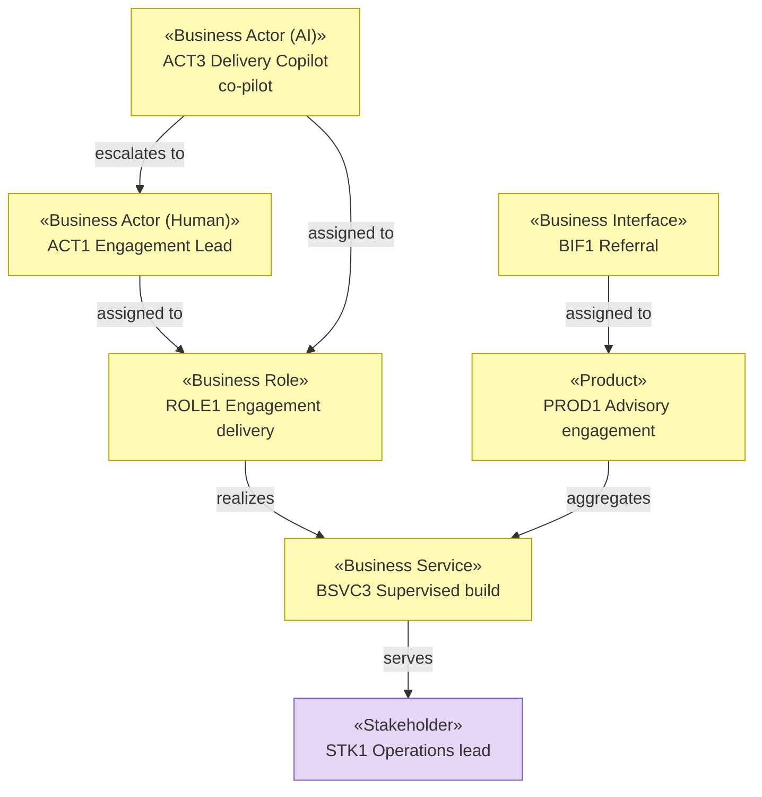

# Business Layer — Solvara AI

_[← EA home](../README.md)_

Who does the work — including two AI actors at different autonomy levels —
which products and services are offered, and through which channels.

Derived from [0_business-design/](../0_business-design/README.md) alongside
the [strategy layer](../1_strategy/README.md), and approved with it at
**Gate 1**.

## Analysis order

| #   | Document                                                          | Elements                                                                   | Question it answers                                     | Source                       |
| --- | -------------------------------------------------------------------| ----------------------------------------------------------------------------| ---------------------------------------------------------- | ------------------------------ |
| 1   | [1_business-actors-and-roles.md](./1_business-actors-and-roles.md) | Business Actors and Roles, external partners, Contracts                     | Who does the work, and who do we depend on?              | `CS*`, `KP*`                 |
| 2   | [2_business-services.md](./2_business-services.md)                | Products, Business Services, Business Interfaces                            | What is offered, and through which channels?             | `VP*`, `CH*`, `CR*`          |
| 3   | `3_business-processes.md`                                         | Business Processes                                                          | How are those services delivered?                        | `KA*` — **not started**      |
| 4   | `4_business-objects.md`                                           | Business Objects                                                            | What things do the processes handle?                     | **not started**              |
| 5   | `5_domain-context-and-rules.md`                                   | Glossary, business rules                                                    | What vocabulary and constraints bind everything?         | **not started**              |

Documents 3–5 are named without links because they have not been written —
this initiative scoped itself to the canvases and the layers derivable from
them. See the
[scope document](../../scope/1_model-the-operating-model.md#in-scope--out-of-scope).

## Two AI actors, two autonomy levels

The point of interest in this layer.
[1_business-actors-and-roles.md](./1_business-actors-and-roles.md) carries a
**Delivery Copilot** (`ACT3`, co-pilot) that drafts consulting work a human
approves, and a **Product Agent** (`ACT4`, autonomous with checkpoint) that
acts inside a customer's own project without prior approval. The difference
follows who bears the consequence and who can undo it — not how capable
each is. `P2` requires both to escalate to a **named role**, which is why
every AI node in that document's diagram has an outgoing escalation edge.

## Layer view

