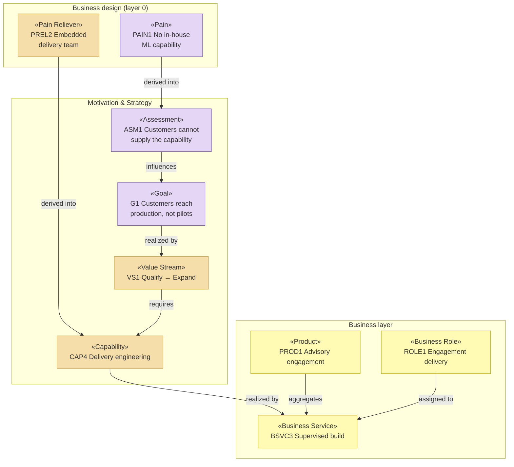

# Enterprise Architecture — Solvara AI

_[← Project README](../../README.md) · [Scope documents](../scope/README.md)_

The current-state model of **Solvara AI**, a fictional small consultancy
that sells AI advisory engagements and an AI product subscription. There is
no application here: the architecture *is* the deliverable, which is the
point of this example.

Every element is grounded — but for an organization, "grounded" means naming
the **team, role, or written procedure** that realizes it, not a source
file. Elements with nothing realizing them yet are marked explicitly
**"Pending — future initiative"**.

## Layers, in assessment order

| #   | Layer                                               | ArchiMate viewpoint            | State                                                              |
| --- | ---------------------------------------------------- | ------------------------------ | -------------------------------------------------------------------- |
| 0   | [0_business-design/](./0_business-design/README.md) | _none — business design input_ | **Filled.** Two value proposition canvases, two business model canvases |
| 1   | [1_strategy/](./1_strategy/README.md)               | Motivation + Strategy          | **Filled**, derived from layer 0                                    |
| 2   | [2_business/](./2_business/README.md)               | Business layer                 | **Partially filled** — actors, roles, products, services, channels; processes/objects/rules pending |
| 3   | `3_information/`                                    | Passive structure (data)       | **Not started** — no application, so no data architecture yet       |
| 4   | `4_application/`                                    | Application layer              | **Not started** — nothing has been built                            |
| 5   | `5_technology/`                                     | Technology layer               | **Not started**                                                     |
| —   | [domains/](./domains/README.md)                     | _the same layers, nested_      | **Charters filled**, domain layers pending — two business lines, and the one service that crosses between them |

**Modeling depth: 3 — Enterprise.** Solvara runs two business lines with
different customers, different economics, and different people saying yes,
so each is modeled as a [domain](./domains/README.md). The layers above hold
what is true across both — the goals, the principles, the shared capability
base `CAP1`–`CAP3`, and the external partners — and the domains hold what
isn't.

Layers 3–5 are named without links because they do not exist. That is the
expected shape for an operating-model initiative: the business is modeled
first, and the systems that serve it are separate initiatives that will
re-enter `ea-first-change` and find this model already in place.

## Notation conventions

This project follows the template's conventions rather than restating them —
stereotypes, the layer palette, relationship labels, the human/AI/hybrid
actor notation, and element IDs all live in
[the template's EA README](../../../docs/ea/README.md#notation-conventions)
and the `ea-doc-style` skill.

## Layered overview

The two `derived into` edges crossing out of the layer-0 subgraph are what
this example exists to show: a pain a customer described became an
assessment, and the thing that relieves it became a capability. Neither was
invented at the strategy layer.

## Reading order

[0_business-design/1_value-proposition-canvas.md](./0_business-design/1_value-proposition-canvas.md)
→ [0_business-design/2_business-model-canvas.md](./0_business-design/2_business-model-canvas.md)
→ [1_strategy/1_motivation.md](./1_strategy/1_motivation.md)
→ [1_strategy/2_capabilities-and-resources.md](./1_strategy/2_capabilities-and-resources.md)
→ [1_strategy/3_value-stream.md](./1_strategy/3_value-stream.md)
→ [2_business/1_business-actors-and-roles.md](./2_business/1_business-actors-and-roles.md)
→ [2_business/2_business-services.md](./2_business/2_business-services.md).

Read in that order, each document answers a question the previous one
raised. Read backwards, every element can be traced to the customer
statement it came from.
