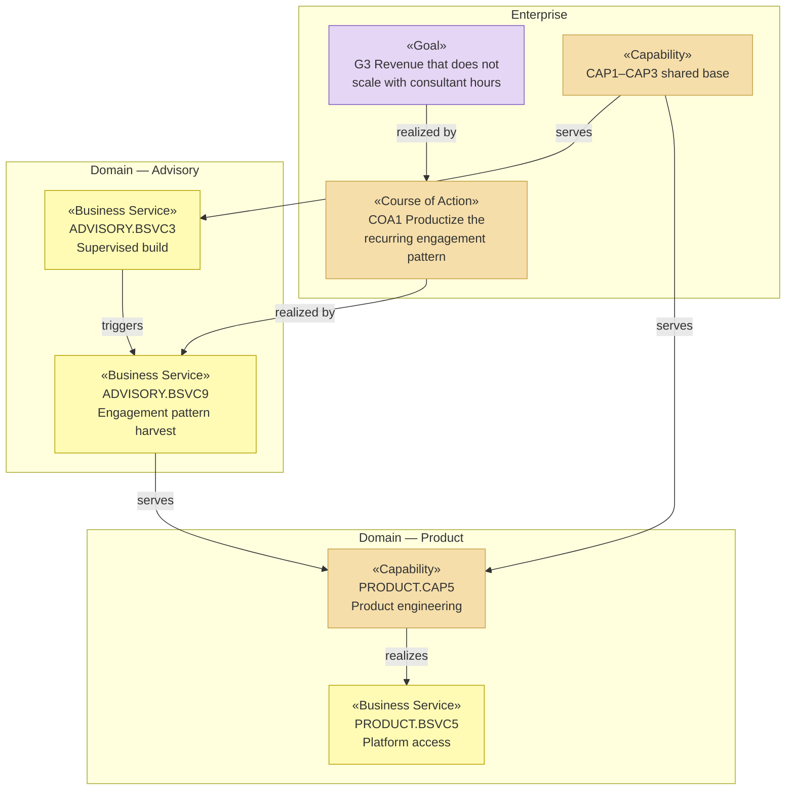

# Domains — Solvara AI

_[← EA home](../README.md) · [Project README](../../../README.md)_

Solvara AI runs two business lines that share a capability base and agree on
almost nothing else. This folder models each as a **domain** — an
organization in its own right, with its own customers, its own economics,
and a charter naming what it exposes to the other.

| Domain | Purpose | Exposes | Operated by |
| ------ | ------- | ------- | ----------- |
| [advisory/](./advisory/README.md) | Get a mid-market customer's process into production, with a team able to run it afterwards | `ADVISORY.BSVC1`–`BSVC4`, and `ADVISORY.BSVC9` to `PRODUCT` | Hybrid — humans lead, `ACT3` drafts at **co-pilot** autonomy |
| [product/](./product/README.md) | Sell the same discipline at a price a solo builder can pay, with no engagement | `PRODUCT.BSVC5`–`BSVC8` | Hybrid — humans own the platform, `ACT4` acts in customer projects at **autonomous with checkpoint** |

## Why these two, and not one

The [split test](../../../../docs/ea/domains/README.md#when-to-split-a-domain-out)
asks for two of five. Solvara meets four:

| Test | Verdict |
| ---- | ------- |
| **Its own customers** | ✅ Advisory serves `STK1` (operations lead); Product serves `STK2` (solo builder). Neither buys the other |
| **Its own economics** | ✅ `RS1`/`RS2` against a consultant bench, versus `RS3`/`RS4` against a platform. The [shared-versus-different table](../0_business-design/2_business-model-canvas.md#what-the-two-share) is the evidence |
| **Its own decision rights** | ✅ `ACT1` closes an engagement phase without consulting Product; `ACT5` ships platform changes without consulting Advisory |
| **Its own capabilities** | ✅ `CAP4` is Advisory-only; `CAP5` and `CAP6` are Product-only |
| **A named interface** | ⚠️ Only since `ADVISORY.BSVC9` was defined — see below. Before that, `COA1` was an intention with no mechanism |

The fifth test is the interesting one, and it is the reason this split was
worth doing. `COA1` — *productize the recurring engagement pattern* — is the
strategic bet that makes `G3` achievable, and it was
[blocked on `RES6`](../1_strategy/2_capabilities-and-resources.md#resources),
an engagement archive that nobody owned. Modeling the two lines as domains
forced the question "what exactly does Advisory owe Product?", and the
answer became a service with an owner instead of a resource with a gap.

## What stays at the enterprise level

Not everything belongs to a domain. These stay in the layers above, because
splitting them would duplicate them:

- **Goals and principles** (`G1`–`G4`, `P1`–`P3`) — one company, one set.
- **The shared capability base** — `CAP1` AI solution design, `CAP2` domain
  discovery, `CAP3` governance and evaluation. Both domains depend on all
  three, which is precisely why a change to one is expensive and neither
  domain gets to own it. The line-specific capabilities do move:
  `ADVISORY.CAP4` delivery engineering, `PRODUCT.CAP5` product engineering,
  and `PRODUCT.CAP6` customer self-enablement each have exactly one
  consumer, so each belongs to it.
- **Shared resources and contracts** — `RES2`, `RES4`, `CTR1`, `CTR2`.
- **External partners** — `ACT8`–`ACT11`. `ACT8` and `ACT9` serve both
  lines, which is the concentration risk the model already flags.

## Element IDs

Existing IDs are **not renumbered** — an ID is assigned once and never
changes (`ea-doc-style` § Element IDs). Advisory happened to own `BSVC1`–
`BSVC4` and Product `BSVC5`–`BSVC8` before the split, and they keep them;
the qualifier is what disambiguates from here on, and new elements are
numbered per domain. Enterprise-level elements stay bare: `G3`, `CAP1`, `P2`.

## The contract between them

One exposed service crosses the boundary. Everything else each domain does
is its own business — which is the point: `ACT5` can ship the platform
weekly without an Advisory conversation, and `ACT1` can run an engagement
without a Product one. They meet at `ADVISORY.BSVC9` and nowhere else.

## Not yet modeled

Per the grounding rule, stated rather than implied. **Both domains carry
charters and no layer folders yet.** That is the prescribed order —
`domain-modeling` says write the charter first, because it is what catches a
domain with nothing to expose — but it means the domain-level `1_strategy/`
through `5_technology/` folders are **Pending — future initiative**. Each
will be created by the first initiative that actually touches it, rather
than pre-created empty. The elements the charters reference all still live
in the enterprise layers above.
