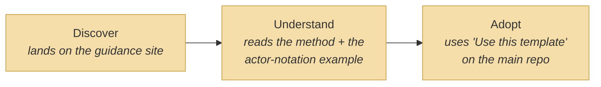

# Value Stream

_[← Strategy layer](./README.md) · [EA home](../README.md)_

**ArchiMate elements:** Value Stream, Value Stream Stage.

## Discover → Understand → Adopt

| Stage | Realized by |
| ----- | ----------- |
| Discover | [`site/index.html`](../../../site/index.html) — landing page, states the one rule and links onward |
| Understand | [`site/guide.html`](../../../site/guide.html) — the EA-first process and the human/AI/hybrid actor notation as reference — and [`site/walkthrough.html`](../../../site/walkthrough.html) — one requirement walked through the five layers end to end, plus the situational skills |
| Adopt | [`site/architecture.html`](../../../site/architecture.html) — this project's own filled EA layers, as the concrete "what it looks like when finished," plus a direct link to the parent template's "Use this template" flow |

This value stream is realized end to end by the
[EA-first method guidance](../2_business/README.md) business service.
