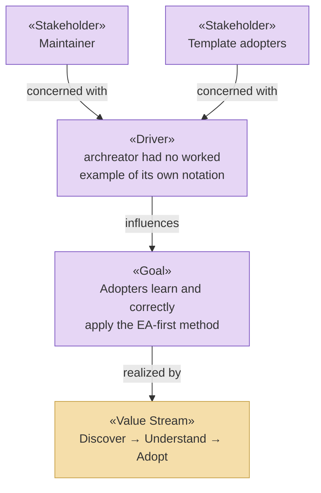

# Strategy & Motivation Layer

_[← EA home](../README.md)_

The top-down business context: who has a stake in this project, why it
exists, which capabilities it needs, and the value stream it delivers.

## Analysis order

| #   | Document                                                             | Elements                                                         | Question it answers                                |
| --- | ---------------------------------------------------------------------| ------------------------------------------------------------------ | ---------------------------------------------------- |
| 1   | [1_motivation.md](./1_motivation.md)                                 | Stakeholders, Drivers, Assessments, Goals, Outcomes, Principles | Who cares, what pressures them, what must be true?  |
| 2   | 2_capabilities-and-resources.md                                      | Capabilities, Resources, Courses of Action                      | What must we be able to do, and with what?          |
| 3   | [3_value-stream.md](./3_value-stream.md)                             | Value Stream and its stage mapping                               | How does value flow end-to-end?                     |

Document 2 is not written for this project — a guidance site is small
enough that its capabilities are fully implied by the value stream in
document 3; nothing here would say more than that. See the parent
template's application-layer README for the same "not every project needs
every numbered file" rule.

## Layer view

See [1_motivation.md](./1_motivation.md) for the Principles, and
[3_value-stream.md](./3_value-stream.md) for the stage-by-stage flow.
