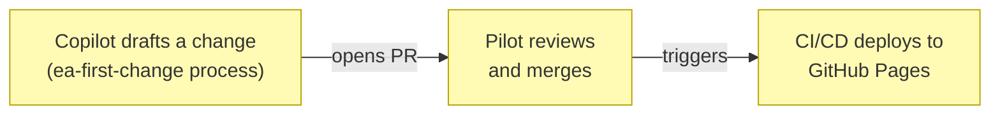

# Business Services

_[← Business layer](./README.md) · [EA home](../README.md)_

**ArchiMate elements:** Business Service, Business Process.

## EA-first method guidance

The service offered to template adopters: a browsable explanation of the
EA-first process and the human/AI/hybrid actor notation, kept current with
the parent template.

Realized by the **Publish guidance update** process:

- **Draft** — Copilot (see
  [1_business-actors-and-roles.md](./1_business-actors-and-roles.md))
  walks the EA layers for the requested change, updates the affected
  `docs/ea/` and `site/` files, and opens a PR — same process as any other
  change to this repository, per `ea-first-change`.
- **Review** — Pilot approves or requests changes. Nothing merges
  without this step (Principle P2,
  [1_strategy/1_motivation.md](../1_strategy/README.md)).
- **Deploy** — merging to `main` triggers
  [`deploy-example-site.yml`](../../../../.github/workflows/deploy-example-site.yml),
  which publishes [`site/`](../../../site/index.html) to GitHub Pages (see
  [5_technology/2_deployment.md](../5_technology/README.md)).

Realized by the [Guidance publishing](../4_application/README.md)
application service.
