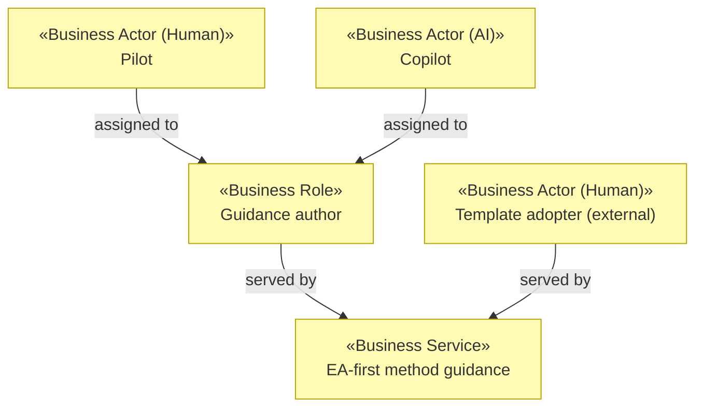

# Business Layer

_[← EA home](../README.md)_

Who interacts with the system, the service it offers them, and the process
that delivers it.

## Analysis order

| #   | Document                                                          | Elements                                           | Question it answers                              |
| --- | -------------------------------------------------------------------| ----------------------------------------------------- | --------------------------------------------------- |
| 1   | [1_business-actors-and-roles.md](./1_business-actors-and-roles.md) | Business Actors and Roles                          | Who interacts with the system?                    |
| 2   | [2_business-services.md](./2_business-services.md)                | Business Services                                  | What is offered to them?                          |
| 3   | 3_business-processes.md                                            | Business Processes                                 | How are those services delivered?                 |
| 4   | 4_business-objects.md                                              | Business Objects                                   | What things do the processes handle?              |
| 5   | 5_domain-context-and-rules.md                                      | Problem statement, system context, glossary, rules | What vocabulary and constraints bind everything?  |

Documents 3–5 are not written separately for this project — the single
process (draft → review → deploy) is small enough to describe inline in
[2_business-services.md](./2_business-services.md), and there is no
segregated-role access matrix or growing glossary that would justify a
standalone rules document yet.

## Layer view

Every business service here is realized by the
[Guidance publishing](../4_application/README.md) application service.
