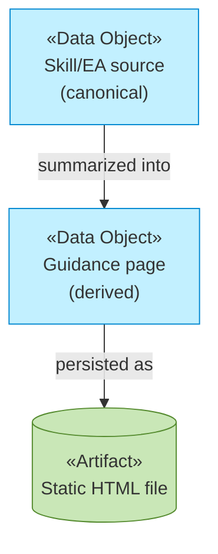

# Information Layer

_[← EA home](../README.md)_

The passive structure: the guidance content itself, and how it relates to
its canonical source.

## Analysis order

| #   | Document                                           | Elements                                              | Question it answers                                 |
| --- | ---------------------------------------------------| -------------------------------------------------------| ------------------------------------------------------ |
| 1   | [1_data-objects.md](./1_data-objects.md)           | Data Objects (domain types) and their code locations  | What information exists?                             |
| 2   | 2_data-flows.md                                    | Representations, persistence and flow relationships   | How does it move between representations?            |
| 3   | 3_data-architecture.md                             | Schema, classification, retention                     | Where does it live, how sensitive is it, how long?   |

Documents 2–3 are not written for this project: there is exactly one data
object with exactly one representation (a static HTML file, publicly
readable, no classification or retention concerns) — nothing that flow or
architecture documents would add.

## Layer view

See [1_data-objects.md](./1_data-objects.md).
