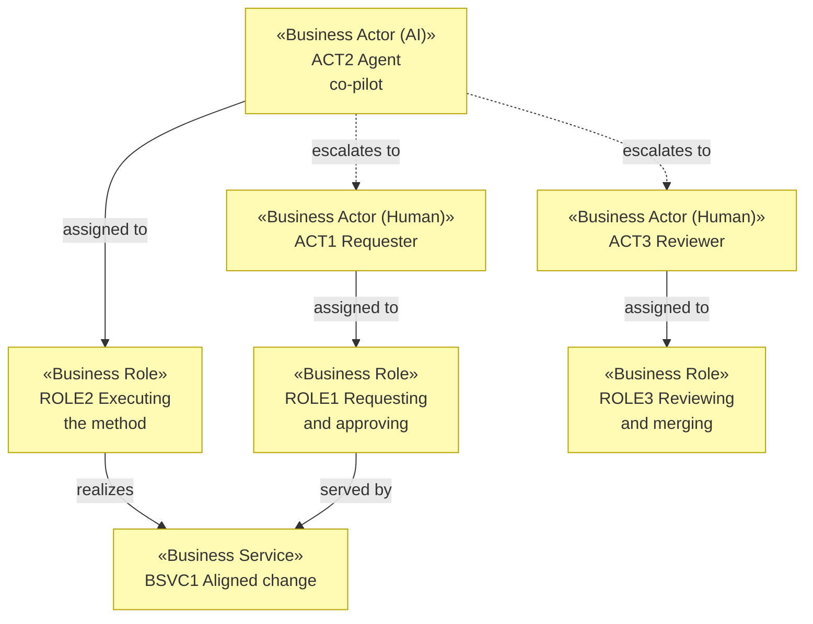

# Business Actors and Roles — archreator

_[← Business layer](./README.md) · [EA home](../README.md)_

**ArchiMate elements:** Business Actor, Business Role.

Three actors, one of them an AI. Per
[`ea-doc-style` § Actors](../../../.claude/skills/ea-doc-style/SKILL.md),
every AI actor carries an autonomy level, concrete decision rights, and a
named escalation path.

## Actors

| ID | Actor | Kind | Role | Autonomy level | Decision rights | Escalation path |
| -- | ----- | ---- | ---- | -------------- | --------------- | --------------- |
| `ACT1` | **Requester** | Human | `ROLE1` Requesting and approving | — (human) | Owns what gets built and why: approves at Gates 0–3, sets the modeling depth, and resolves conflicts with a Principle. The only actor who can approve a gate | — |
| `ACT2` | **Agent** | **AI** | `ROLE2` Executing the method | **Co-pilot** — walks the layers, drafts every document, implements, and opens the PR; nothing reaches `main` without `ACT3` merging it, and nothing is built before `ACT1` grants Gate 2 | May draft and edit any document under `docs/`, write code, choose an implementation approach within an approved design, declare a modeling depth, and open a PR. May **not** approve its own gate, merge, change a Principle, retire an element during restatement without `ACT1` confirming, or proceed past a Conflict verdict | **`ACT1` Requester** for anything that touches strategy, business, or a gate; **`ACT3` Reviewer** for anything in the diff |
| `ACT3` | **Reviewer** | Human | `ROLE3` Reviewing and merging | — (human) | Approves or rejects the PR, checks that the gates the change required are recorded, and merges. Often the same person as `ACT1` on a small project — but the roles stay distinct because the checks differ | — |

`ACT2` sits at **co-pilot** rather than autonomous-with-checkpoint for the
reason `P2` states: the consequence of a wrong architectural change is
absorbed by whoever maintains the project afterwards, and is not trivially
reversible once other work builds on it. A human gate before code and a
human merge after it are two independent checks, and the method keeps both.
Raising `ACT2`'s autonomy would be exactly the kind of call
[`decision-record`](../../../.claude/skills/decision-record/SKILL.md) exists
for.

## Roles

| ID | Role | Filled by | Covers |
| -- | ---- | --------- | ------ |
| `ROLE1` | Requesting and approving | `ACT1` (human) | Presenting a requirement or a problem; granting Gates 0–3 |
| `ROLE2` | Executing the method | `ACT2` (AI), or a person following the same steps | `ea-first-change` Steps 0–8 |
| `ROLE3` | Reviewing and merging | `ACT3` (human) | PR review, gate-record verification, merge |

`ROLE2` is deliberately written so a human can fill it unchanged. The
process does not branch on who or what is executing it — which is what makes
the AI actor a member of the organization rather than a tool bolted onto it.

## Actor view

