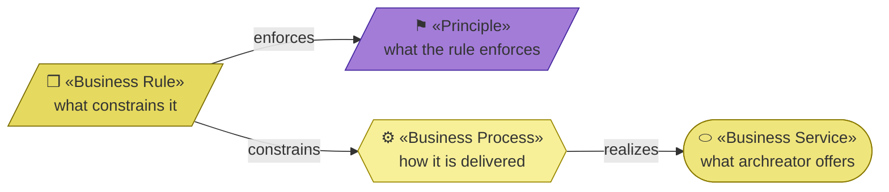
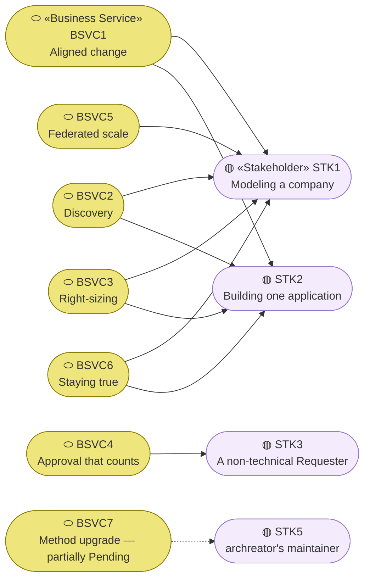
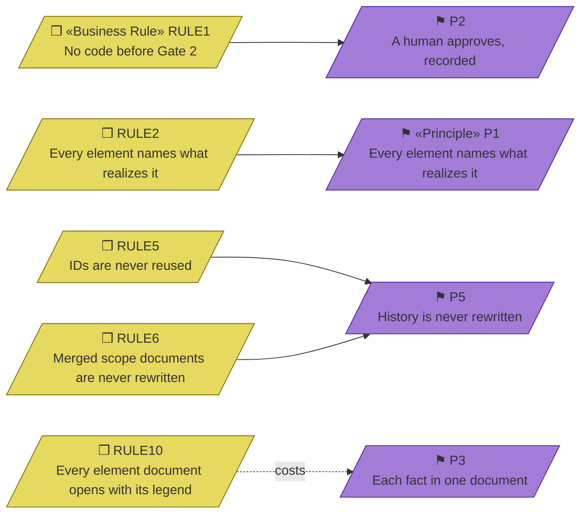

# Business Services and Rules — archreator

_[← Business layer](./README.md) · [EA home](../README.md)_

**ArchiMate elements:** Business Service, Business Process, Business Rule.

## How to read this document

| Glyph | Shape | Element | ID prefix | Reads as |
| ----- | ----- | ------- | --------- | -------- |
| `⬭` | Stadium | «Business Service» | `BSVC` | `BSVC1` = Business Service 1 |
| `❒` | Parallelogram | «Business Rule» | `RULE` | `RULE1` = Business Rule 1 |
| `⚙` | Hexagon | «Business Process» | `BPROC` | unnumbered here — the processes are steps of one flow |
| `⚑` | Parallelogram (violet) | «Principle» — context, from [layer 1](../1_strategy/1_motivation.md) | `P` | `P1` = Principle 1 |

**The glyph rides on every node; the «stereotype» word appears once.**

## Business services

Every edge reads **serves**. `BSVC5` reaches only `STK1` — federated scale
is the one service a single-application project never needs — and `BSVC7`'s
edge is dashed because no second version has shipped through the mechanism.

What archreator offers whoever adopts it. Each names the document or skill
that realizes it, per `P1`.

| ID | Service | Serves | Realized by |
| -- | ------- | ------ | ----------- |
| `BSVC1` | **Aligned change** — a requirement becomes a change that is consistent with everything already decided | `STK1`, `STK2` | [`ea-first-change`](../../../.claude/skills/ea-first-change/SKILL.md) |
| `BSVC2` | **Discovery** — an unstated strategy or business model becomes a documented one, by asking rather than assuming | `STK1`, `STK2` | [`operating-model-discovery`](../../../.claude/skills/operating-model-discovery/SKILL.md), [`strategy-discovery`](../../../.claude/skills/strategy-discovery/SKILL.md) |
| `BSVC3` | **Right-sizing** — the method costs what the subject is worth, and says which weight it picked | `STK1`, `STK2` | The depth ladder in [`docs/ea/README.md`](../../../docs/ea/README.md#modeling-depth); [`project-bootstrap`](../../../.claude/skills/project-bootstrap/SKILL.md) |
| `BSVC4` | **Approval that counts** — a business judgment is exercised by whoever holds it and survives in the record | `STK3` | `ea-first-change` § The gates and § Where a gate happens; the Approvals table in [`scope-doc`](../../../.claude/skills/scope-doc/SKILL.md) |
| `BSVC5` | **Federated scale** — a business line is modeled on its own terms without being flattened into the enterprise | `STK1` | [`domain-modeling`](../../../.claude/skills/domain-modeling/SKILL.md); [`docs/ea/domains/`](../../../docs/ea/domains/README.md) |
| `BSVC6` | **Staying true** — the model keeps describing today rather than accumulating into an archive | `STK1`, `STK2` | [`restate-current-state`](../../../.claude/skills/restate-current-state/SKILL.md) |
| `BSVC7` | **Method upgrade** — an improvement to the method reaches an existing project without a migration | `STK5` | The plugin manifest at `.claude/.claude-plugin/plugin.json`; **partially Pending** — the mechanism exists, no second version has shipped through it yet |

## Business rules

Solid edges read **enforces**. `RULE10`'s edge is dashed and points the other
way: it is the one rule that **costs** a principle rather than serving one,
and the table below says why that is accepted. Five of the ten rules are
shown; the rest follow the same pattern.

The rules that constrain how the services are delivered. Each traces to the
principle it enforces.

| ID | Rule | Enforces | Where it bites |
| -- | ---- | -------- | -------------- |
| `RULE1` | No code is written before the Requester grants Gate 2 | `P2` | `ea-first-change` Step 4 |
| `RULE2` | Every EA element names its realizing artifact, or is explicitly "Pending — future initiative" | `P1` | `ea-doc-style` § Grounding rule; `ea-first-change` Step 7. Carried by **review**, not tooling — see `ACMP13` |
| `RULE3` | Every layer gets an explicit verdict in a scope document, including "no change" | `P2` | `scope-doc` § Rules |
| `RULE4` | An approval that isn't recorded didn't happen; a gate that didn't apply is written `N/A — <why>` rather than deleted | `P2` | The Approvals table |
| `RULE5` | An element ID is assigned once and never reused, even after the element is retired | `P5` | `ea-doc-style` § Element IDs; `restate-current-state`. Enforced in CI by `ACMP15` |
| `RULE6` | A merged scope document is never rewritten — follow-up work gets a new numbered document | `P5` | `scope-doc`; `restate-current-state` § The one rule |
| `RULE7` | A change that contradicts an existing Principle stops and goes back to the Requester | `P2` | `ea-first-change` Step 1c, Conflict verdict |
| `RULE8` | Changing a domain's exposed service requires the consuming domains' Requesters at Gate 2 | `P2` | `domain-modeling` § Cross-domain changes |
| `RULE9` | A skill links only within `.claude/skills/`; it names a project's documents in code spans | `P3` | `ea-doc-style` § Links. Added when packaging as a plugin made outbound links resolve to nothing |
| `RULE10` | Every EA document **that carries elements** opens with its own notation legend, and every section that has a diagram opens with it | **none — it costs `P3`** | `ea-doc-style` § Diagrams come first; `docs/ea/README.md` § Notation conventions. The per-document legend is a deliberate, bounded copy of the global notation — duplication `P3` would normally forbid — accepted because these documents are read one at a time and out of order, by people and agents who will not open a second file. Narrowed to element documents when the rule was first applied at scale: a layer README that only indexes other documents has no elements to legend, and giving it one would be ceremony. Carried by **review**; nothing checks that a diagram was drawn |

## The process, in one view

```mermaid
flowchart LR
  req(["Requirement or problem"]):::start
  depth{{"⚙ «Business Process»<br>Confirm depth, locate domain"}}:::process
  align{{"⚙ Align layers 1–3"}}:::process
  gate[/"❒ RULE1<br>Gate 2 granted?"/]:::rule
  build{{"⚙ Align 4–5, implement"}}:::process
  verify{{"⚙ Verify RULE2, open PR"}}:::process
  merged(["Merged"]):::start

  req --> depth --> align --> gate
  gate -- no --> align
  gate -- yes --> build --> verify --> merged

  classDef start fill:#fffbb5,stroke:#b8a200,color:#333
  classDef process fill:#f7f099,stroke:#9a8800,color:#333
  classDef rule fill:#e5d95f,stroke:#7a6c00,color:#333
```

The full version, including the discovery branches and all four gates, is
the process flow in [CONTRIBUTING.md](../../../CONTRIBUTING.md) — not
restated here, per `P3`.
