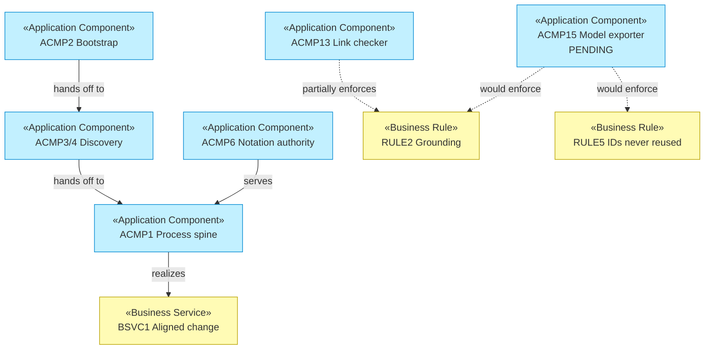

# Application Components — archreator

_[← Application layer](./README.md) · [EA home](../README.md)_

**ArchiMate elements:** Application Component, Application Service.

Every row names its file, per `P1`. This table is the grounding rule applied
to archreator itself: if a skill listed here doesn't exist at the path
given, the model is wrong and CI should have caught it.

## Components

| ID | Component | Realizes | File |
| -- | --------- | -------- | ---- |
| `ACMP1` | Process spine | `BSVC1` | [`.claude/skills/ea-first-change/SKILL.md`](../../../.claude/skills/ea-first-change/SKILL.md) |
| `ACMP2` | Bootstrap | `BSVC3` | [`.claude/skills/project-bootstrap/SKILL.md`](../../../.claude/skills/project-bootstrap/SKILL.md) |
| `ACMP3` | Operating-model discovery | `BSVC2` | [`.claude/skills/operating-model-discovery/SKILL.md`](../../../.claude/skills/operating-model-discovery/SKILL.md) |
| `ACMP4` | Strategy discovery | `BSVC2` | [`.claude/skills/strategy-discovery/SKILL.md`](../../../.claude/skills/strategy-discovery/SKILL.md) |
| `ACMP5` | Domain modeling | `BSVC5` | [`.claude/skills/domain-modeling/SKILL.md`](../../../.claude/skills/domain-modeling/SKILL.md) |
| `ACMP6` | Notation authority | `RULE2`, `RULE5`, `RULE9` | [`.claude/skills/ea-doc-style/SKILL.md`](../../../.claude/skills/ea-doc-style/SKILL.md) |
| `ACMP7` | Scope document authoring | `BSVC4`, `RULE3`, `RULE4` | [`.claude/skills/scope-doc/SKILL.md`](../../../.claude/skills/scope-doc/SKILL.md) |
| `ACMP8` | Restatement | `BSVC6` | [`.claude/skills/restate-current-state/SKILL.md`](../../../.claude/skills/restate-current-state/SKILL.md) |
| `ACMP9` | Decision records | — (supports `BSVC1`) | [`.claude/skills/decision-record/SKILL.md`](../../../.claude/skills/decision-record/SKILL.md) |
| `ACMP10` | Story sharding | — (supports `BSVC1`) | [`.claude/skills/story-sharding/SKILL.md`](../../../.claude/skills/story-sharding/SKILL.md) |
| `ACMP11` | Stack selection | — (supports `BSVC1`) | [`.claude/skills/stack-selection/SKILL.md`](../../../.claude/skills/stack-selection/SKILL.md) |
| `ACMP12` | PR authoring | — (supports `BSVC1`) | [`.claude/skills/pr-description/SKILL.md`](../../../.claude/skills/pr-description/SKILL.md) |
| `ACMP13` | Link checker | `RULE2` (partially — it checks links, not element references) | [`scripts/check_links.py`](../../../scripts/check_links.py) |
| `ACMP14` | Plugin package | `BSVC7` | [`.claude/.claude-plugin/plugin.json`](../../../.claude/.claude-plugin/plugin.json), [`.claude-plugin/marketplace.json`](../../../.claude-plugin/marketplace.json) |
| `ACMP15` | Model exporter — the `nodes`/`edges` projection and dangling-ID validator | `RULE5` fully, `RULE2` fully | **Pending — future initiative.** Designed in [`stack-selection`](../../../.claude/skills/stack-selection/SKILL.md) § The model as data; nothing built |

## The gap this table makes obvious

`ACMP13` realizes `RULE2` only *partially*, and `RULE5` is enforced by
nothing at all. The link checker verifies that a link resolves to a file; no
component verifies that `PAIN2` resolves to an element, or that a retired ID
was never reused. `ACMP15` is the component that would close both, and it
does not exist.

That is the single largest gap in archreator's own architecture, and putting
it in this table rather than in prose is the point — a Pending row with two
rules pointing at it is harder to forget than a paragraph in a backlog.

## Interface

Every skill component exposes the same interface: a `description:` line in
its `SKILL.md` frontmatter, which Claude Code matches against the situation
rather than against a command name. That is `P4` made concrete — the caller
does not name the component, it describes the problem.

The consequence is that a skill's description **is** its contract, and a
badly-scoped description is a defect even when the body is perfect: the
component never gets invoked. This is how `ACMP10` came to be effectively
dead code for ten pull requests — its description was accurate and no other
component pointed at it, so nothing ever reached it.

## Component view

