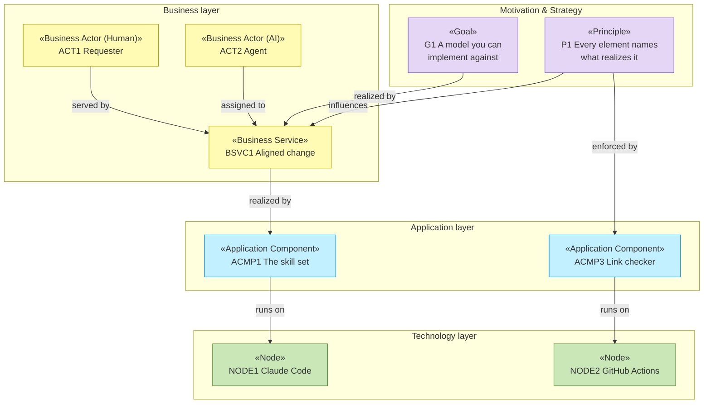

# Enterprise Architecture — archreator itself

_[← meta index](../README.md) · [Scope documents](../scope/README.md)_

The current-state model of **archreator, the method** — modeled with the
method. This is the dogfood: if the process is worth asking a downstream
project to follow, it has to survive being pointed at its own author.

**Modeling depth: 1 — Application.** The subject is one thing that gets
built (a documented method plus the skills that operationalize it), not an
organization. So `0_business-design/` is not used, the strategy layer stays
light — goals and principles, enough to judge a change against — and
`domains/` is not used.

Every element is grounded. archreator has almost no executable code, so
"grounded" here usually means naming the **markdown document or skill file**
that realizes an element, and occasionally a script or a workflow.

## Why this lives in `meta/` and not `docs/`

`docs/ea/` is the **blank scaffold a cloner receives**. Filling it in with
archreator's own architecture would hand every new project someone else's
stakeholders on day one, and the template would stop being a template. So
archreator's own model lives here, alongside its own scope documents,
decisions, and open questions.

The rule: **`docs/` is what you get; `meta/` is what archreator did to
itself.** A change to the method gets a scope document in
[`meta/scope/`](../scope/README.md). A change to a project *built from*
archreator gets one in that project's own `docs/scope/`.

## Layers, in assessment order

| # | Layer | ArchiMate viewpoint | State |
| - | ----- | ------------------- | ----- |
| 0 | `0_business-design/` | _none — business design input_ | **Not used** — Depth 1. archreator is not modeling an organization |
| 1 | [1_strategy/](./1_strategy/README.md) | Motivation + Strategy | **Filled** — stakeholders, drivers, goals, and the principles that gate every change to the method |
| 2 | [2_business/](./2_business/README.md) | Business layer | **Filled** — the three process actors, the services the method offers, and the gates as business rules |
| 3 | `3_information/` | Passive structure (data) | **Not started** — the model is markdown in git; there is no data architecture yet. The graph exporter would create one |
| 4 | [4_application/](./4_application/README.md) | Application layer | **Filled** — the twelve skills as components, the plugin, and the link checker |
| 5 | [5_technology/](./5_technology/README.md) | Technology layer | **Filled** — markdown, git, Claude Code, GitHub Actions, GitHub Pages |
| — | `domains/` | _the same layers, nested_ | **Not used** — Depth 1 |

Layers 0, 3, and `domains/` are named without links because they do not
exist. That is the expected shape at Depth 1, and saying so is the rule the
depth ladder asks for: an unfilled layer is a known gap, a missing folder is
an unknown one.

## Notation conventions

This model follows the template's conventions rather than restating them —
stereotypes, the layer palette, relationship labels, the human/AI/hybrid
actor notation, and element IDs all live in
[the template's EA README](../../docs/ea/README.md#notation-conventions) and
the `ea-doc-style` skill.

## Layered overview

## Reading order

[1_strategy/1_motivation.md](./1_strategy/README.md) →
[2_business/README.md](./2_business/README.md) →
[4_application/README.md](./4_application/README.md) →
[5_technology/README.md](./5_technology/README.md).
