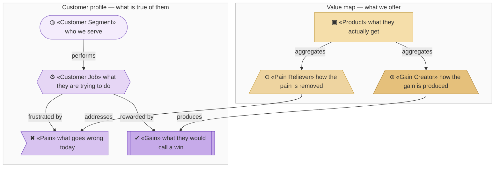
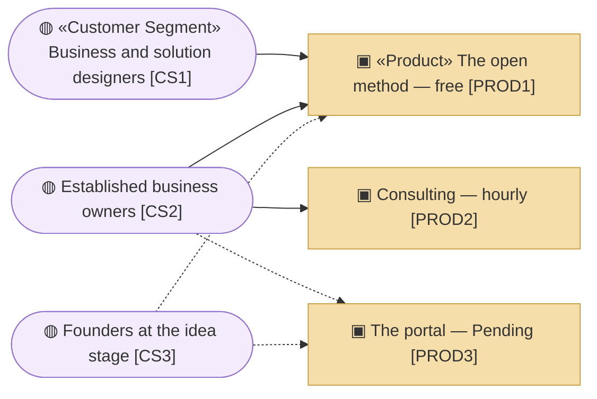
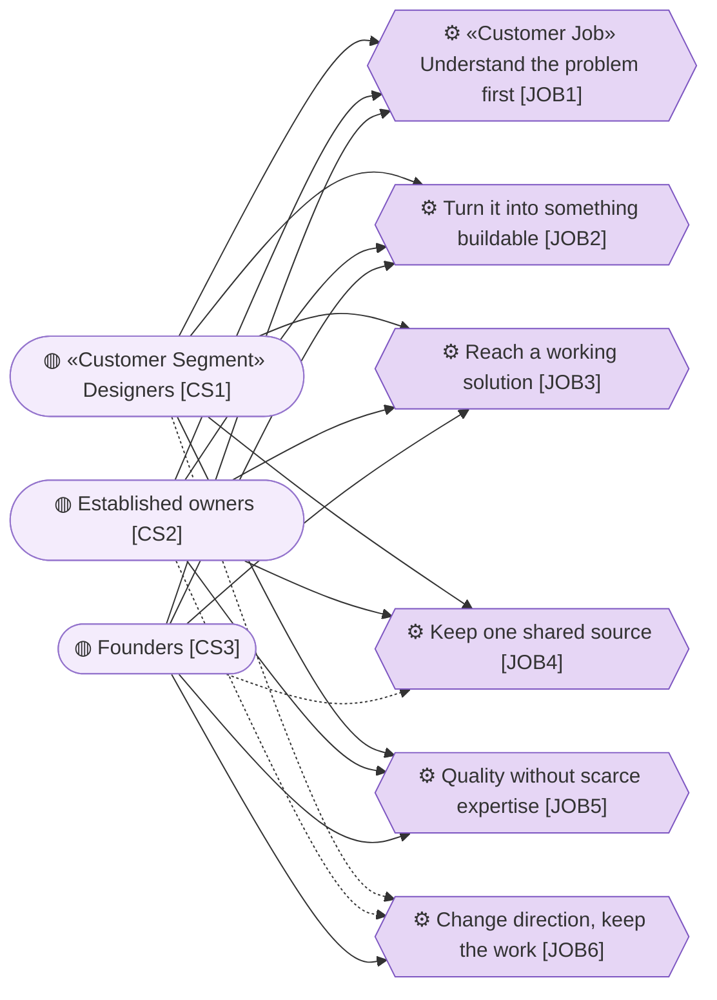
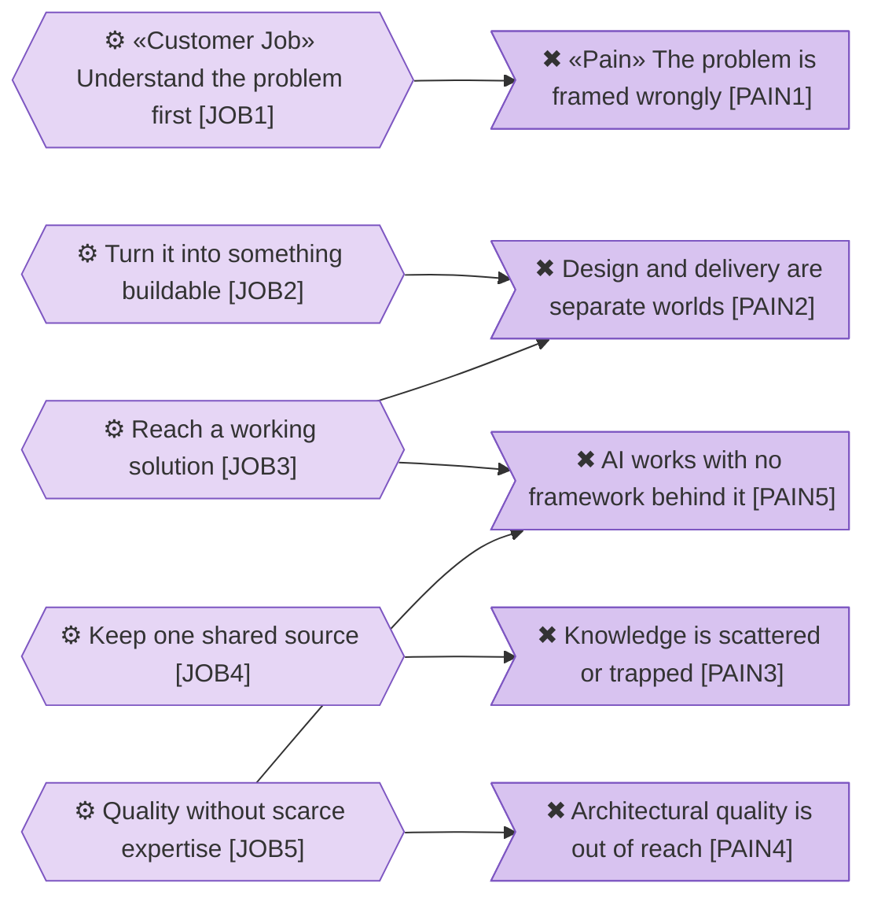
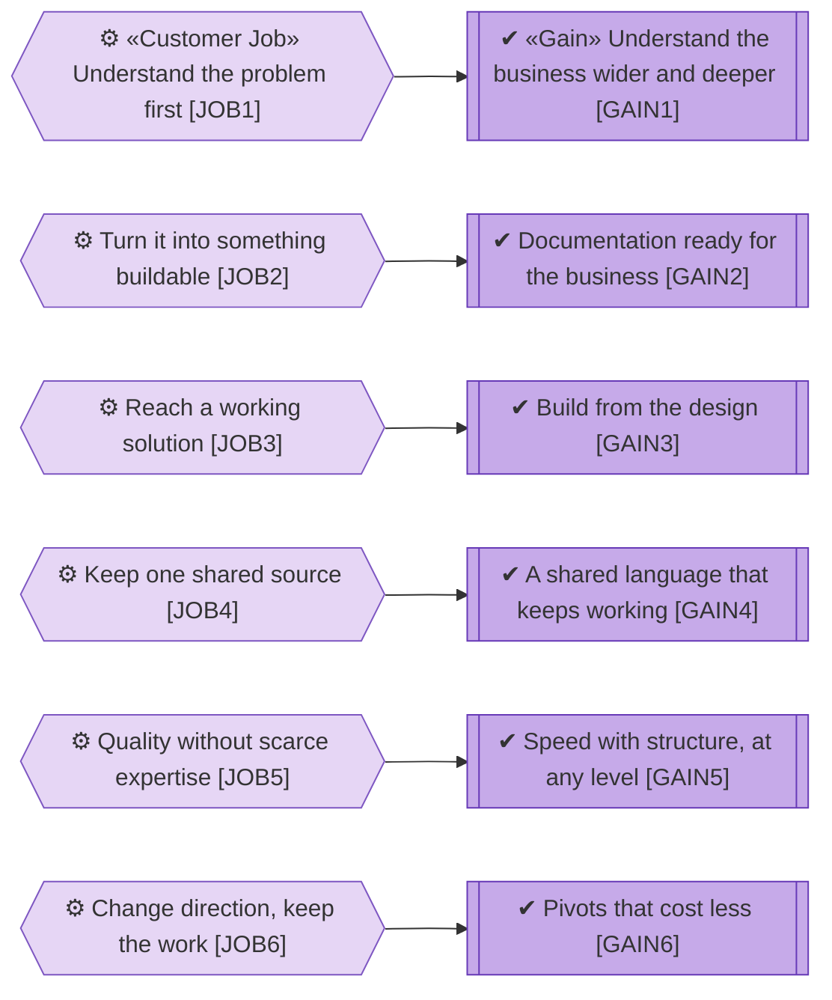
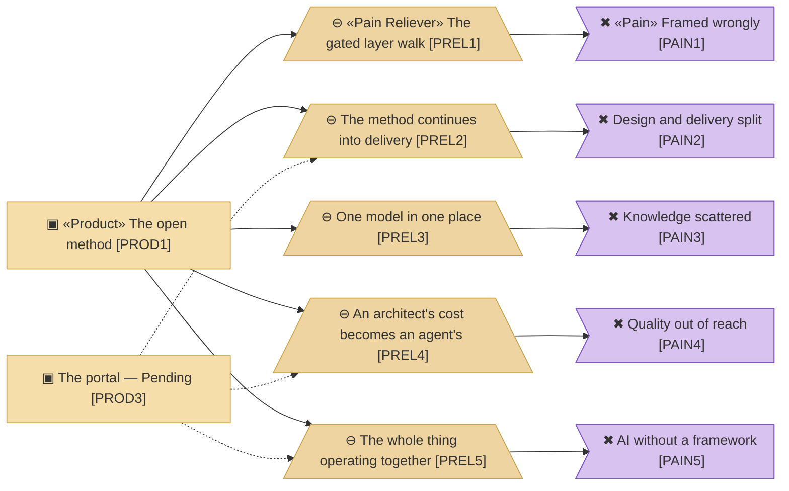

# Value Proposition Canvas

_[← Business design](./README.md) · [EA home](../README.md)_

**Strategyzer artifact, not ArchiMate.** Layers 1 and 2 are *derived* from
this after **Gate 0**.

**Status: approved at Gate 0 on 2026-08-08**, and derived into
[the strategy layer](../1_strategy/README.md) and
[the business layer](../2_business/README.md).

> **Element IDs were renumbered once, here, before any approval.** The first
> draft carried 36 elements across three separate profiles; consolidating
> them reassigned the identifiers. This is allowed only because nothing had
> been approved yet. After Gate 0 the IDs are fixed and never reused.

## How to read this document

**A canvas is two halves that have to meet.** The left is a claim about the
customer and is true or false regardless of what this organization does. The
right is what it offers. The edges between them are the **fit**, and a canvas
with a pain no reliever reaches is not a documentation gap — it is a customer
decision nobody made out loud.

| Glyph | Element | ID prefix | Reads as |
| ----- | ------- | --------- | -------- |
| `◍` | «Customer Segment» | `CS` | `CS1` = Customer Segment 1 |
| `⚙` | «Customer Job» | `JOB` | `JOB1` = Job 1 |
| `✖` | «Pain» | `PAIN` | `PAIN1` = Pain 1 |
| `✔` | «Gain» | `GAIN` | `GAIN1` = Gain 1 |
| `▣` | «Product» | `PROD` | `PROD1` = Product 1 |
| `⊖` | «Pain Reliever» — it subtracts | `PREL` | `PREL1` = Pain Reliever 1 |
| `⊕` | «Gain Creator» — it adds | `GCRE` | `GCRE1` = Gain Creator 1 |

**These are Strategyzer blocks, not ArchiMate elements.** They are drawn in
the Motivation violet and the Strategy sand because that is where they land
once [layer 1](../1_strategy/README.md) derives them — the customer profile
becomes motivation, the value map becomes strategy.

**The glyph rides on every node; the «stereotype» word appears once** — on the
first node of each type in a diagram, dropped on the rest.

## Segments

Solid edges are served today; dashed ones are served badly or not yet.
**`CS3` has no solid edge to anything but the free method**, and reaches that
only by driving a coding agent — which is the honest statement of who this
organization currently serves.

| ID | Customer segment | Pays | Uses | Decides |
| --- | --- | --- | --- | --- |
| `CS1` | **Customer Segment 1 — Business and solution designers.** Enterprise architects at any level, business analysts, entrepreneurs acting as their own designer | Nothing today | ✅ | On their own projects |
| `CS2` | **Customer Segment 2 — Established business owners.** A running company with real operational knowledge, but no structure or shared language a builder can act on | ✅ Consulting hours today | Target state | ✅ |
| `CS3` | **Customer Segment 3 — Founders at the idea stage.** Pre-operational: the business model is still forming, nothing is running yet | Rarely — most price-sensitive | Target state | ✅ |

`CS1` is what the project is built around, and who would notice first if it
stopped. `CS2` and `CS3` are where the target-state service is aimed: owners
who want to build **by themselves**, with small businesses and startups named
as the key target.

**One merged role, not two.** "Business and solution designers" is a single
role. Today the two ends are split — designers do not deliver, and builders
do not understand the business — and closing that split is the point. The
segment is named for the role the method creates.

**Why `CS2` and `CS3` are separate.** Both are owners, but their first
contact with the product differs. `CS2` has documents and operational
knowledge to feed in, so a draft architecture can be generated from what
already exists. `CS3` has less to feed — an idea, maybe a canvas, some early
notes — so more has to be drawn out through questions. Same destination,
different starting point.

**Split by business stage, not by how they buy.** An owner who commissions a
designer today and self-serves tomorrow is one person at two moments. That
is a channel and relationship difference, and it belongs in the business
model canvas.

## Jobs to be done

One catalogue, shared. The column marks how central each job is to each
segment.

Solid edges are **Core** for that segment; dashed are **Secondary**. Four of
the six jobs are core to all three segments, which is the finding that let one
consolidated profile replace three separate ones.

| ID | Job | `CS1` | `CS2` | `CS3` |
| --- | --- | --- | --- | --- |
| `JOB1` | **Understand the problem before answering it.** Solutions rarely fail because they were technically hard; they fail because the problem was misunderstood. Designing *is* how the understanding happens | Core | Core | Core |
| `JOB2` | **Turn that understanding into something a builder can act on** — increasingly an AI builder | Core | Core | Core |
| `JOB3` | **Get from an approved design to a working solution** — by building it, or by finding a builder and directing them well. AI increasingly mediates either path | Core — builds it | Core — directs a builder | Core — directs a builder |
| `JOB4` | **Keep one shared source others can work from**, so the same explanation is not repeated to every new person | Core | Core | Secondary |
| `JOB5` | **Get architectural quality without scarce expertise** — without years of seniority, and without hiring someone expensive | Core | Core | Core |
| `JOB6` | **Change direction without losing the work already designed** | Secondary | Secondary | Core |

`JOB1` is the counter-intuitive one, and the Requester was emphatic: owners
arrive believing they know their business and often frame it wrongly — naming
the wrong customer segments, for instance. The architecture is not a record
of a strategy already known. It is how the strategy gets tested.

`JOB3` is one job with two ways of being done. A designer reaches the far
end themselves. An owner usually gets there through a builder — so their
version of the job is **finding an implementer and communicating well enough
to get what they meant**, which is where the design earns its keep as the
medium of that communication. Building it personally is a minority path,
suiting small initiatives and technically-minded founders. The outcome
wanted is the same either way, which is why it is one job and not two.

## Pains

Every edge reads **frustrated by**. `PAIN2` and `PAIN5` each block two jobs,
which is why they are the two the method is built around.

| ID | Pain | `CS1` | `CS2` | `CS3` |
| --- | --- | --- | --- | --- |
| `PAIN1` | **The problem is framed wrongly, and nobody finds out until late.** Without a method that forces a complete frame, blind spots stay invisible | Unacceptable | Unacceptable | Serious |
| `PAIN2` | **Design and delivery are separate worlds.** Designers do not build; builders do not understand the business. Information changes shape at every handover, documentation that drives nothing is a cost rather than an asset, and there is no path from a business model canvas to implementation. The visible cost is time to market | Unacceptable | Unacceptable | Unacceptable |
| `PAIN3` | **Knowledge is scattered, stale, or trapped in one person's head.** Documents, meetings, diagrams, wikis, spreadsheets — and when a builder leaves, the owner explains it all again to the next one | Unacceptable | Unacceptable | Unacceptable |
| `PAIN4` | **Architectural quality is out of reach.** An enterprise architect is too expensive for this segment, and doing it yourself takes years of accumulated experience | Serious | Unacceptable | Unacceptable |
| `PAIN5` | **AI already does most of this work, but in isolation, with no framework behind it.** The person is the framework, holding it together by hand | Unacceptable | Serious | Serious |

`PAIN5` is the load-bearing one. The other four are decades old. What is new
is that the tooling to relieve them exists and has nothing connecting it.

`PAIN2` absorbs several symptoms that were separate in the first draft —
slow delivery, useless documentation, and the missing path past the canvas.
They are one pain seen from three positions, and splitting them hid that.

**No pain is deliberately unserved.** The fit rule requires saying so
explicitly: every pain above is targeted.

## Gains

Every edge reads **rewarded by**. One gain per job, which is what a
consolidated profile looks like when it is working: no job wants two
unrelated wins, and no gain is floating free of a job.

| ID | Gain | Kind | Ranked first by |
| --- | --- | --- | --- |
| `GAIN1` | **Understand the business wider and deeper**, with strategic and business gaps surfacing *during* the work rather than after it | Required | `CS2` |
| `GAIN2` | **Documentation ready to put in front of the business**, without a rewrite — diagrams over walls of text, because prose is not friendly to humans | Expected | — |
| `GAIN3` | **Build from the design.** The design is the input to delivery, with AI doing the technical work, so the designer leads implementation instead of handing it off | Delight | `CS1` |
| `GAIN4` | **A shared language that keeps working** as people join and leave, holding delivery outcomes together | Expected | `CS2` (second) |
| `GAIN5` | **Speed with structure, at any level of experience.** Competence comes from the method rather than from seniority or budget | Required | `CS1` |
| `GAIN6` | **Pivots that cost less**, because the design survives the change instead of being redone | Expected | `CS3` |

## Value map

### Products

One product per economic model, as a customer would name it.

| ID | Product | For | Price |
| --- | --- | --- | --- |
| `PROD1` | **archreator, the open method** — the skills, the documentation, the guidance site | `CS1` primarily | Free, open source |
| `PROD2` | **Consulting** — the Requester's time, delivering with archreator | `CS2` | Hourly |
| `PROD3` | **The archreator portal** — enterprise architecture as a service. **Pending — target state** | `CS2`, `CS3` | One-off payment: the cost of running the agents, plus a small product fee |

`PROD3` is **one product**, not one per segment. `CS2` and `CS3` differ in
how much they have to feed it, not in what they buy.

### Pain relievers

| ID | Pain reliever | Relieves | Realized by |
| --- | --- | --- | --- |
| `PREL1` | **The gated layer walk.** Approval gates force a complete frame before anything is built, so a misframed problem surfaces at the gate rather than at delivery | `PAIN1` | `PROD1` — the `architecture-first-change` skill and the gates |
| `PREL2` | **The method continues past design into delivery.** The design is what an agent builds from, so there is no handover for information to change shape in | `PAIN2` | `PROD1`, `PROD3` |
| `PREL3` | **One model in one place** — markdown in git, catalogues and diagrams, every element naming what realizes it | `PAIN3` | `PROD1` |
| `PREL4` | **The cost of an architect collapses to the cost of an agent.** With a coding agent, the price is a subscription instead of consultancy hours; through the portal, a one-off payment that is faster and cheaper than hiring, and the owner stays on top of it | `PAIN4` | `PROD1` with a coding agent; `PROD3` |
| `PREL5` | **The whole thing operating together** — skills that hold the methodology, gates that keep a human giving feedback, and a design that the solution is built from. An enterprise-architecture framework extended into solution delivery | `PAIN5` | `PROD1`, `PROD3` |

`PREL5` is what archreator essentially *is*. Not the notation, and not the
skills alone — the parts working as one thing.

### Gain creators

| ID | Gain creator | Produces | Realized by |
| --- | --- | --- | --- |
| `GCRE1` | Question-driven discovery that tests the business rather than recording it | `GAIN1` | `PROD1`, `PROD3` |
| `GCRE2` | Markdown and diagrams as first-class output, written for people | `GAIN2` | `PROD1` |
| `GCRE3` | Skills that turn an approved design into implementation work | `GAIN3` | `PROD1` |
| `GCRE4` | **Standardised concepts with defined relationships** — ArchiMate as the shared vocabulary | `GAIN4` | `PROD1` |
| `GCRE5` | The method carries the competence, so experience level stops being the gate | `GAIN5` | `PROD1`, `PROD3` |
| `GCRE6` | The layered model: strategy can change without redoing technology, and the reverse | `GAIN6` | `PROD1` |

### Better language, not simpler language

`GCRE4` needs stating carefully, because the earlier draft got it wrong.

The value for owners is **better** language — less confusing, standardised
concepts, defined relationships. Not *simpler* language. "Simpler" would mean
hiding the model from them. "Better" means the standardisation itself is the
value: an owner understands their business more completely **because** the
method forced a frame, not despite it. That is what makes `JOB1` and `GAIN1`
possible at all.

## Fit check

Product edges read **aggregates**; reliever edges read **addresses**. Every
pain is reached, which is the rule. What the diagram adds to the table below
is **where the reach is thin**: `PREL2` and `PREL4` are the two relievers
`PROD3` would strengthen, and `PROD3` does not exist — so the dashed edges
are the fit that is claimed rather than delivered.

Every pain has at least one reliever, and every gain has at least one
creator:

| Pain | Reliever | Gain | Creator |
| --- | --- | --- | --- |
| `PAIN1` | `PREL1` | `GAIN1` | `GCRE1` |
| `PAIN2` | `PREL2` | `GAIN2` | `GCRE2` |
| `PAIN3` | `PREL3` | `GAIN3` | `GCRE3` |
| `PAIN4` | `PREL4` | `GAIN4` | `GCRE4` |
| `PAIN5` | `PREL5` | `GAIN5` | `GCRE5` |
| | | `GAIN6` | `GCRE6` |

**Where the fit is weaker than it looks.** `PREL4` and much of `PREL2` lean
on `PROD3`, which does not exist yet. Until it does, `CS2` and `CS3` are
served through `PROD1` and a coding agent.

That is a matter of degree rather than a wall. Someone without a paid AI
subscription can still use the method: they get less thinking capacity, less
coverage in one pass, and shorter usage limits, so the same work takes more
sittings. There is no hard blocker. `PROD3` mainly removes that friction and
the need to drive an agent at all.

## Resolved during discovery

| # | Question | Answer |
| - | -------- | ------ |
| 1 | Does the target-state service serve `CS1` paying, or `CS2` directly? | `CS2` and `CS3` directly. That is where the greatest value is |
| 2 | Is "non-profit" a decided posture? | Yes, and durable. Even at scale, the intent is not to charge much beyond operational cost |
| 3 | Is the portal one product or two? | **One.** `CS2` and `CS3` differ in what they feed it, not in what they buy |
| 4 | Is structured natural language the product or a reliever? | A **reliever**. The product is that interface *plus running it* to deliver outcomes |
