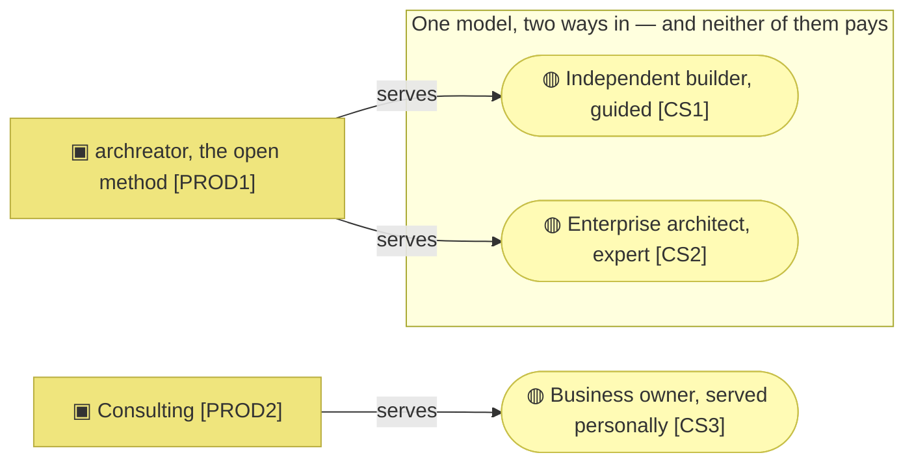
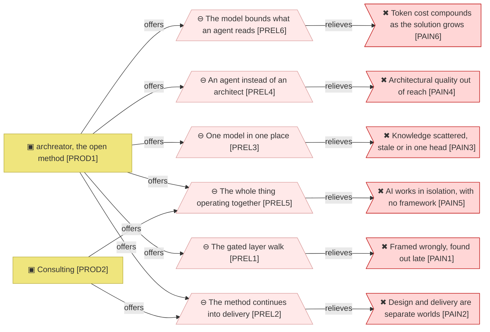
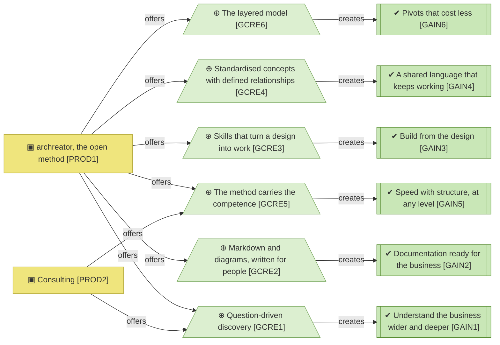

# Value proposition canvas

_[← Business design](./README.md) · [Front door](../README.md)_

Who the organization serves, what they are trying to get done, what hurts,
what would delight them, and what the organization offers against each.

**ArchiMate viewpoint:** none; a Strategyzer Value Proposition Canvas, one per
customer segment.

**Status:** ◐ Draft catalogue, not yet approved at Direction.

## Segments

The method serves two different customers over one model with two ways in:
guided use for the builder, direct navigation for the architect. The product
with two segments earns nothing from either; the one that earns has a single
segment and a single person behind it.

| ID | Segment | How they arrive | Pays |
| -- | ------- | --------------- | ---- |
| `CS1` | **Independent builder.** Builds something real, such as an app, a tool or a business, with a coding agent and no architecture background. The primary guided customer: they explain the business and get only the architecture they need | Finds the method as code or through the site, installs it, uses it on their own project | Nothing; the free tier by design |
| `CS2` | **Enterprise architect.** Architects, business analysts and solution designers who know the discipline. The first-class expert customer: they navigate the standard layered structure directly and use the agent as leverage, not as a doorway | Same channels as `CS1`, already fluent | Nothing |
| `CS3` | **Business owner.** A company with real operational knowledge and no structure a builder can act on, running today or still at the idea stage. The stage changes the price sensitivity, not the segment | Referral and direct approach; served personally by the Requester | Consulting hours |

`CS1` and `CS2` will never pay, and the method is written for them. They
adopt it, exercise it on real problems and are the only plausible source of
the feedback the method improves from. They are not a funnel to a paid tier.

## Jobs to be done

| ID | Job | `CS1` | `CS2` | `CS3` |
| -- | --- | ----- | ----- | ----- |
| `JOB1` | **Understand the problem before answering it.** Solutions rarely fail because they were technically hard; they fail because the problem was misunderstood, and designing is how the understanding happens | Core | Core | Core |
| `JOB2` | **Turn that understanding into a delivered solution**, by building it with an agent or by directing a builder well | Core, builds it | Core, directs and builds | Core, directs a builder |
| `JOB3` | **Keep one shared source others can work from**, so the same explanation is not repeated to every new person or agent | Core | Core | Core |
| `JOB4` | **Get architectural quality without scarce expertise**: without years of seniority and without hiring someone expensive | Core | Secondary; they are the expertise and want their time back | Core |
| `JOB5` | **Change direction without losing the work already designed** | Secondary | Secondary | Core |

## Pains

| ID | Pain | `CS1` | `CS2` | `CS3` |
| -- | ---- | ----- | ----- | ----- |
| `PAIN1` | **The problem is framed wrongly, and nobody finds out until late.** Without a method that forces a complete frame, blind spots stay invisible | Unacceptable | Serious | Unacceptable |
| `PAIN2` | **Design and delivery are separate worlds.** Meaning changes shape at every handover, documentation that drives nothing is a cost, and time to market pays for it | Unacceptable | Unacceptable | Unacceptable |
| `PAIN3` | **Knowledge is scattered, stale, or trapped in one person's head**. When a builder leaves, the owner explains it all again | Unacceptable | Unacceptable | Unacceptable |
| `PAIN4` | **Architectural quality is out of reach**. An architect costs more than these segments can justify, and doing it yourself takes years | Unacceptable | — | Unacceptable |
| `PAIN5` | **AI already does most of this work, but in isolation, with no framework behind it.** The person is the framework, holding it together by hand | Unacceptable | Unacceptable | Serious |
| `PAIN6` | **Token cost compounds as the solution grows.** Building without an architecture is cheap on day one; maintaining is not, because the agent traverses the entire project looking for answers to every question | Unacceptable | Serious | Serious |

## Gains

| ID | Gain | Level | Strongest for |
| -- | ---- | ----- | ------------- |
| `GAIN1` | **Understand the business wider and deeper**, with strategic and business gaps surfacing during the work rather than after it | Required | segment `CS3` |
| `GAIN2` | **Documentation ready to put in front of the business** without a rewrite: diagrams over walls of text | Expected | segment `CS2` |
| `GAIN3` | **Build from the design**. The design is the input to delivery, with AI doing the technical work | Delight | segment `CS1` |
| `GAIN4` | **A shared language that keeps working** as people and agents join and leave | Expected | segment `CS2` |
| `GAIN5` | **Speed with structure, at any level of experience**. Competence comes from the method rather than from seniority or budget | Required | segment `CS1` |
| `GAIN6` | **Pivots that cost less**, because the design survives the change instead of being redone | Expected | segment `CS3` |

## Value map

### Products

| ID | Product | For | Price | State |
| -- | ------- | --- | ----- | ----- |
| `PROD1` | **archreator, the open method**: the skills, the scaffold, the documentation, the guidance site | segments `CS1`, `CS2` | Free, open source | Live |
| `PROD2` | **Consulting**: the Requester's time, delivering with archreator | segment `CS3` | Hourly | Live |

### Pain relievers

The free product carries the whole value map and the paid one borrows two
relievers from it. Nothing in `PROD2` relieves a pain `PROD1` does not
already reach, so the consulting route is a delivery channel for the method
rather than a second offering.

| ID | Pain reliever | Relieves | Offered by |
| -- | ------------- | -------- | ---------- |
| `PREL1` | **The gated layer walk.** Approval gates force a complete frame before anything is built, so a misframed problem surfaces at the gate rather than at delivery | pain `PAIN1` | product `PROD1` |
| `PREL2` | **The method continues past design into delivery.** The design is what an agent builds from, so there is no handover for meaning to change shape in | pain `PAIN2` | products `PROD1`, `PROD2` |
| `PREL3` | **One model in one place**: Markdown in git, catalogues and diagrams, every element naming what realizes it | pain `PAIN3` | product `PROD1` |
| `PREL4` | **The cost of an architect collapses to the cost of an agent**: a subscription instead of consultancy hours, with the adopter's own coding agent doing the work | pain `PAIN4` | product `PROD1` |
| `PREL5` | **The whole thing operating together**: skills holding the method, gates keeping a human in the loop, and a model the solution is built from | pain `PAIN5` | products `PROD1`, `PROD2` |
| `PREL6` | **The model bounds what an agent reads.** A question is answered from the layer that owns it instead of a traversal of the whole project, so token spend falls as the solution grows: somewhat dearer on day one, cheaper every month after. The claim still needs validation in real use | pain `PAIN6` | product `PROD1` |

### Gain creators

`PROD2` adds the two creators a person in the room supplies, the questions
and the competence, and takes the other four from the method it delivers
with.

| ID | Gain creator | Creates | Offered by |
| -- | ------------ | ------- | ---------- |
| `GCRE1` | Question-driven discovery that tests the business rather than recording it | gain `GAIN1` | products `PROD1`, `PROD2` |
| `GCRE2` | Markdown and diagrams as first-class output, written for people | gain `GAIN2` | product `PROD1` |
| `GCRE3` | Skills that turn an approved design into implementation work | gain `GAIN3` | product `PROD1` |
| `GCRE4` | **Standardised concepts with defined relationships**: ArchiMate as the shared vocabulary | gain `GAIN4` | product `PROD1` |
| `GCRE5` | The method carries the competence, so experience level stops being the gate | gain `GAIN5` | products `PROD1`, `PROD2` |
| `GCRE6` | The layered model: strategy can change without redoing technology, and the reverse | gain `GAIN6` | product `PROD1` |

## Fit check

Every pain has a reliever and every gain a creator. Passing the check says
something is pointed at each pain, not that the relief works for every
segment.

| Check | Result |
| ----- | ------ |
| Every pain has at least one pain reliever | Holds. `PAIN1` to `PAIN6` are relieved by `PREL1` to `PREL6`, one each |
| Every gain has at least one gain creator | Holds. `GAIN1` to `GAIN6` are created by `GCRE1` to `GCRE6`, one each |
| Every pain reliever and gain creator traces to a capability | Open. The [capabilities](../1_strategy/2_capabilities-and-value-stream.md) are derived from the key activities, and no row yet names which capability carries each reliever or creator |
| Every product has its own business model canvas | Holds. Two products, two canvases in the [business model canvas](./2_business-model-canvas.md) |
