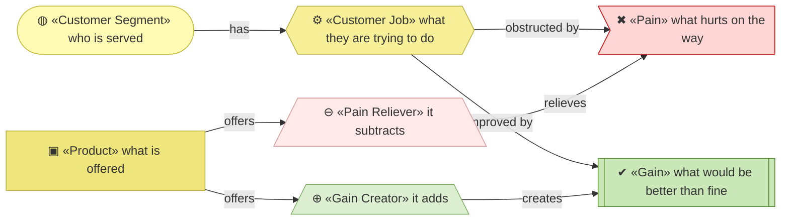
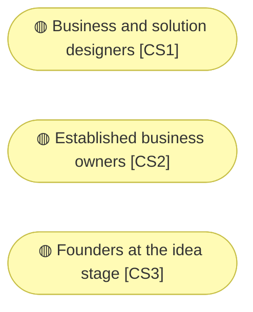
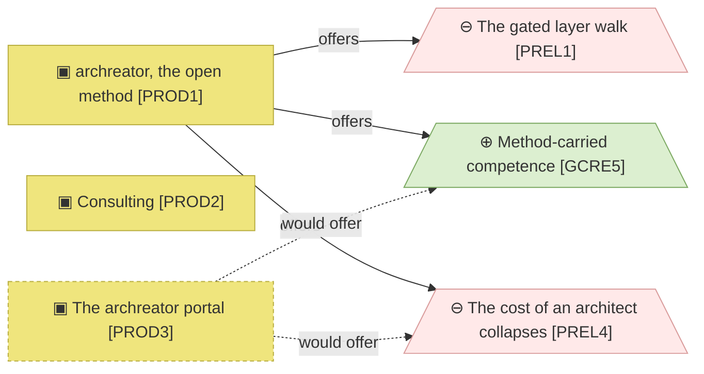

# Value proposition canvas

_[← Business design](./README.md) · [EA home](../README.md)_

**Not an ArchiMate layer.** Customer segments, the jobs they are trying to get
done, what hurts, what would delight — and, against those, what this
organization offers. The [strategy layer](../1_strategy/README.md) is derived
from this document, block by block, and never invented alongside it.

**Status:** ● Validated at **Gate 0**, 2026-08-22.

## How to read this document

| Glyph | Shape | Element | ID prefix | Reads as |
| ----- | ----- | ------- | --------- | -------- |
| `◍` | Stadium | «Customer Segment» | `CS` | `CS1` = Customer Segment 1 |
| `⚙` | Hexagon | «Customer Job» | `JOB` | `JOB1` = Job 1 |
| `✖` | Flag | «Pain» | `PAIN` | `PAIN1` = Pain 1 |
| `✔` | Rectangle, double bars | «Gain» | `GAIN` | `GAIN1` = Gain 1 |
| `▣` | Rectangle | «Product» | `PROD` | `PROD1` = Product 1 |
| `⊖` | Trapezoid | «Pain Reliever» — it subtracts | `PREL` | `PREL1` = Pain Reliever 1 |
| `⊕` | Trapezoid | «Gain Creator» — it adds | `GCRE` | `GCRE1` = Gain Creator 1 |

Pain is drawn in the implementation rose and gain in the technology green
throughout this document — the one place colour carries a judgement rather
than a layer, because a canvas is arithmetic and the reader should see the
signs.

## Segments

| ID | Segment | Pays today | Would pay | Uses the free method |
| -- | ------- | ---------- | --------- | -------------------- |
| `CS1` | **Business and solution designers.** Enterprise architects at any level, business analysts, entrepreneurs acting as their own designer | Nothing | Nothing — this is the free tier by design | Yes, on their own projects |
| `CS2` | **Established business owners.** A running company with real operational knowledge, but no structure or shared language a builder can act on | Consulting hours | Target state | Yes |
| `CS3` | **Founders at the idea stage.** Pre-operational: the business model is still forming, nothing is running yet | Rarely — the most price-sensitive segment | Target state | Yes |

**`CS1` is the segment that will never pay, and it is the one the method is
written for.** They adopt it, exercise it on real problems, and are the only
plausible source of the feedback the method improves from. Treating them as a
funnel to a paid tier would misread what they are for.

## Jobs to be done

| ID | Job | `CS1` | `CS2` | `CS3` |
| -- | --- | ----- | ----- | ----- |
| `JOB1` | **Understand the problem before answering it.** Solutions rarely fail because they were technically hard; they fail because the problem was misunderstood. Designing *is* how the understanding happens | Core | Core | Core |
| `JOB2` | **Turn that understanding into something a builder can act on** — increasingly an AI builder | Core | Core | Core |
| `JOB3` | **Get from an approved design to a working solution** — by building it, or by directing a builder well | Core — builds it | Core — directs a builder | Core — directs a builder |
| `JOB4` | **Keep one shared source others can work from**, so the same explanation is not repeated to every new person | Core | Core | Secondary |
| `JOB5` | **Get architectural quality without scarce expertise** — without years of seniority, and without hiring someone expensive | Core | Core | Core |
| `JOB6` | **Change direction without losing the work already designed** | Secondary | Secondary | Core |

## Pains

| ID | Pain | `CS1` | `CS2` | `CS3` |
| -- | ---- | ----- | ----- | ----- |
| `PAIN1` | **The problem is framed wrongly, and nobody finds out until late.** Without a method that forces a complete frame, blind spots stay invisible | Unacceptable | Unacceptable | Serious |
| `PAIN2` | **Design and delivery are separate worlds.** Designers do not build; builders do not understand the business. Meaning changes shape at every handover, documentation that drives nothing is a cost rather than an asset, and there is no path from a canvas to an implementation. The visible cost is time to market | Unacceptable | Unacceptable | Unacceptable |
| `PAIN3` | **Knowledge is scattered, stale, or trapped in one person's head.** Documents, meetings, diagrams, wikis, spreadsheets — and when a builder leaves, the owner explains it all again to the next one | Unacceptable | Unacceptable | Unacceptable |
| `PAIN4` | **Architectural quality is out of reach.** An enterprise architect costs more than these segments can justify, and doing it yourself takes years | Serious | Unacceptable | Unacceptable |
| `PAIN5` | **AI already does most of this work, but in isolation, with no framework behind it.** The person is the framework, holding it together by hand | Unacceptable | Serious | Serious |

## Gains

| ID | Gain | Level | Strongest for |
| -- | ---- | ----- | ------------- |
| `GAIN1` | **Understand the business wider and deeper**, with strategic and business gaps surfacing *during* the work rather than after it | Required | `CS2` |
| `GAIN2` | **Documentation ready to put in front of the business**, without a rewrite — diagrams over walls of text | Expected | — |
| `GAIN3` | **Build from the design.** The design is the input to delivery, with AI doing the technical work, so the designer leads implementation instead of handing it off | Delight | `CS1` |
| `GAIN4` | **A shared language that keeps working** as people join and leave | Expected | `CS2` |
| `GAIN5` | **Speed with structure, at any level of experience.** Competence comes from the method rather than from seniority or budget | Required | `CS1` |
| `GAIN6` | **Pivots that cost less**, because the design survives the change instead of being redone | Expected | `CS3` |

## Value map

A selection — the full sets are in the tables. The dashed product is Pending,
and so is every edge leaving it.

| ID | Product | For | Price |
| -- | ------- | --- | ----- |
| `PROD1` | **archreator, the open method** — the skills, the documentation, the guidance site | `CS1` primarily | Free, open source |
| `PROD2` | **Consulting** — the Requester's time, delivering with archreator | `CS2` | Hourly |
| `PROD3` | **The archreator portal** — enterprise architecture as a service. **Pending — target state** | `CS2`, `CS3` | One-off: the cost of running the agents, plus a small product fee |

| ID | Pain reliever | Relieves | Offered by |
| -- | ------------- | -------- | ---------- |
| `PREL1` | **The gated layer walk.** Approval gates force a complete frame before anything is built, so a misframed problem surfaces at the gate rather than at delivery | `PAIN1` | `PROD1` — the gates and the `align-change-through-layers` skill |
| `PREL2` | **The method continues past design into delivery.** The design is what an agent builds from, so there is no handover for meaning to change shape in | `PAIN2` | `PROD1`, `PROD3` |
| `PREL3` | **One model in one place** — Markdown in git, catalogues and diagrams, every element naming what realizes it | `PAIN3` | `PROD1` |
| `PREL4` | **The cost of an architect collapses to the cost of an agent.** With a coding agent the price is a subscription instead of consultancy hours; through the portal, a one-off payment, and the owner stays on top of it | `PAIN4` | `PROD1` with a coding agent; `PROD3` |
| `PREL5` | **The whole thing operating together** — skills holding the method, gates keeping a human in the loop, and a design the solution is built from | `PAIN5` | `PROD1`, `PROD3` |

| ID | Gain creator | Creates | Offered by |
| -- | ------------ | ------- | ---------- |
| `GCRE1` | Question-driven discovery that tests the business rather than recording it | `GAIN1` | `PROD1`, `PROD3` |
| `GCRE2` | Markdown and diagrams as first-class output, written for people | `GAIN2` | `PROD1` |
| `GCRE3` | Skills that turn an approved design into implementation work | `GAIN3` | `PROD1` |
| `GCRE4` | **Standardised concepts with defined relationships** — ArchiMate as the shared vocabulary | `GAIN4` | `PROD1` |
| `GCRE5` | The method carries the competence, so experience level stops being the gate | `GAIN5` | `PROD1`, `PROD3` |
| `GCRE6` | The layered model: strategy can change without redoing technology, and the reverse | `GAIN6` | `PROD1` |

## Fit check

Every pain has a reliever and every gain a creator, which is the check this
section exists for — and passing it is weaker evidence than it looks.

| Pain | Relieved by | Gain | Created by |
| ---- | ----------- | ---- | ---------- |
| `PAIN1` | `PREL1` | `GAIN1` | `GCRE1` |
| `PAIN2` | `PREL2` | `GAIN2` | `GCRE2` |
| `PAIN3` | `PREL3` | `GAIN3` | `GCRE3` |
| `PAIN4` | `PREL4` | `GAIN4` | `GCRE4` |
| `PAIN5` | `PREL5` | `GAIN5` | `GCRE5` |
| — | — | `GAIN6` | `GCRE6` |

**A complete fit table is a claim, not a measurement.** It says every pain has
something pointed at it; it does not say the relief works, or that anyone in
`CS2` or `CS3` has experienced it. Two of the three segments are reachable
today only through a coding agent, which is the gap
[`COA2`](../1_strategy/2_capabilities-and-resources.md) exists to close.

## Relationships

<!-- Transcribed from this document's diagrams. The identifier is
     authoritative; the description beside it is checked against the
     catalogue that defines the element. -->

| From | From element | To | To element | Relationship |
| ---- | ------------ | -- | ---------- | ------------ |
| `PROD1` | «Product» archreator, the open method | `PREL1` | «Pain Reliever» The gated layer walk. | offers |
| `PROD1` | «Product» archreator, the open method | `PREL4` | «Pain Reliever» The cost of an architect collapses to the cost of an agent. | offers |
| `PROD3` | «Product» The archreator portal | `PREL4` | «Pain Reliever» The cost of an architect collapses to the cost of an agent. | would offer |
