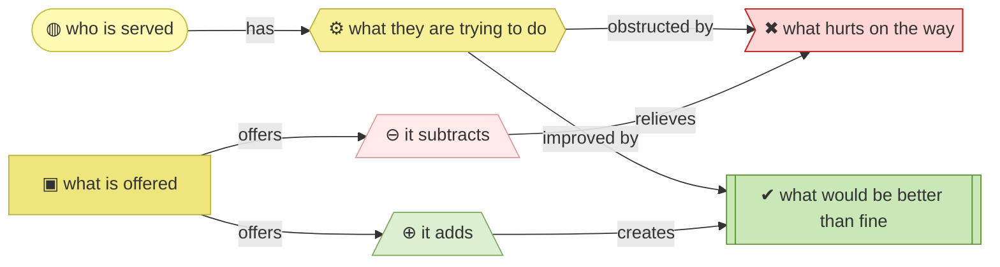
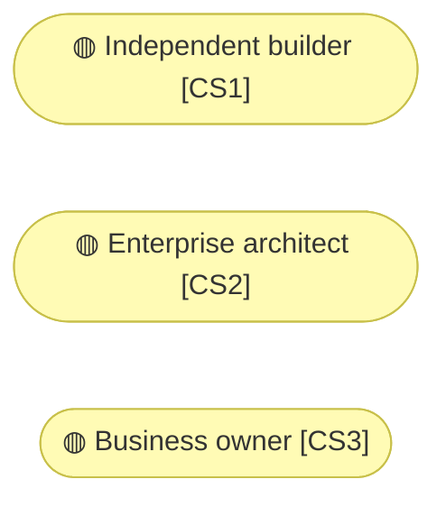

# Value proposition canvas

_[← Business design](./README.md) · [Front door](../README.md)_

**Not an ArchiMate layer.** Customer segments, the jobs they are trying to
get done, what hurts, what would delight — and, against those, what this
organization offers.

**Status:** ◐ Draft catalogue — rebuilt on method 0.2 from the validated
pre-0.2 canvases, not yet re-approved. **Direction** covers this layer.

## How to read this document

| Glyph | Shape | Element | ID prefix | Reads as |
| ----- | ----- | ------- | --------- | -------- |
| `◍` | Stadium | «Customer Segment» | `CS` | `CS#` |
| `⚙` | Hexagon | «Customer Job» | `JOB` | `JOB#` |
| `✖` | Flag | «Pain» | `PAIN` | `PAIN#` |
| `✔` | Rectangle, double bars | «Gain» | `GAIN` | `GAIN#` |
| `▣` | Rectangle | «Product» | `PROD` | `PROD#` |
| `⊖` | Trapezoid | «Pain Reliever» | `PREL` | `PREL#` |
| `⊕` | Trapezoid | «Gain Creator» | `GCRE` | `GCRE#` |

Pain is drawn in the implementation rose and gain in the technology green —
the one place colour carries a judgement rather than a layer, because a
canvas is arithmetic and the reader should see the signs.

## Segments

**Two of these are the method's key customers, and they are different people
with the same source.** The method serves them over one model with two ways
in: guided use for the builder, direct navigation for the architect.

| ID | Segment | How they arrive | Pays | Source |
| -- | ------- | --------------- | ---- | ------ |
| `CS1` | **Independent builder.** Building something real — an app, a tool, a business — with a coding agent and no architecture background. The primary *guided* customer: they explain the business and get only the architecture they need | Finds the method as code or through the site, installs it, uses it on their own project | Nothing — the free tier by design | `pre-02-2026-08` canvases; the 0.2 reset's two-routes framing |
| `CS2` | **Enterprise architect.** Architects, business analysts and solution designers who know the discipline. The first-class *expert* customer: they navigate the standard layered structure directly and use the agent as leverage, not as a doorway | Same channels as `CS1`, already fluent | Nothing | Same |
| `CS3` | **Business owner.** A company with real operational knowledge and no structure a builder can act on — running today, or still at the idea stage; the stage changes the price sensitivity, not the segment | Referral and direct approach; served personally by the Requester | Consulting hours | `pre-02-2026-08` canvases, two segments consolidated: they differed in stage, not in kind |

**`CS1` and `CS2` will never pay, and they are who the method is written
for.** They adopt it, exercise it on real problems, and are the only
plausible source of the feedback the method improves from. Treating them as
a funnel to a paid tier would misread what they are for.

## Jobs to be done

| ID | Job | `CS1` | `CS2` | `CS3` |
| -- | --- | ----- | ----- | ----- |
| `JOB1` | **Understand the problem before answering it.** Solutions rarely fail because they were technically hard; they fail because the problem was misunderstood — and designing *is* how the understanding happens | Core | Core | Core |
| `JOB2` | **Turn that understanding into a delivered solution** — by building it with an agent, or by directing a builder well | Core — builds it | Core — directs and builds | Core — directs a builder |
| `JOB3` | **Keep one shared source others can work from**, so the same explanation is not repeated to every new person or agent | Core | Core | Core |
| `JOB4` | **Get architectural quality without scarce expertise** — without years of seniority, and without hiring someone expensive | Core | Secondary — they *are* the expertise, and want their time back | Core |
| `JOB5` | **Change direction without losing the work already designed** | Secondary | Secondary | Core |

## Pains

| ID | Pain | `CS1` | `CS2` | `CS3` |
| -- | ---- | ----- | ----- | ----- |
| `PAIN1` | **The problem is framed wrongly, and nobody finds out until late.** Without a method that forces a complete frame, blind spots stay invisible | Unacceptable | Serious | Unacceptable |
| `PAIN2` | **Design and delivery are separate worlds.** Meaning changes shape at every handover, documentation that drives nothing is a cost, and time to market pays for it | Unacceptable | Unacceptable | Unacceptable |
| `PAIN3` | **Knowledge is scattered, stale, or trapped in one person's head** — and when a builder leaves, the owner explains it all again | Unacceptable | Unacceptable | Unacceptable |
| `PAIN4` | **Architectural quality is out of reach** — an architect costs more than these segments can justify, and doing it yourself takes years | Unacceptable | — | Unacceptable |
| `PAIN5` | **AI already does most of this work, but in isolation, with no framework behind it.** The person is the framework, holding it together by hand | Unacceptable | Unacceptable | Serious |

## Gains

| ID | Gain | Level | Strongest for |
| -- | ---- | ----- | ------------- |
| `GAIN1` | **Understand the business wider and deeper**, with strategic and business gaps surfacing *during* the work rather than after it | Required | `CS3` |
| `GAIN2` | **Documentation ready to put in front of the business** without a rewrite — diagrams over walls of text | Expected | `CS2` |
| `GAIN3` | **Build from the design** — the design is the input to delivery, with AI doing the technical work | Delight | `CS1` |
| `GAIN4` | **A shared language that keeps working** as people and agents join and leave | Expected | `CS2` |
| `GAIN5` | **Speed with structure, at any level of experience** — competence comes from the method rather than from seniority or budget | Required | `CS1` |
| `GAIN6` | **Pivots that cost less**, because the design survives the change instead of being redone | Expected | `CS3` |

## Value map

| ID | Product | For | Price | State |
| -- | ------- | --- | ----- | ----- |
| `PROD1` | **archreator, the open method** — the skills, the scaffold, the documentation, the guidance site | `CS1` and `CS2` primarily | Free, open source | Live |
| `PROD2` | **Consulting** — the Requester's time, delivering with archreator | `CS3` | Hourly | Live |

| ID | Pain reliever | Relieves | Offered by |
| -- | ------------- | -------- | ---------- |
| `PREL1` | **The gated layer walk.** Approval gates force a complete frame before anything is built, so a misframed problem surfaces at the gate rather than at delivery | `PAIN1` | `PROD1` |
| `PREL2` | **The method continues past design into delivery.** The design is what an agent builds from, so there is no handover for meaning to change shape in | `PAIN2` | `PROD1`, `PROD2` |
| `PREL3` | **One model in one place** — Markdown in git, catalogues and diagrams, every element naming what realizes it | `PAIN3` | `PROD1` |
| `PREL4` | **The cost of an architect collapses to the cost of an agent** — a subscription instead of consultancy hours | `PAIN4` | `PROD1` with a coding agent |
| `PREL5` | **The whole thing operating together** — skills holding the method, gates keeping a human in the loop, and a design the solution is built from | `PAIN5` | `PROD1`, `PROD2` |

| ID | Gain creator | Creates | Offered by |
| -- | ------------ | ------- | ---------- |
| `GCRE1` | Question-driven discovery that tests the business rather than recording it | `GAIN1` | `PROD1`, `PROD2` |
| `GCRE2` | Markdown and diagrams as first-class output, written for people | `GAIN2` | `PROD1` |
| `GCRE3` | Skills that turn an approved design into implementation work | `GAIN3` | `PROD1` |
| `GCRE4` | **Standardised concepts with defined relationships** — ArchiMate as the shared vocabulary | `GAIN4` | `PROD1` |
| `GCRE5` | The method carries the competence, so experience level stops being the gate | `GAIN5` | `PROD1`, `PROD2` |
| `GCRE6` | The layered model: strategy can change without redoing technology, and the reverse | `GAIN6` | `PROD1` |

## Fit check

Every pain has a reliever and every gain a creator — and passing this check
is weaker evidence than it looks: it says something is pointed at each pain,
not that the relief works for every segment.

| Pain | Relieved by | Gain | Created by |
| ---- | ----------- | ---- | ---------- |
| `PAIN1` | `PREL1` | `GAIN1` | `GCRE1` |
| `PAIN2` | `PREL2` | `GAIN2` | `GCRE2` |
| `PAIN3` | `PREL3` | `GAIN3` | `GCRE3` |
| `PAIN4` | `PREL4` | `GAIN4` | `GCRE4` |
| `PAIN5` | `PREL5` | `GAIN5` | `GCRE5` |
| — | — | `GAIN6` | `GCRE6` |
