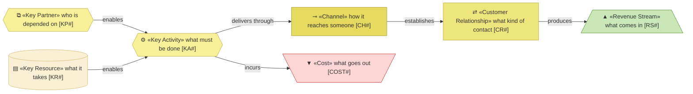

# Business model canvas

_[← Business design](./README.md) · [Front door](../README.md)_

**Not an ArchiMate layer.** How the organization around
[archreator, the open method [PROD1]](./1_value-proposition-canvas.md) and
[Consulting [PROD2]](./1_value-proposition-canvas.md) actually operates and
pays for itself.

**Status:** ◐ Draft catalogue — not yet approved at a gate. **Direction**
covers this document.

## How to read this document

Revenue is green and cost is rose, so the arithmetic is visible without
reading a label. The segments and products keep the identifiers
[the value proposition canvas](./1_value-proposition-canvas.md) defines.

## The products at a glance

| | archreator, the open method [`PROD1`] | Consulting [`PROD2`] |
| --- | --- | --- |
| **Segments** | `CS1`, `CS2` | `CS3` |
| **Channels** | `CH1`, `CH2`, `CH3` | `CH4` |
| **Relationship** | `CR1` | `CR2` |
| **Revenue** | `RS1`, `RS2` — non-monetary | `RS3` |
| **Dominant cost** | `COST1` | `COST1` |
| **Scales?** | Yes, freely | **No** — bounded by one person's hours |

**The last row is the model's central tension.** The product that earns
money cannot grow, and the product that grows earns feedback and mission
progress rather than money — deliberately, per
[Priced at the cost of running it [P7]](../1_strategy/1_motivation.md#principles).

A third product — **a self-service portal**, everything the consulting
route does but self-served — is deliberately absent: it waits on the method
proving itself, and enters the model when an initiative through Direction
makes it real.

## Channels

| ID | Channel | Carries | Reaches | State |
| -- | ------- | ------- | ------- | ----- |
| `CH1` | The public repository | `PROD1` | `CS1`, `CS2` — they find it as code, not as marketing | Live |
| `CH2` | The guidance site | `PROD1` | `CS1`, `CS2`, and any owner evaluating the method | Live |
| `CH3` | The plugin marketplace | `PROD1` | `CS1`, `CS2`, already working inside an agent | Live |
| `CH4` | Referral and direct approach | `PROD2` | `CS3` | Live |

## Customer relationships

| ID | Relationship | For | Costs |
| -- | ------------ | --- | ----- |
| `CR1` | Self-service | `PROD1` | Near zero per user |
| `CR2` | Personal and direct — the Requester individually | `PROD2` | Their whole available time |

## Key activities

| ID | Activity | For | Performed by |
| -- | -------- | --- | ------------ |
| `KA1` | Developing and improving the method | `PROD1` | The Requester, with an AI agent at co-pilot autonomy |
| `KA2` | Publishing guidance | `PROD1` | The Requester, with an AI agent |
| `KA3` | Running discovery and delivery with clients | `PROD2` | The Requester |

## Key resources

| ID | Resource | Kind | State |
| -- | -------- | ---- | ----- |
| `KR1` | The Requester's knowledge and time | People | **Constrained — the binding limit on the whole organization** |
| `KR2` | The method: skills, conventions, gates | Knowledge | Held, and improving |
| `KR3` | The published guidance site | Asset | Held |

## Key partners

| ID | Partner | Provides | Note |
| -- | ------- | -------- | ---- |
| `KP1` | AI model providers | The inference every product ultimately runs on | **Substitutable by design.** The method is provider-agnostic prose; only the packaging names a platform |
| `KP2` | The code host | Repository, plugin distribution, site hosting | Replaceable, and free at this scale |

## Revenue streams and cost structure

| ID | Revenue stream | Kind | From | Note |
| -- | -------------- | ---- | ---- | ---- |
| `RS1` | **Continuous improvement** — feedback and real usage flowing back into the method | Non-monetary | `PROD1` | Grows with adoption; the method improves because people use it where the Requester is not |
| `RS2` | **Mission progress** — people building better things with AI while human knowledge improves rather than being delegated away | Non-monetary | `PROD1` | The reason the organization exists |
| `RS3` | Consulting fees | Monetary | `PROD2` | Hourly; bounded by one person's available time |

| ID | Cost | For | Note |
| -- | ---- | --- | ---- |
| `COST1` | **The Requester's time** | `PROD1`, `PROD2` | **Dominant, and the binding constraint on everything** |
| `COST2` | AI inference | `PROD1`, `PROD2` | Each adopter carries their own; the organization pays only for its own use |
| `COST3` | Hosting the repository and site | `PROD1` | Effectively zero — free tiers |

**The Requester appears three times** — a key resource, the dominant cost,
and a stakeholder with wants of their own. That triple entry is the
organization's central fact, not a modelling accident.

## From canvas to ArchiMate

Stated once, here; the [strategy layer](../1_strategy/README.md) cites it
per element rather than restating it.

| Canvas block | Becomes | In |
| ------------ | ------- | -- |
| Customer segment | «Stakeholder» | [Motivation](../1_strategy/1_motivation.md) |
| Pain | «Driver» and its «Assessment» | Motivation |
| Job, gain | «Goal» and its «Outcome» | Motivation |
| Key activity, pain reliever, gain creator | «Capability» | [Capabilities](../1_strategy/2_capabilities-and-value-stream.md) |
| Key resource | «Resource» | Capabilities |
| Channel, relationship | The service's access, on the business layer | [Business](../2_business/README.md) |
