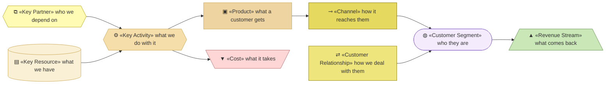
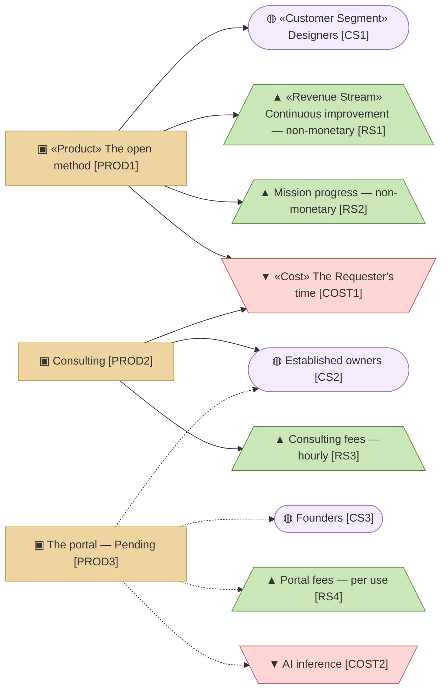
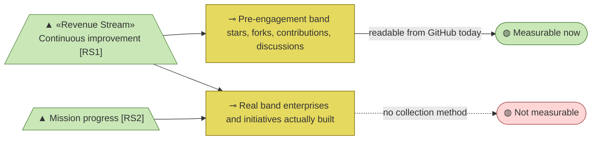
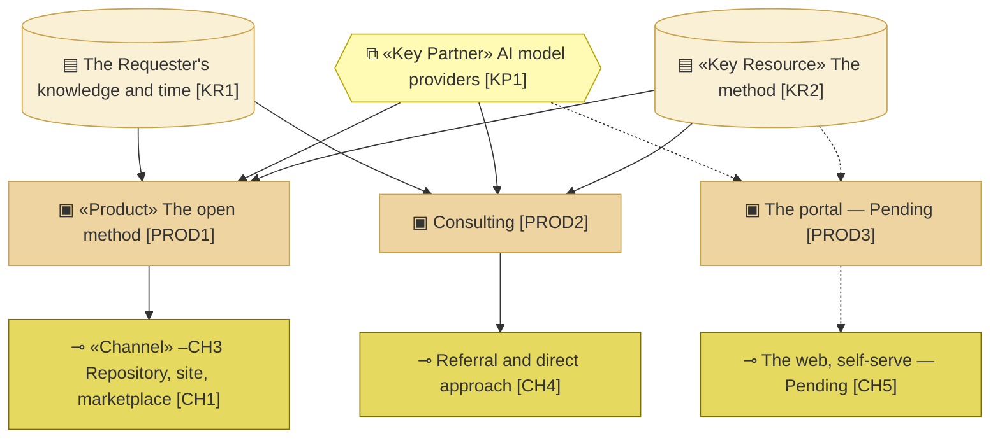

# Business Model Canvas

_[← Business design](./README.md) · [EA home](../README.md)_

**Strategyzer artifact, not ArchiMate.** One canvas per product, from
[1_value-proposition-canvas.md](./1_value-proposition-canvas.md) § Products.
Layers 1 and 2 are derived from both canvases after **Gate 0**, which was
granted on 2026-08-08 — see [the strategy layer](../1_strategy/README.md).

Three products, three economic models:

| Product | ID | State |
| --- | --- | --- |
| archreator, the open method | `PROD1` | Live |
| Consulting | `PROD2` | Live |
| The archreator portal | `PROD3` | **Pending — target state** |

The products are defined in the value proposition canvas; this table only
points at them.

## How to read this document

**The nine blocks, and the direction they run in.** The left side is what it
takes; the right side is who it is for; revenue and cost are what the two
sides produce. A canvas that balances is one where the right-hand side pays
for the left — and this one deliberately does not, which is the subject of
the next section.

| Glyph | Block | ID prefix | Reads as |
| ----- | ----- | --------- | -------- |
| `⧉` | «Key Partner» | `KP` | `KP1` = Key Partner 1 |
| `▤` | «Key Resource» | `KR` | `KR1` = Key Resource 1 |
| `⚙` | «Key Activity» | `KA` | `KA1` = Key Activity 1 |
| `▣` | «Product» | `PROD` | `PROD1` = Product 1 |
| `⊸` | «Channel» | `CH` | `CH1` = Channel 1 |
| `⇄` | «Customer Relationship» | `CR` | `CR1` = Customer Relationship 1 |
| `◍` | «Customer Segment» | `CS` | `CS1` = Customer Segment 1 |
| `▲` | «Revenue Stream» — what comes in | `RS` | `RS1` = Revenue Stream 1 |
| `▼` | «Cost» — what goes out | `COST` | `COST1` = Cost 1 |

Revenue takes the Technology green and cost the Implementation rose, because
neither has an ArchiMate element to borrow a colour from and money in versus
money out is the one distinction a reader should never have to squint at.

**The glyph rides on every node; the «stereotype» word appears once** — on the
first node of each type in a diagram, dropped on the rest.

## A note before the blocks: this organization is not selling for money

The standard canvas assumes revenue means money. Here it mostly does not,
and forcing the model into a monetary frame would misdescribe it.

The stated purpose is to help people build better things with artificial
intelligence while **improving human knowledge rather than delegating it to
the machine**. Monetary income is a secondary concern, and the intent is not
to charge much beyond operational cost even at scale.

So the revenue block below records **two kinds of return**: monetary, and
non-monetary — social and business development. Both are real returns to the
organization; only one arrives as money.

**Social Return on Investment** is the established way to value the
non-monetary kind, and the Requester has worked with it in a governmental
context. Applying it here is **Pending — future initiative**: the returns
are named, the valuation method is not yet chosen. See the open question at
the end.

## The three products at a glance

**Three products, three different economics**, and the diagram shows the
shape before the tables give the detail: the free one returns everything that
is not money, the paid one is bounded by one person's time, and the Pending
one is the only place where cost grows with use. The three sections below
give each product its nine blocks.

---

## `PROD1` — archreator, the open method

The skills, the documentation, and the published guidance site. Free and
open source.

| Block | Content |
| ----- | ------- |
| **Value propositions** | `PREL1`–`PREL5`, `GCRE1`–`GCRE6` — the whole value map. `PROD1` is where the method actually lives |
| **Customer segments** | `CS1` primarily. `CS2` and `CS3` reach it through a coding agent |
| **Channels** | `CH1` the public repository · `CH2` the guidance site · `CH3` the Claude Code plugin marketplace |
| **Customer relationships** | `CR1` **self-service**, with `CR2` **community** as the feedback path |
| **Revenue streams** | `RS1`, `RS2` — both **non-monetary** |
| **Key resources** | `KR1` the Requester's knowledge and time · `KR2` the method itself · `KR3` the published guidance |
| **Key activities** | `KA1` developing the method · `KA2` publishing guidance |
| **Key partners** | `KP1` model providers · `KP2` GitHub · `KP3` contributors (**Pending**) |
| **Cost structure** | `COST1` the Requester's time — dominant · `COST3` hosting, at zero on free tiers |

## `PROD2` — Consulting

The Requester's time, delivering with archreator. This is where money
changes hands today.

| Block | Content |
| ----- | ------- |
| **Value propositions** | The same value map, delivered by someone experienced rather than self-served. Relieves `PAIN4` for an owner who does not want to drive it themselves |
| **Customer segments** | `CS2`, and occasionally `CS1` at organizations wanting help adopting the method |
| **Channels** | `CH4` referral and direct approach |
| **Customer relationships** | `CR3` **personal and direct** — the Requester, individually |
| **Revenue streams** | `RS3` — **monetary**, hourly |
| **Key resources** | `KR1` the Requester's knowledge and time — the binding constraint |
| **Key activities** | `KA3` running discovery and delivery with clients |
| **Key partners** | `KP1` model providers |
| **Cost structure** | `COST1` the Requester's time · `COST2` inference for delivery |

**`PROD2` does not scale, on purpose.** The Requester has no interest in
scaling large. If it ever needed to, the route named is **AI agents acting
as consultants**, carrying the Requester's knowledge — which requires more
AI maturity than exists today. Recorded as a course of action to consider at
Gate 1, not as a plan.

## `PROD3` — The archreator portal

**Pending — target state.** Enterprise architecture as a service: an owner
supplies what they have, and gets a working architecture repository.

| Block | Content |
| ----- | ------- |
| **Value propositions** | `PREL2` and `PREL4` without needing to drive a coding agent. The same method, reachable by someone who would never install anything |
| **Customer segments** | `CS2` and `CS3` — the segments furthest from the tooling today |
| **Channels** | `CH5` the web, self-serve |
| **Customer relationships** | `CR1` **self-service** |
| **Revenue streams** | `RS4` — **monetary**: a one-off payment covering the cost of running the agents plus a small product fee |
| **Key resources** | `KR2` the method · `KR4` the portal itself (**Pending**) |
| **Key activities** | `KA4` building and running the portal (**Pending**) |
| **Key partners** | `KP1` model providers — the dominant cost sits here · `KP2` hosting |
| **Cost structure** | `COST2` inference — **dominant, and it scales with usage** · `COST4` hosting and operations (**Pending**) |

`RS4` is deliberately priced at cost plus a small fee. It is the clearest
place the non-profit posture shows up as a number.

---

## Channels

| ID | Channel | Products | Reaches |
| --- | --- | --- | --- |
| `CH1` | The public repository | `PROD1` | `CS1` — designers find it as code, not as marketing |
| `CH2` | The guidance site | `PROD1` | `CS1`, and any owner evaluating the method |
| `CH3` | The Claude Code plugin marketplace | `PROD1` | `CS1` already working in an agent |
| `CH4` | Referral and direct approach | `PROD2` | `CS2` |
| `CH5` | The web, self-serve | `PROD3` | `CS2`, `CS3` — **Pending** |

`CH1`–`CH3` cost nothing to operate and reach only people already close to
the tooling. Nothing here reaches an owner who is not already looking, which
is the honest gap in how `CS2` and `CS3` are served today.

## Customer relationships

| ID | Relationship | Products | Cost to serve |
| --- | --- | --- | --- |
| `CR1` | Self-service | `PROD1`, `PROD3` | Near zero per user |
| `CR2` | Community — feedback flowing back into the method | `PROD1` | The Requester's attention. Produces `RS1` |
| `CR3` | Personal and direct — the Requester individually | `PROD2` | Their whole available time |

## Key resources

| ID | Resource | Kind | State |
| --- | --- | --- | --- |
| `KR1` | The Requester's knowledge and time | People | **Constrained — the binding limit on the whole organization** |
| `KR2` | The method: skills, conventions, gates | Knowledge | Held, and improving |
| `KR3` | The published guidance site | Asset | Held |
| `KR4` | The portal | Asset | **Pending — future initiative** |

## Key activities

| ID | Activity | Products | Performed by |
| --- | --- | --- | --- |
| `KA1` | Developing and improving the method | `PROD1` | The Requester, with an AI agent at co-pilot autonomy |
| `KA2` | Publishing guidance | `PROD1` | The Requester, with an AI agent |
| `KA3` | Running discovery and delivery with clients | `PROD2` | The Requester |
| `KA4` | Building and running the portal | `PROD3` | **Pending** |

Every activity that exists today is performed by one person assisted by an
AI agent. That is worth stating plainly rather than leaving implicit: this
organization already operates the way it tells its customers to operate.

## Revenue streams — monetary and not

| ID | Revenue stream | Kind | Product | Shape |
| --- | --- | --- | --- | --- |
| `RS1` | **Continuous improvement** — community feedback and real usage flowing back into the method | Non-monetary | `PROD1` | Grows with adoption; the method improves because people use it in situations the Requester would never meet alone |
| `RS2` | **Mission progress** — people building better things with AI while human knowledge improves rather than being delegated away | Non-monetary | `PROD1` | The reason the organization exists. Measured by adoption — see below |
| `RS3` | Consulting fees | Monetary | `PROD2` | Hourly. Bounded by one person's available time |
| `RS4` | Portal fees | Monetary | `PROD3` | One-off per use: agent cost plus a small product fee. **Pending** |

### Measuring `RS1` and `RS2` — adoption, in two bands

**`RS2` has one band and it is the unmeasurable one.** Mission progress is
evidenced only by the real band; the pre-engagement band cannot stand in for
it, which is the whole reason the two are named separately.

Both non-monetary streams are measured the same way, because both are
consequences of the same thing: **people actually using the project**. The
measure splits into two bands, and the distinction between them is the point.

| Band | What it counts | What it tells you |
| --- | --- | --- |
| **Pre-engagement** | GitHub stars, forks, contributions, online discussions | Interest. Someone found the project and thought it worth a signal — cheap to give, and cheap to overread |
| **Real** | Enterprises and initiatives actually designed and built with the method | Return. Someone ran the method end to end and got something out of it |

Only the **real** band evidences `RS2`. Mission progress means human knowledge
improved while something got built — a star proves neither. The
pre-engagement band is a leading indicator worth watching precisely because
it moves first, not because it stands in for the outcome.

**Neither band is instrumented today.** The pre-engagement numbers are
readable from GitHub at any time; the real band has no collection method at
all, and asking adopters to self-report is the obvious candidate. Choosing
one is **Pending — future initiative**, and it is what a **Social Return on
Investment** valuation would be built on: the framework needs quantities
before it can attach value to them.

`PROD1` is free and returns `RS1` and `RS2`. It also feeds `PROD2`: someone
who starts with the open method and finds they would rather have an
experienced person is exactly who becomes a consulting client. That is a
real business return from a free product, and it is why `PROD1` is neither
a loss leader nor charity — it is the thing that makes the other two
possible.

## Cost structure

| ID | Cost | Products | Shape |
| --- | --- | --- | --- |
| `COST1` | **The Requester's time** | `PROD1`, `PROD2` | **Dominant today, and the binding constraint on everything** |
| `COST2` | AI inference | `PROD2`, `PROD3` | Scales with usage. Becomes dominant for `PROD3` |
| `COST3` | Hosting the repository and site | `PROD1` | Effectively zero — free tiers |
| `COST4` | Portal operations | `PROD3` | **Pending** |

## What the three share, and where they diverge

This table is where the operating model actually lives.

**Everything converges above the products and diverges below them.** Two
elements feed all three — `KR2` the method and `KP1` the model providers —
and below the products no channel is shared by any two. That is the operating
model in one picture: one asset, one dependency, three ways out.

`KR1` reaching only two of the three is the other thing worth seeing. The
portal is the only product that would not consume the Requester's time per
unit sold, which is exactly why `COA2` exists and exactly why it costs so
much to start.

| | `PROD1` open method | `PROD2` consulting | `PROD3` portal |
| --- | --- | --- | --- |
| Who is served | `CS1` | `CS2` | `CS2`, `CS3` |
| Return | Non-monetary | Monetary, hourly | Monetary, per use |
| Relationship | Self-service | Personal | Self-service |
| Dominant cost | The Requester's time | The Requester's time | Inference |
| Scales? | Yes — cost does not grow with users | **No** — bounded by one person | Yes — cost grows with users but so does revenue |

All three share `KR2` (the method) and `KP1` (model providers). The method
is the single asset every product depends on, which is why improving it is
`KA1` rather than an overhead.

**The concentration is `KR1`.** One person is the key resource behind two of
three products and the only human in the organization. That is the largest
structural risk in this model. It is a deliberate choice — the Requester has
no interest in scaling large — but a choice is not the same as an absence of
risk, and the model should say so rather than imply resilience it does not
have.

## Key partners

| ID | Partner | Provides | Dependency |
| --- | --- | --- | --- |
| `KP1` | AI model providers | The inference every product ultimately runs on | **Substitutable by design** — see below |
| `KP2` | GitHub | Repository, plugin distribution, site hosting | Replaceable, and free at this scale |
| `KP3` | Community contributors | Feedback and real-world usage that produce `RS1` | **Pending** — no contributor base exists yet |

### Provider neutrality

archreator is distributed today as a Claude Code plugin, and the skills are
written for it. But **the method is not tied to one provider**: the skills
are markdown instructions, transferable to any agent platform that can read
them. The provider-specific parts are the plugin manifest and the packaging
convention, not the method.

The posture: **generic by design, one implementation today.** Optimising for
a single target while it is the one in use is reasonable; letting the method
itself become unportable would not be. Where exactly that line falls is
fixed by
[decision 6](../../../product-archreator/architecture/decisions/6_the-portability-boundary.md):
method content and skill frontmatter are portable, packaging is not, and a
file is assigned to a tier by asking whether it would need *editing* or just
*moving* if Claude Code disappeared.

## Open questions

| # | Question | Interpretation adopted |
| - | -------- | ---------------------- |
| 1 | How should the non-monetary returns `RS1` and `RS2` be valued? | **Answered at Gate 0, in part.** The *measure* is adoption in two bands — pre-engagement and real — as recorded above. The *valuation* is still open: **Social Return on Investment** remains the candidate framework, and it needs the real band instrumented before it has quantities to work on. archreator's own canvas guidance still has no support for non-monetary return, so that part is a gap in the method as well as in this model |
| 2 | How far should provider neutrality go in practice? | **Answered.** [Decision 6](../../../product-archreator/architecture/decisions/6_the-portability-boundary.md) fixes three tiers — method content and skill frontmatter are portable, packaging is provider-specific — with a test that assigns any file to one: *would it need editing if Claude Code vanished, or just moving?* `CH3` is packaging, so a second platform adds a channel rather than replacing one |
| 3 | Is `KP3` (contributors) a partner or an aspiration? | Recorded as **Pending**. `RS1` depends on it, so a community that never forms would make the primary non-monetary return theoretical |
