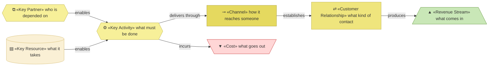

# Business model canvas

_[← Business design](./README.md) · [EA home](../README.md)_

**Not an ArchiMate layer.** How each of the three products is delivered, what
it takes, and what comes back. Read
[the value proposition canvas](./1_value-proposition-canvas.md) first: the
segments, products, pains and gains are defined there and reused here.

**Status:** ● Validated at **Gate 0**, 2026-08-22.

## A note before the blocks

**This organization is not primarily selling for money.** Two of its four
revenue streams are non-monetary, and the one product with real reach is free.
A canvas read as a business plan will look like a failing one; read as a model
of what the organization is actually doing, it is coherent. The test it
answers is not "does this pay" but "does this reach the people it is for
without exhausting the one person running it".

## How to read this document

| Glyph | Shape | Element | ID prefix | Reads as |
| ----- | ----- | ------- | --------- | -------- |
| `⧉` | Hexagon | «Key Partner» | `KP` | `KP1` = Key Partner 1 |
| `⚙` | Hexagon | «Key Activity» | `KA` | `KA1` = Key Activity 1 |
| `▤` | Cylinder | «Key Resource» | `KR` | `KR1` = Key Resource 1 |
| `⊸` | Rectangle | «Channel» | `CH` | `CH1` = Channel 1 |
| `⇄` | Rectangle | «Customer Relationship» | `CR` | `CR1` = Customer Relationship 1 |
| `▲` | Trapezoid | «Revenue Stream» — what comes in | `RS` | `RS1` = Revenue Stream 1 |
| `▼` | Inverted trapezoid | «Cost» — what goes out | `COST` | `COST1` = Cost 1 |

Revenue is green and cost is rose, so the arithmetic is visible without
reading a label.

## The three products at a glance

| | `PROD1` — the method | `PROD2` — consulting | `PROD3` — the portal |
| --- | --- | --- | --- |
| **Segment** | `CS1` | `CS2` | `CS2`, `CS3` |
| **Channel** | `CH1`, `CH2`, `CH3` | `CH4` | `CH5` — **Pending** |
| **Relationship** | `CR1`, `CR2` | `CR3` | `CR1` |
| **Revenue** | `RS1`, `RS2` — non-monetary | `RS3` | `RS4` — **Pending** |
| **Dominant cost** | `COST1` | `COST1` | `COST2`, `COST4` |
| **Scales?** | Yes, freely | **No** — bounded by one person | Yes, at the cost of building it |

**The row that matters is the last one.** `PROD2` is the only product earning
money and the only one that cannot grow, because it is one person's hours.
`PROD3` exists to break that link, and has not been built.

## Channels

| ID | Channel | Delivers | Reaches | State |
| -- | ------- | -------- | ------- | ----- |
| `CH1` | The public repository | `PROD1` | `CS1` — designers find it as code, not as marketing | Live |
| `CH2` | The guidance site | `PROD1` | `CS1`, and any owner evaluating the method | Live |
| `CH3` | The plugin marketplace | `PROD1` | `CS1`, already working inside an agent | Live |
| `CH4` | Referral and direct approach | `PROD2` | `CS2` | Live |
| `CH5` | The web, self-serve | `PROD3` | `CS2`, `CS3` | **Pending — future initiative** (`COA2`) |

**Four of five channels reach `CS1`, and `CS1` is the segment that does not
pay.** `CS2` is reached only by knowing the Requester personally, and `CS3`
is not reached at all. That is the distribution problem `COA2` names.

## Customer relationships

| ID | Relationship | For | Cost to maintain |
| -- | ------------ | --- | ---------------- |
| `CR1` | Self-service | `PROD1`, `PROD3` | Near zero per user |
| `CR2` | Community — feedback flowing back into the method | `PROD1` | The Requester's attention. Produces `RS1` |
| `CR3` | Personal and direct — the Requester individually | `PROD2` | Their whole available time |

## Key resources

| ID | Key resource | Kind | State |
| -- | ------------ | ---- | ----- |
| `KR1` | The Requester's knowledge and time | People | **Constrained — the binding limit on the whole organization** |
| `KR2` | The method: skills, conventions, gates | Knowledge | Held, and improving |
| `KR3` | The published guidance site | Asset | Held |
| `KR4` | The portal | Asset | **Pending — future initiative** |

## Key activities

| ID | Key activity | For | Done by |
| -- | ------------ | --- | ------- |
| `KA1` | Developing and improving the method | `PROD1` | The Requester, with an AI agent at co-pilot autonomy |
| `KA2` | Publishing guidance | `PROD1` | The Requester, with an AI agent |
| `KA3` | Running discovery and delivery with clients | `PROD2` | The Requester |
| `KA4` | Building and running the portal | `PROD3` | **Pending** |

## Revenue streams — monetary and not

| ID | Stream | Kind | From | Behaviour | State |
| -- | ------ | ---- | ---- | --------- | ----- |
| `RS1` | **Continuous improvement** — community feedback and real usage flowing back into the method | Non-monetary | `PROD1` | Grows with adoption. The method improves because people use it in situations the Requester would never meet alone | Live |
| `RS2` | **Mission progress** — people building better things with AI while human knowledge improves rather than being delegated away | Non-monetary | `PROD1` | The reason the organization exists | Live |
| `RS3` | Consulting fees | Monetary | `PROD2` | Hourly. Bounded by one person's available time | Live |
| `RS4` | Portal fees | Monetary | `PROD3` | One-off per use: agent cost plus a small product fee | **Pending — future initiative** (`COA2`) |

**`RS1` and `RS2` are the streams the organization is actually optimising
for**, and neither has a collection method. Pre-engagement adoption — stars,
forks, discussions — is readable from the code host today. Real adoption —
organizations actually modeled and built with the method — has no way to
report itself at all. That gap is `COA3`.

## Cost structure

| ID | Cost | For | Behaviour |
| -- | ---- | --- | --------- |
| `COST1` | **The Requester's time** | `PROD1`, `PROD2` | **Dominant today, and the binding constraint on everything** |
| `COST2` | AI inference | `PROD2`, `PROD3` | Scales with usage. Becomes dominant for `PROD3` |
| `COST3` | Hosting the repository and site | `PROD1` | Effectively zero — free tiers |
| `COST4` | Portal operations | `PROD3` | **Pending** |

**`COST1` and `KR1` are the same thing seen twice**, which is what makes it
the constraint rather than a line item: every hour spent on `PROD2` is an hour
not spent on `PROD1`, and both come out of the same person.

## Key partners

| ID | Key partner | Provides | Dependency |
| -- | ----------- | -------- | ---------- |
| `KP1` | AI model providers | The inference every product ultimately runs on | **Substitutable by design.** The method is provider-agnostic prose; only the packaging names a platform |
| `KP2` | The code host | Repository, plugin distribution, site hosting | Replaceable, and free at this scale |
| `KP3` | Community contributors | Feedback and real usage that produce `RS1` | **Pending** — no contributor base exists yet |

**`KP3` is a partner the organization does not have.** `RS1` depends on it,
which means the stream the organization most wants is the one with no supply
today.

## From canvas to ArchiMate

Every element of the [strategy layer](../1_strategy/README.md) traces back to
a block here or in the value proposition canvas. This mapping is the single
source for that correspondence, and the strategy documents carry a `Source`
column pointing back rather than restating it.

| Canvas block | Becomes | Where |
| ------------ | ------- | ----- |
| Customer Segment | «Stakeholder» | `1_motivation.md` |
| Pain, Gain | «Driver», and an «Assessment» stating what is true today | `1_motivation.md` |
| Gain | «Outcome» — the gain expressed as something observable | `1_motivation.md` |
| Pain Reliever, Gain Creator | «Capability» | `2_capabilities-and-resources.md` |
| Key Resource | «Resource» | `2_capabilities-and-resources.md` |
| Key Activity, Channel | «Value Stream» stages | `3_value-stream.md` |
| Product | «Product» — **defined here**, referenced below | `0_business-design/`, reused in `2_business/2_business-services.md` |
| Channel | «Business Interface» | `2_business/2_business-services.md` |
| Key Partner | «Business Actor», external | `2_business/1_business-actors-and-roles.md` |

**Principles have no canvas block.** They are discovered directly with the
Requester, which is why they are the one part of the strategy layer with a
blank `Source`.
