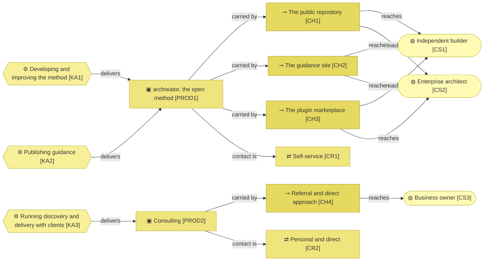
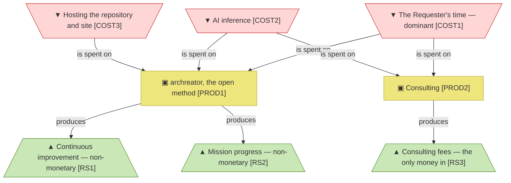

# Business model canvas

_[← Business design](./README.md) · [Front door](../README.md)_

How the organization operates and pays for itself, one canvas per product:
the product [`PROD1`] [archreator, the open method](./1_value-proposition-canvas.md#products)
and the product [`PROD2`] [Consulting](./1_value-proposition-canvas.md#products).

**ArchiMate viewpoint:** none; a Strategyzer Business Model Canvas per product.

**Status:** ◐ Draft catalogue, not yet validated.

## The products at a glance

Three channels converge on two segments and one product, and one channel is
a person. Everything on the `PROD1` side fans out and costs nothing per
user; everything on the `PROD2` side passes through a single line.

| | [`PROD1`] archreator, the open method | [`PROD2`] Consulting |
| --- | --- | --- |
| **Segments** | [`CS1`] Independent builder, [`CS2`] Enterprise architect | [`CS3`] Business owner |
| **Channels** | `CH1`, `CH2`, `CH3` | `CH4` |
| **Relationship** | `CR1` | `CR2` |
| **Revenue** | `RS1`, `RS2`, non-monetary | `RS3` |
| **Dominant cost** | `COST1` | `COST1` |
| **Scales?** | Yes, freely | **No**; bounded by one person's hours |

The product that earns money cannot grow, and the product that grows earns
feedback and mission progress rather than money. That is deliberate, per the
principle [`P7`] [Priced at the cost of running it](../1_strategy/1_motivation.md#principles).

A third product, a self-service portal doing everything the consulting route
does, is deliberately absent. It waits on the method proving itself.

## Channels

| ID | Channel | Carries | Reaches | State |
| -- | ------- | ------- | ------- | ----- |
| `CH1` | **The public repository**; they find it as code, not as marketing | [`PROD1`] archreator, the open method | [`CS1`] Independent builder, [`CS2`] Enterprise architect | Live |
| `CH2` | **The guidance site**, also where an owner evaluates the method before adopting | [`PROD1`] archreator, the open method | [`CS1`] Independent builder, [`CS2`] Enterprise architect | Live |
| `CH3` | **The plugin marketplace**, reaching them already working inside an agent | [`PROD1`] archreator, the open method | [`CS1`] Independent builder, [`CS2`] Enterprise architect | Live |
| `CH4` | Referral and direct approach | [`PROD2`] Consulting | [`CS3`] Business owner | Live |

## Customer relationships

| ID | Relationship | For | Costs |
| -- | ------------ | --- | ----- |
| `CR1` | Self-service | [`PROD1`] archreator, the open method | Near zero per user |
| `CR2` | **Personal and direct**, the Requester individually | [`PROD2`] Consulting | Their whole available time |

## Key activities

| ID | Activity | For | Performed by |
| -- | -------- | --- | ------------ |
| `KA1` | Developing and improving the method | [`PROD1`] archreator, the open method | The Requester, with an AI agent at co-pilot autonomy |
| `KA2` | Publishing guidance | [`PROD1`] archreator, the open method | The Requester, with an AI agent |
| `KA3` | Running discovery and delivery with clients | [`PROD2`] Consulting | The Requester |

## Key resources

| ID | Resource | Kind | State |
| -- | -------- | ---- | ----- |
| `KR1` | The Requester's knowledge and time | People | **Constrained**, the binding limit on the whole organization |
| `KR2` | The method: skills, conventions, the layered walk | Knowledge | Held, and improving |
| `KR3` | The published guidance site | Asset | Held |

## Key partners

| ID | Partner | Provides | Note |
| -- | ------- | -------- | ---- |
| `KP1` | AI model providers | The inference every product ultimately runs on | **Substitutable by design.** The method is provider-agnostic prose; only the packaging names a platform |
| `KP2` | The code host | Repository, plugin distribution, site hosting | Replaceable, and free at this scale |

## Revenue streams and cost structure

Only one green box is money, and it hangs off the product that cannot grow.
The product carrying every cost returns feedback and mission progress instead
of revenue; the principle `P7` accepts that arithmetic on purpose.

| ID | Revenue stream | Kind | From | Note |
| -- | -------------- | ---- | ---- | ---- |
| `RS1` | **Continuous improvement**: feedback and real usage flowing back into the method | Non-monetary | [`PROD1`] archreator, the open method | Grows with adoption; the method improves because people use it where the Requester is not |
| `RS2` | **Mission progress**: people building better things with AI while human knowledge improves rather than being delegated away | Non-monetary | [`PROD1`] archreator, the open method | The reason the organization exists |
| `RS3` | Consulting fees | Monetary | [`PROD2`] Consulting | Hourly; bounded by one person's available time |

| ID | Cost | For | Note |
| -- | ---- | --- | ---- |
| `COST1` | **The Requester's time** | [`PROD1`] archreator, the open method, [`PROD2`] Consulting | **Dominant**, and the binding constraint on everything |
| `COST2` | AI inference | [`PROD1`] archreator, the open method, [`PROD2`] Consulting | Each adopter carries their own; the organization pays only for its own use |
| `COST3` | Hosting the repository and site | [`PROD1`] archreator, the open method | Effectively zero; free tiers |

The Requester appears three times: as a key resource, as the dominant cost
and as a stakeholder with wants of their own. That triple entry is the
organization's central fact.
