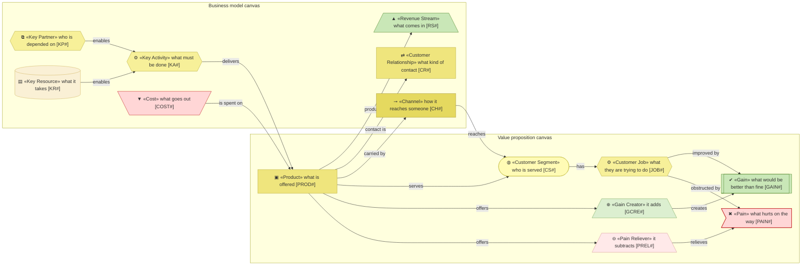
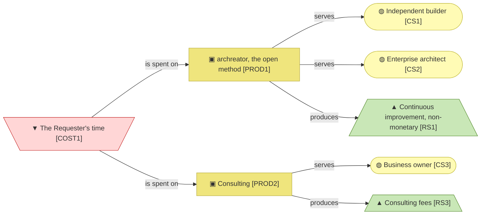

# Business design

_[← Front door](../README.md)_

Who the organization serves, what hurts them, what is offered against it, and
how the whole thing pays for itself.

**ArchiMate viewpoint:** none. Two Strategyzer canvases: a Value Proposition
Canvas per customer segment and a Business Model Canvas per product. The
[strategy layer](../1_strategy/README.md) is derived from their blocks.

## Documents

| # | Document | Elements | Question it answers |
| - | -------- | -------- | ------------------- |
| 1 | [Value proposition canvas](./1_value-proposition-canvas.md) | Segments, jobs, pains, gains; the products, pain relievers and gain creators offered against them | Who do we serve, what do they need, and what do we offer? |
| 2 | [Business model canvas](./2_business-model-canvas.md) | Channels, customer relationships, key activities, key resources, key partners, revenue streams and costs | How is each product delivered, and how does it pay? |

## Metamodel

Revenue is green and cost is rose, so the arithmetic is visible without
reading a label. The segments and the products appear on both canvases and
keep the identifiers the value proposition canvas gives them.

## Layer view

The product with two segments earns feedback rather than money; the product
that earns money has one segment and one person's time behind it.
