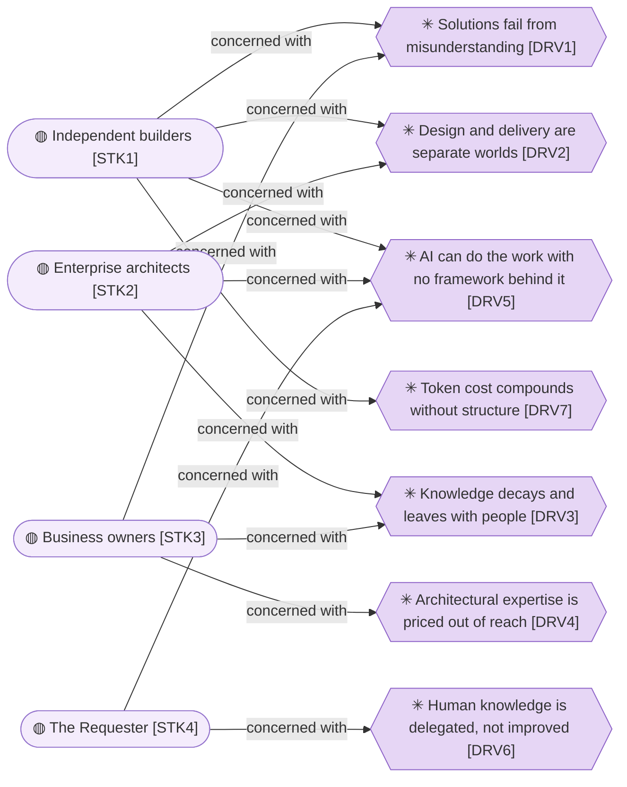
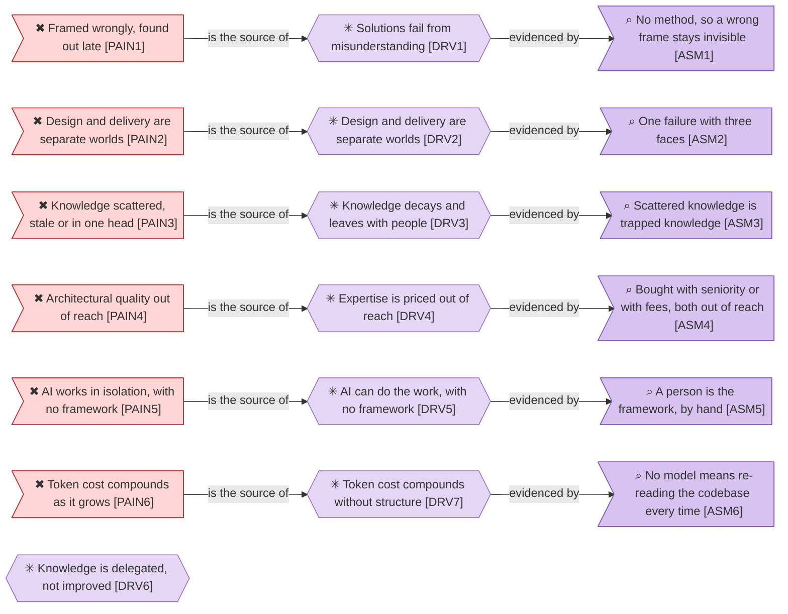
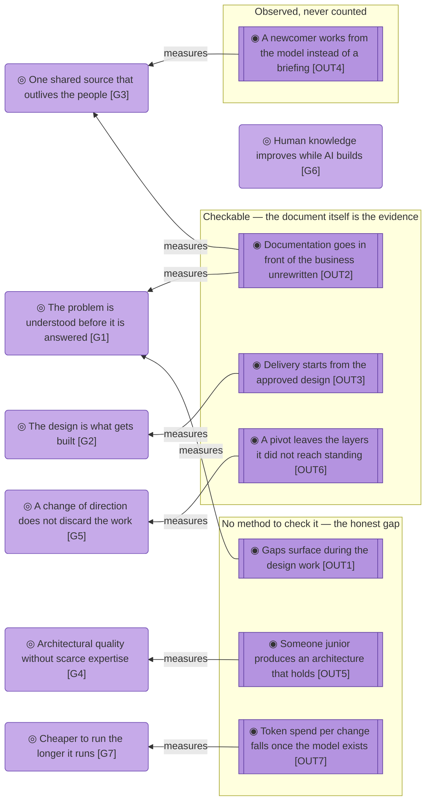

# Motivation

_[← Strategy layer](./README.md) · [Front door](../README.md)_

Who has a stake in the organization, what presses on them, what must become
true, and the principles every change is tested against.

**ArchiMate viewpoint:** Motivation: Stakeholder, Driver, Assessment, Goal,
Outcome, Principle.

**Status:** ◐ Draft catalogue, not yet approved at Direction.

## Stakeholders

`DRV5` is the only driver every stakeholder is concerned with, and `DRV6`
the only one reaching a single person. The pressure that brought the
customers is the arrival of capable AI; the pressure nobody else feels is
what it costs them to use it.

| ID | Stakeholder | What they want | Source |
| -- | ----------- | -------------- | ------ |
| `STK1` | **Independent builders**, building something real with a coding agent and no architecture background | To explain the business once and get from a design to something delivered, without the work outrunning their understanding | [`CS1`] Independent builder |
| `STK2` | **Enterprise architects**, fluent in the discipline, using the method as leverage | A standard model they can navigate directly, with an agent that follows the same rules they do | [`CS2`] Enterprise architect |
| `STK3` | **Business owners**, running a company or forming one, with knowledge but no structure a builder can act on | To have their business understood well enough that what gets built is what they meant | [`CS3`] Business owner |
| `STK4` | **The Requester**, the one person who maintains the method and delivers the consulting | That the method is used, improves through that use, and stops depending on their availability | [`KR1`] The Requester's knowledge and time, [`COST1`] The Requester's time |

## Drivers and assessments

`DRV6` enters from neither side and leaves on neither. Six rows run pain to
driver to assessment without a break; the seventh has no customer pain behind
it and no assessment in front of it.

| ID | Driver | Source |
| -- | ------ | ------ |
| `DRV1` | **Solutions fail from misunderstanding, not difficulty**: a good answer to the wrong question, discovered late | [`PAIN1`] The problem is framed wrongly, and nobody finds out until late |
| `DRV2` | **Design and delivery are separate worlds**: meaning is lost at the handover, and time to market pays for it | [`PAIN2`] Design and delivery are separate worlds |
| `DRV3` | **Knowledge decays and leaves with people**: the owner explains the business again to every new builder | [`PAIN3`] Knowledge is scattered, stale, or trapped in one person's head |
| `DRV4` | **Architectural expertise is priced out of reach** for the businesses that most need it | [`PAIN4`] Architectural quality is out of reach |
| `DRV5` | **AI can now do the work and has no framework behind it**: the capability arrived; the discipline did not | [`PAIN5`] AI already does most of this work, but in isolation, with no framework behind it |
| `DRV6` | **Human knowledge is being delegated rather than improved**: the fastest path with AI is to let it think, and the person ends up understanding their own business less than before | The mission; no canvas block |
| `DRV7` | **Token cost compounds without structure**: building is cheap while the solution is new, and maintaining is not, because an agent with no model traverses the whole project for every answer | [`PAIN6`] Token cost compounds as the solution grows |

The one driver with no canvas source is the one the organization exists
for. Nobody lists `DRV6` as a pain, because it does not hurt while it is
happening. It drives `G6` and `P1`.

| ID | Assessment | Source |
| -- | ---------- | ------ |
| `ASM1` | Without a method that forces a complete frame, a wrongly framed problem stays invisible until delivery | [`PAIN1`] The problem is framed wrongly, and nobody finds out until late |
| `ASM2` | Design and delivery being separate is one failure with three faces: slow delivery, documentation that drives nothing, and no path from a canvas to an implementation | [`PAIN2`] Design and delivery are separate worlds |
| `ASM3` | Knowledge scattered across documents, meetings, diagrams and wikis is knowledge trapped in whoever last held it | [`PAIN3`] Knowledge is scattered, stale, or trapped in one person's head |
| `ASM4` | Architectural quality is bought either with years of seniority or with consulting fees, and both are out of reach for the segments that need it most | [`PAIN4`] Architectural quality is out of reach |
| `ASM5` | AI already performs most of this work in isolation, with a person acting as the framework by hand | [`PAIN5`] AI already does most of this work, but in isolation, with no framework behind it |
| `ASM6` | An agent without a model answers every question by re-reading the codebase, and pays for the traversal in tokens every time | [`PAIN6`] Token cost compounds as the solution grows |

## Goals and outcomes

`G6` has no outcome pointing at it. The goal the organization exists for is
the one nothing measures, the same asymmetry `DRV6` shows at the other end
of the chain.

- **G1 — The problem is understood before it is answered.** Designing is how
  the understanding happens, not a record of understanding already had. From
  the job [`JOB1`] Understand the problem before answering it, against `ASM1`.
- **G2 — The design is what gets built.** An approved design flows into
  delivery without a handover for meaning to be lost in. From the job [`JOB2`] Turn that understanding into a delivered solution,
  against `ASM2`.
- **G3 — One shared source that outlives the people.** The same explanation
  is not repeated to every new person or agent, and a departure does not take
  the model with it. From the job [`JOB3`] Keep one shared source others can work from, against
  `ASM3`.
- **G4 — Architectural quality without scarce expertise.** Competence comes
  from the method rather than from seniority or budget. From the job [`JOB4`] Get architectural quality without scarce expertise,
  against `ASM4`.
- **G5 — A change of direction does not discard the work.** A pivot changes
  the layers it reaches and leaves the rest standing. From the job [`JOB5`] Change direction without losing the work already
  designed.
- **G6 — Human knowledge improves while AI builds.** The person understands
  their own business more after the work than before it. From `DRV6`, and
  held for its own sake rather than because a customer asked.
- **G7 — Cheaper to run the longer it runs.** The model bounds what an agent
  reads, so token spend falls over the life of a solution instead of rising
  with its size: somewhat dearer on day one, cheaper every month after. From
  the pain [`PAIN6`] Token cost compounds as the solution grows, against
  `ASM6`, and still to be validated in real use.

| ID | Outcome | How it is checked | Source |
| -- | ------- | ----------------- | ------ |
| `OUT1` | Strategic and business gaps surface during the design work rather than after delivery | **No method**; a gate presentation naming a gap the owner had not stated is the evidence, and nothing records it | [`GAIN1`] Understand the business wider and deeper |
| `OUT2` | Documentation goes in front of the business without a rewrite | **Checkable**; the document shown at a gate is the document in the repository, and no separate deck exists | [`GAIN2`] Documentation ready to put in front of the business |
| `OUT3` | Delivery starts from the approved design, with AI doing the technical work | **Checkable**; an implementation initiative names the scope document and the elements it builds | [`GAIN3`] Build from the design |
| `OUT4` | A new person or agent works from the model instead of being briefed | **Observable, never counted** | [`GAIN4`] A shared language that keeps working |
| `OUT5` | Someone without years of seniority produces an architecture that holds | **No method**; only real adoption would evidence it | [`GAIN5`] Speed with structure, at any level of experience |
| `OUT6` | A pivot changes some layers and leaves the rest standing | **Checkable**; a scope document records "no change" verdicts for the layers the pivot did not reach | [`GAIN6`] Pivots that cost less |
| `OUT7` | Token spend per change falls once the model exists | **No method yet**; the claim needs measuring in a real adoption before anyone repeats it | [`PREL6`] The model bounds what an agent reads |

Three of seven outcomes are checkable, one is observed and never counted,
and three have no method at all. That is how far the organization can know
whether it is working.

## Principles

- **P1 — Humans hold strategy and business judgement; AI assists and
  executes.** The gates make that structural rather than aspirational. Rules
  out an agent deciding what the business is, and the convenience path of
  letting AI think so the person does not have to, which is `DRV6` arriving
  from the inside.
- **P2 — Everything is in the repository, as text.** Model, method, decisions
  and approvals. Rules out a modeling tool, a wiki or a database as the
  source of truth, and any cache the model could go stale behind.
- **P3 — Better language, never simpler language.** Standardised concepts
  with defined relationships, expanded on first use, the name leading and the
  identifier riding along. Rules out hiding the model from the owner to
  spare them.
- **P4 — A design that delivers nothing is a cost.** Every element earns its
  place by leading to an outcome. Rules out documentation as the
  deliverable, and modeling an intention nobody committed to.
- **P5 — Well-done less is more.** Consolidate before enumerating; nothing
  lands that the project does not use; when in doubt, stop a level earlier.
  Rules out a catalogue nobody can hold in their head.
- **P6 — Generic by design, one implementation at a time.** The method is
  transferable instructions; the packaging is provider-specific and
  disposable.
- **P7 — Priced at the cost of running it.** Even at scale, the intent is
  not to charge much beyond operational cost. Rules out value-based pricing
  without revisiting this principle first.
- **P8 — Interrupt only for what a person alone can settle.** Ask when the
  answer changes what gets built now and nothing in the model settles it;
  decide the rest, apply it, and mark it draft so a later word overrides it.
  Rules out a question about a state that does not exist yet, and making
  somebody learn the method to answer one. A change inside an element the
  model already names asks nothing and documents nothing.

`P1` and `P4` refuse a change; `P8` pauses one. A change that would let
an agent decide what the business is, or that adds an element leading
nowhere, is refused at the first step rather than argued about later. A
change waits for a person only when the answer changes what gets built now.
