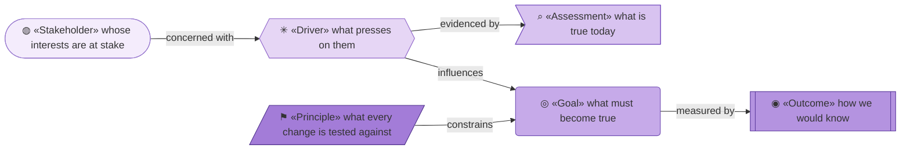
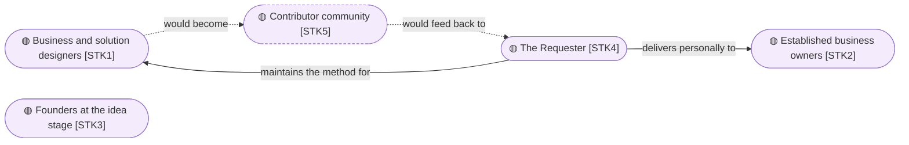
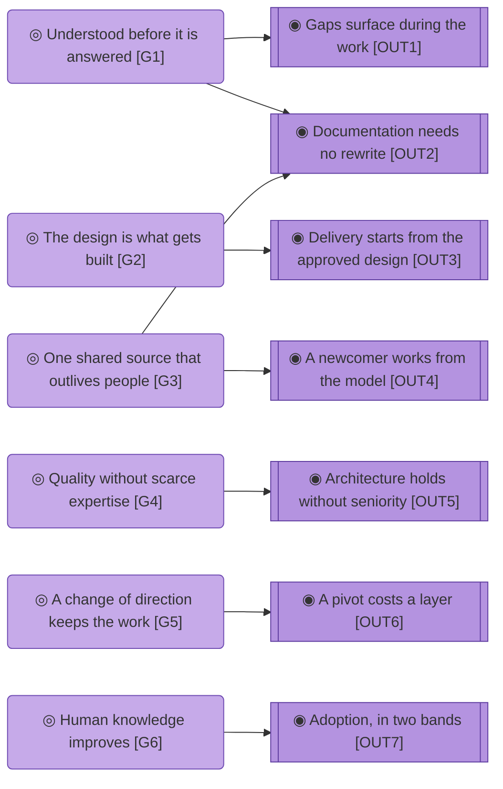

# Motivation

_[← Strategy layer](./README.md) · [EA home](../README.md)_

**ArchiMate viewpoint:** Motivation. Who has a stake in this organization,
what presses on them, what must become true, and the principles every change
is tested against.

**Status:** ● Validated at **Gate 1**, 2026-08-22.

Every element here is **derived from the canvases**, and the `Source` column
says from which block. The correspondence itself is stated once, in
[the business model canvas](../0_business-design/2_business-model-canvas.md#from-canvas-to-archimate),
and is not restated below.

## How to read this document

| Glyph | Shape | Element | ID prefix | Reads as |
| ----- | ----- | ------- | --------- | -------- |
| `◍` | Stadium | «Stakeholder» | `STK` | `STK1` = Stakeholder 1 |
| `✳` | Hexagon | «Driver» | `DRV` | `DRV1` = Driver 1 |
| `⌕` | Flag | «Assessment» | `ASM` | `ASM1` = Assessment 1 |
| `◎` | Rounded rectangle | «Goal» | `G` | `G1` = Goal 1 |
| `◉` | Rectangle, double bars | «Outcome» | `OUT` | `OUT1` = Outcome 1 |
| `⚑` | Parallelogram | «Principle» | `P` | `P1` = Principle 1 |

## Stakeholders

| ID | Stakeholder | What they want | Concerned with | Source |
| -- | ----------- | -------------- | -------------- | ------ |
| `STK1` | **Business and solution designers** — enterprise architects at any level, business analysts, entrepreneurs designing for themselves | To get from a design to something delivered, without handing the work to someone who will not understand it | `DRV1`, `DRV2` | `CS1` |
| `STK2` | **Established business owners** — a running company with real operational knowledge and no structure a builder can act on | To have their business understood well enough that what gets built is what they meant | `DRV1`, `DRV3`, `DRV4` | `CS2` |
| `STK3` | **Founders at the idea stage** — pre-operational, the business model still forming | To test an idea without paying for expertise they cannot yet justify | `DRV1`, `DRV4` | `CS3` |
| `STK4` | **The Requester** — the one person who maintains the method and delivers the consulting | That the method is used, improves through that use, and stops depending on their availability | `DRV5`, `DRV6` | `KR1`, `COST1` |
| `STK5` | **Contributor community** — **Pending**, no contributor base exists yet | To feed real experience back into a method they did not write | `DRV5` | `KP3` |

**`STK4` appears in three blocks of the canvases** — a key resource, the
dominant cost, and a stakeholder with wants of their own. That triple entry is
the organization's central fact, not a modelling accident.

## Drivers

| ID | Driver | Source |
| -- | ------ | ------ |
| `DRV1` | **Solutions fail from misunderstanding, not difficulty** — a good answer to the wrong question, discovered late | `PAIN1` |
| `DRV2` | **Design and delivery are separate worlds** — the design is handed over, the meaning is lost at the handover, and time to market pays for it | `PAIN2` |
| `DRV3` | **Knowledge decays and leaves with people** — the owner explains the business again to every new builder | `PAIN3` |
| `DRV4` | **Architectural expertise is priced out of reach** — an architect costs more than the businesses that most need one can justify | `PAIN4` |
| `DRV5` | **AI can now do the work and has no framework behind it** — the capability arrived; the discipline did not | `PAIN5` |
| `DRV6` | **Human knowledge is being delegated rather than improved** — the fastest path with AI is to let it think, and the person ends up understanding their own business less than before | — the mission, no canvas block |

**`DRV6` has no canvas source, and it is the one the organization exists
for.** Nobody lists it as a pain, because it does not hurt while it is
happening. It is the driver behind `G6` and behind `P1`.

## Assessments

| ID | Assessment | Evidences | Source |
| -- | ---------- | --------- | ------ |
| `ASM1` | Without a method that forces a complete frame, a wrongly framed problem stays invisible until delivery | `DRV1` | `PAIN1` |
| `ASM2` | Design and delivery being separate is one failure with three faces: slow delivery, documentation that drives nothing, and no path from a canvas to an implementation | `DRV2` | `PAIN2` |
| `ASM3` | Knowledge scattered across documents, meetings, diagrams and wikis is knowledge trapped in whoever last held it | `DRV3` | `PAIN3` |
| `ASM4` | Architectural quality is bought either with years of seniority or with consulting fees, and both are out of reach for the segments that need it most | `DRV4` | `PAIN4` |
| `ASM5` | AI already performs most of this work in isolation, with a person acting as the framework by hand | `DRV5` | `PAIN5` |

## Goals and outcomes

Six goals from six customer jobs plus the mission — `G1` through `G5` are the
organization's goals stated as its customers' jobs getting done, and `G6` is
the one held for its own sake.

- **G1 — The problem is understood before it is answered.** Designing is how
  the understanding happens, not a record of understanding already had.
  From `JOB1`, against `ASM1`.
- **G2 — The design is what gets built.** An approved design flows into
  delivery without a handover for meaning to be lost in. From `JOB2` and
  `JOB3`, against `ASM2`.
- **G3 — One shared source that outlives the people.** The same explanation is
  not repeated to every new person, and a departure does not take the model
  with it. From `JOB4`, against `ASM3`.
- **G4 — Architectural quality without scarce expertise.** Competence comes
  from the method rather than from seniority or budget. From `JOB5`, against
  `ASM4`.
- **G5 — A change of direction does not discard the work.** A pivot changes
  the layers it reaches and leaves the rest standing. From `JOB6`.
- **G6 — Human knowledge improves while AI builds.** The person understands
  their own business more after the work than before it. From `DRV6`, and held
  for its own sake rather than because a customer asked.

| ID | Outcome | For | How it is checked | Source |
| -- | ------- | --- | ----------------- | ------ |
| `OUT1` | Strategic and business gaps surface **during** the design work rather than after delivery | `G1` | **No method.** A gate presentation naming a gap the Requester had not stated is the evidence, and nothing records it | `GAIN1` |
| `OUT2` | Documentation goes in front of the business without a rewrite | `G1`, `G3` | **Checkable.** The document shown at a gate is the document in the repository — no separate deck exists | `GAIN2` |
| `OUT3` | Delivery starts from the approved design, with AI doing the technical work | `G2` | **Checkable.** An implementation initiative names the scope document and the elements it builds | `GAIN3` |
| `OUT4` | A new person or agent works from the model instead of being briefed | `G3` | **Observable, never counted.** It happens or it does not, and nobody tallies it | `GAIN4` |
| `OUT5` | Someone without years of seniority produces an architecture that holds | `G4` | **No method.** Only real adoption would evidence it | `GAIN5` |
| `OUT6` | A pivot changes some layers and leaves the rest standing | `G5` | **Checkable.** A scope document records "no change" verdicts for the layers the pivot did not reach | `GAIN6` |
| `OUT7` | **Adoption in two bands** — pre-engagement (stars, forks, discussions) and real (organizations actually designed and built with the method) | `G6` | **Split.** The first band is readable from the code host today; the second has no collection method at all | `RS1`, `RS2` |

**Three of seven outcomes are checkable, one is observed and never counted,
and three have no method at all.** That distribution is the honest state of
this organization's ability to know whether it is working, and closing it is
`COA3`.

## Principles

- **P1 — Humans hold strategy and business judgement; AI assists and
  executes.** The gates make that structural rather than aspirational. Rules
  out an agent deciding what the business is — and also the convenience path,
  letting AI think so the person does not have to, which is `DRV6` arriving
  from the inside.
- **P2 — Everything is in the repository, as text.** Model, method, decisions
  and approvals. Rules out a modeling tool, a wiki or a database as the source
  of truth, and is why the model graph is validated in memory rather than
  stored.
- **P3 — Better language, never simpler language.** Standardised concepts with
  defined relationships, expanded on first use. Rules out hiding the model
  from the owner to spare them: the standardisation *is* the value, because an
  owner understands their business more completely once the method has forced
  a frame.
- **P4 — A design that delivers nothing is a cost.** Every element earns its
  place by leading to an outcome. Rules out documentation as the deliverable,
  and rules out modeling an intention nobody committed to — it is marked
  Pending or it is not modeled.
- **P5 — Well-done less is more.** Consolidate before enumerating; propose
  consolidated options rather than menus. Rules out a catalogue nobody can
  hold in their head, and therefore relationships nobody traces.
- **P6 — Generic by design, one implementation at a time.** The method is
  transferable instructions; the packaging is provider-specific and
  disposable. Rules out the method itself becoming unportable.
- **P7 — Priced at the cost of running it.** Even at scale, the intent is not
  to charge much beyond operational cost. Rules out value-based pricing, and
  any future paid tier introduced without revisiting this principle first.

**`P1` and `P4` are the two that stop work.** A change that would let an agent
decide what the business is, or that adds an element leading nowhere, is
refused at Step 1 rather than argued about later.

## Why there is no single view of this layer

Thirty-one elements across six types do not fit one honest diagram. Each
section above carries its own, overlapping by one rank so a reader can chain
them — which is the drawing rule applied rather than a limitation of this
document.
