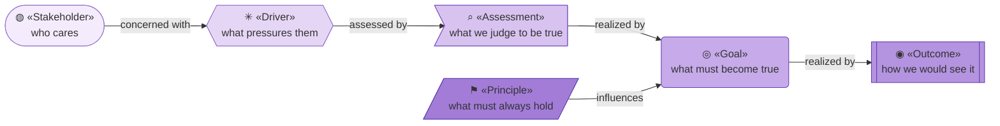
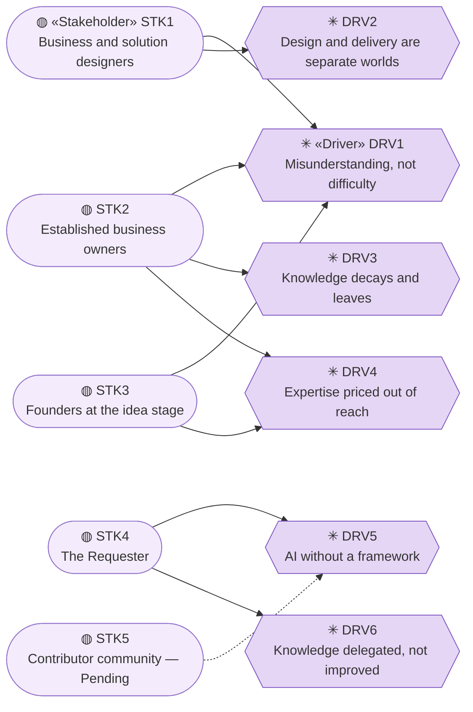
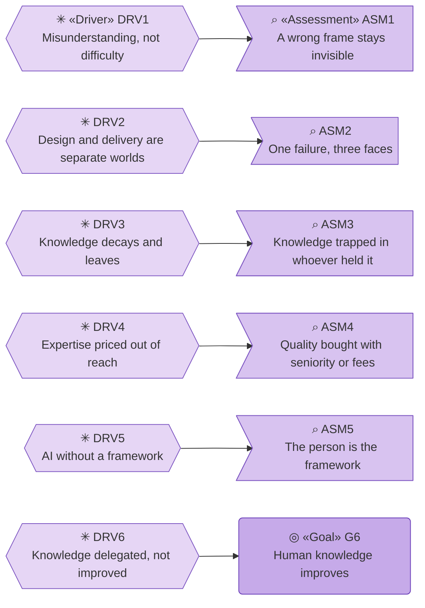
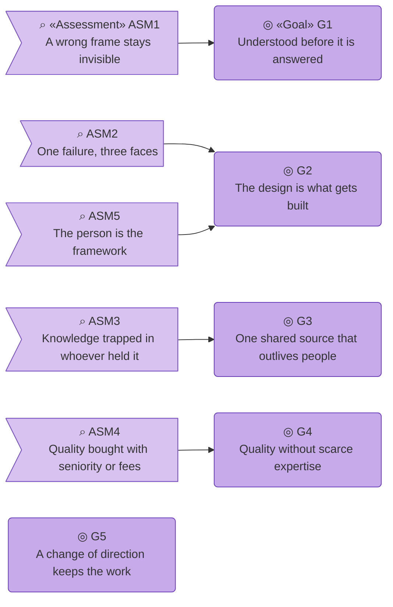
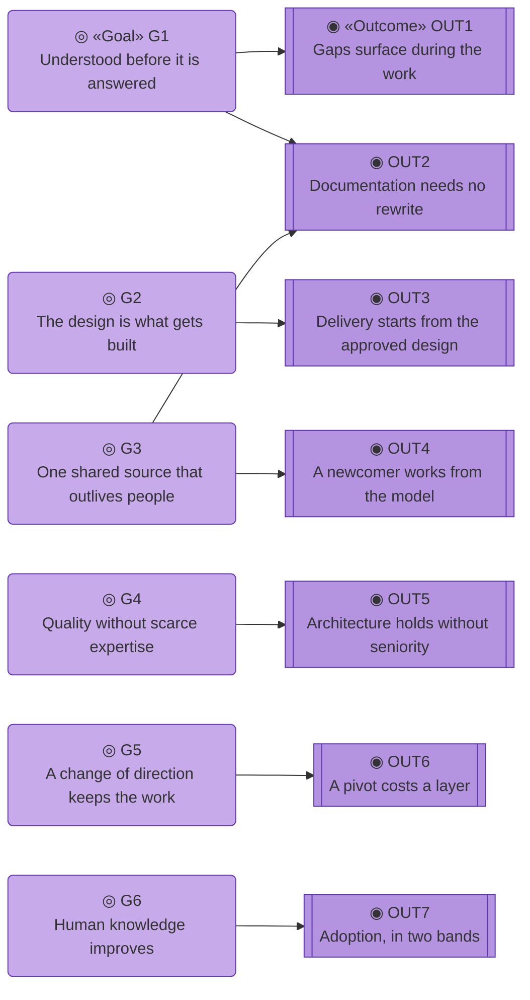
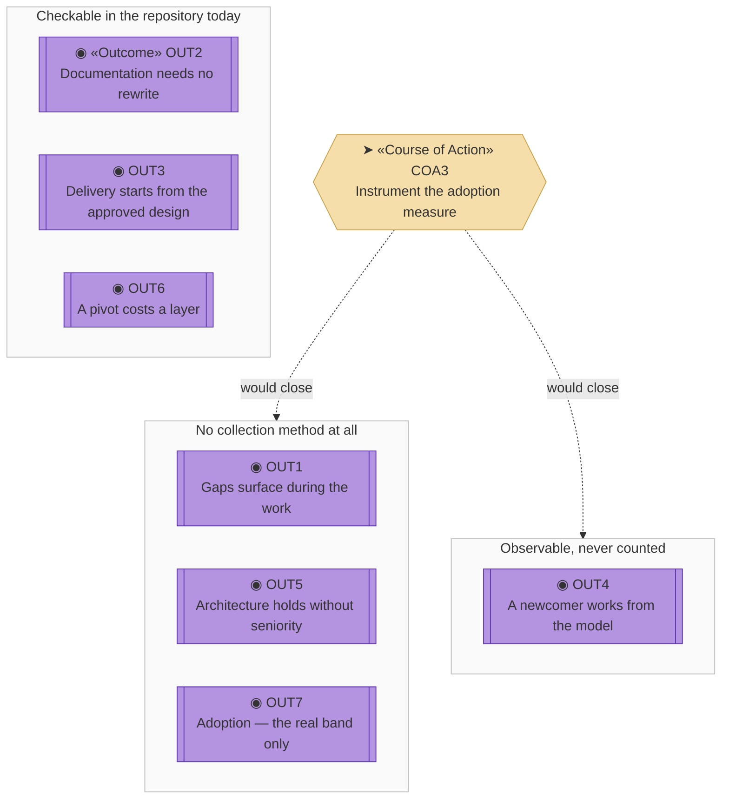
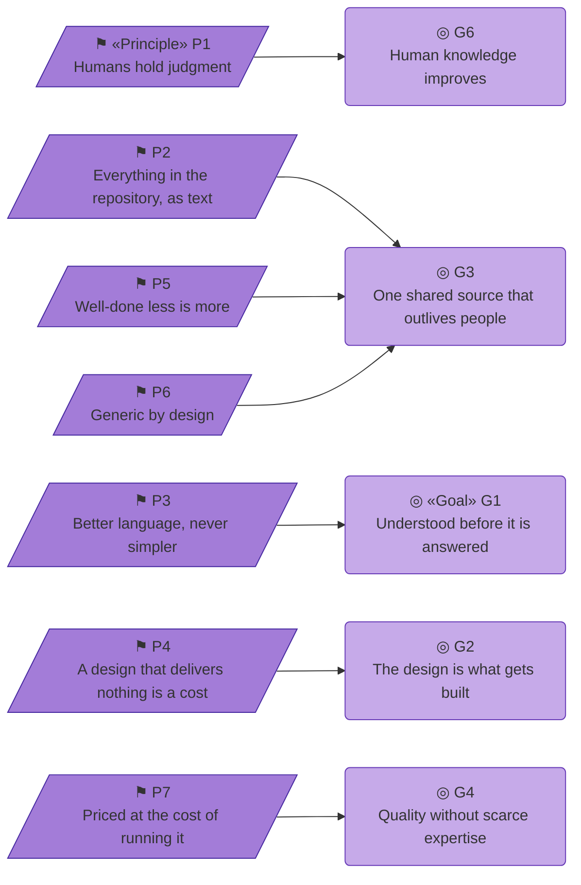

# Motivation — the organization behind archreator

_[← Strategy layer](./README.md) · [EA home](../README.md)_

**ArchiMate elements:** Stakeholder, Driver, Assessment, Goal, Outcome,
Principle.

Derived from the [value proposition canvas](../0_business-design/1_value-proposition-canvas.md)
and the [business model canvas](../0_business-design/2_business-model-canvas.md),
approved at Gate 0 on 2026-08-08. Each table's `Source` column names the
canvas element it came from, so the trace back survives.

## How to read this document

**That chain is the argument this whole layer makes**, and each section below
draws one link of it: who is pressured, by what, what we judge about it, what
must become true, and how we would know. Principles enter from the side —
they constrain every goal without being caused by any driver.

**Every element type has its own glyph, shape, tone and ID prefix:**

| Glyph | Shape | Element | ID prefix | Reads as |
| ----- | ----- | ------- | --------- | -------- |
| `◍` | Stadium (rounded ends) | «Stakeholder» | `STK` | `STK1` = Stakeholder 1 |
| `✳` | Hexagon | «Driver» | `DRV` | `DRV1` = Driver 1 |
| `⌕` | Flag (notched right edge) | «Assessment» | `ASM` | `ASM1` = Assessment 1 |
| `◎` | Rounded rectangle | «Goal» | `G` | `G1` = Goal 1 |
| `◉` | Rectangle with double bars | «Outcome» | `OUT` | `OUT1` = Outcome 1 |
| `⚑` | Parallelogram | «Principle» | `P` | `P1` = Principle 1 |

**Some glyphs depict, others only distinguish.** `⌕` is the ArchiMate
Assessment magnifier, `◎` its Goal, `◉` its Outcome, and `✳` echoes the
Driver's steering wheel. `◍` and `⚑` carry no resemblance and are simply
consistent — like the shapes and the tones, they are learned from this table
once and then read everywhere. ArchiMate's own icons cannot be drawn here;
[the notation review](../../../product-archreator/reviews/2_diagram-notation-icons.md)
records what was tried.

The ID prefix is how every other document in this model refers to an element
here without restating it, so `relieved by G4` in a scope document three
initiatives from now still resolves.

All six tones are the Motivation violet; the ramp runs light at the start of
the chain to dark at the end, so that in a single-layer view like this one
the element type is readable without hunting for the «stereotype» label. In a
**cross-layer** view the layer palette wins instead — the point of colour
there is to separate motivation from business from technology, not one
motivation element from another.

**The glyph rides on every node; the «stereotype» word appears once.** The
glyph costs one character, so it can afford to be everywhere. The word costs
a line, so it is written on the first node of each type in a diagram and
dropped on the rest — it teaches nobody anything on the thirteenth reading.

## Stakeholders

Every edge above reads **concerned with**. The three customer segments become
stakeholders, and so do the two internal parties. Partners are stakeholders
in the loose sense but are modeled where they act — as external Business
Actors in [the business layer](../2_business/1_business-actors-and-roles.md) —
rather than duplicated here.

| ID | Stakeholder | Concern | Driver | Source |
| -- | ----------- | ------- | ------ | ------ |
| `STK1` | **Business and solution designers** — enterprise architects at any level, business analysts, entrepreneurs designing for themselves | Getting from a design to something delivered, without handing the work to someone who will not understand it | `DRV1`, `DRV2` | `CS1` Customer Segment 1 |
| `STK2` | **Established business owners** — a running company with real operational knowledge and no structure a builder can act on | Having their business understood well enough that what gets built is what they meant | `DRV1`, `DRV3`, `DRV4` | `CS2` Customer Segment 2 |
| `STK3` | **Founders at the idea stage** — pre-operational, the business model still forming | Testing an idea without paying for expertise they cannot yet justify | `DRV1`, `DRV4` | `CS3` Customer Segment 3 |
| `STK4` | **The Requester** — the single person who maintains the method and delivers the consulting | That the method is used, improves through that use, and does not depend on their availability forever | `DRV5`, `DRV6` | `KR1` Key Resource 1, `COST1` Cost 1 |
| `STK5` | **Contributor community** — **Pending**, no contributor base exists yet | Being able to feed real experience back into a method they did not write | `DRV5` | `KP3` Key Partner 3 |

`DRV1` is the only driver that pressures all three customer segments, which
is why it is the one the method is built around. `STK5`'s edge is dashed
because the stakeholder does not exist yet — it is recorded because `RS1`
(Revenue Stream 1 — continuous improvement) depends on it, and a return
that is claimed should name who produces it.

## Drivers

Five drivers are **assessed by** an assessment. `DRV6` is the exception: it
goes straight to a goal, because nobody has to be convinced of it — it is the
position this organization takes rather than a condition it observes.

| ID | Driver | What pressures it |
| -- | ------ | ----------------- |
| `DRV1` | **Solutions fail from misunderstanding, not difficulty** — a good answer to the wrong question, discovered late |
| `DRV2` | **Design and delivery are separate worlds** — the design is handed over, the meaning is lost at the handover, and time to market pays for it |
| `DRV3` | **Knowledge decays and leaves with people** — the owner explains the business again to every new builder |
| `DRV4` | **Architectural expertise is priced out of reach** — an enterprise architect costs more than the businesses that most need one can justify |
| `DRV5` | **AI can now do the work and has no framework behind it** — the capability arrived; the discipline did not |
| `DRV6` | **Human knowledge is being delegated rather than improved** — the fastest path with AI is to let it think, and the person ends up understanding their own business less than before |

`DRV6` is the reason this organization exists rather than a competitor to it.
Everything else on this list is a market condition; `DRV6` is a choice about
which way the market should go.

## Assessments

Every edge reads **realized by**. `G5` sits in the diagram with nothing
pointing at it, deliberately: it comes from a customer job (`JOB6`) that no
pain ever contested, so no assessment backs it. An unbacked goal is worth
seeing rather than hiding.

| ID | Assessment | Assesses | Source |
| -- | ---------- | -------- | ------ |
| `ASM1` | Without a method that forces a complete frame, a wrongly framed problem stays invisible until delivery | `DRV1` | `PAIN1` Pain 1 |
| `ASM2` | Design and delivery being separate is one failure with three faces: slow delivery, documentation that drives nothing, and no path from a canvas to an implementation | `DRV2` | `PAIN2` |
| `ASM3` | Knowledge scattered across documents, meetings, diagrams and wikis is knowledge trapped in whoever last held it | `DRV3` | `PAIN3` |
| `ASM4` | Architectural quality is currently bought either with years of seniority or with consulting fees, and both are out of reach for the segments that need it most | `DRV4` | `PAIN4` |
| `ASM5` | AI already performs most of this work in isolation, with a person acting as the framework by hand | `DRV5` | `PAIN5` |

`ASM5` is the load-bearing one, and the diagram shows why: it is the only
assessment that shares a goal with another. The other four are decades old;
what is new is that the tooling to relieve them exists and has nothing
connecting it.

## Goals

Six goals from six customer jobs plus the mission — `G1` through `G5` are the
organization's goals stated as its customers' jobs getting done, and `G6` is
the one held for its own sake.

- **G1 — The problem is understood before it is answered.** Designing is how
  the understanding happens, not a record of understanding already had.
  Derived from `JOB1` (Job 1) against `ASM1`.
- **G2 — The design is what gets built.** An approved design flows into a
  working solution with no handover for the meaning to change shape in —
  whether the designer builds it or directs a builder. Derived from `JOB2`
  and `JOB3` against `ASM2` and `ASM5`.
- **G3 — One shared source that outlives the people.** The same explanation
  is not given twice. Derived from `JOB4` against `ASM3`.
- **G4 — Architectural quality without scarce expertise.** Competence comes
  from the method rather than from seniority or budget. Derived from `JOB5`
  against `ASM4`.
- **G5 — A change of direction does not discard the work.** Derived from
  `JOB6`.
- **G6 — Human knowledge improves while AI builds.** The person understands
  their business better after using the method than before, which is the
  opposite of delegating the thinking. Derived from `DRV6` and `RS2`
  (Revenue Stream 2 — mission progress).

`G2` absorbs two jobs because they are one goal reached by two routes: a
designer who builds it and an owner who directs a builder want the same thing
to become true.

## Outcomes

The grouping is the point of this section. **Three outcomes are checkable
against the repository right now; four are not** — one because nobody counts
it, three because there is no way to. `OUT7` straddles the line: its
pre-engagement band is readable from GitHub today, and its real band, the one
that actually evidences the mission, is not.

| ID | Outcome | Realizes | Measured by | Source |
| -- | ------- | -------- | ----------- | ------ |
| `OUT1` | Strategic and business gaps surface **during** the design work rather than after delivery | `G1` | **No method.** A gate presentation naming a gap the Requester had not stated is the evidence, and nothing records it | `GAIN1` Gain 1 |
| `OUT2` | Documentation goes in front of the business without a rewrite | `G1`, `G3` | **Checkable.** The document shown at a gate is the document in the repository — no separate deck exists | `GAIN2` |
| `OUT3` | Delivery starts from the approved design, with AI doing the technical work | `G2` | **Checkable.** An implementation initiative names the scope document and the elements it builds | `GAIN3` |
| `OUT4` | A new person or agent works from the model instead of being briefed | `G3` | **Observable, never counted.** It happens or it does not, and nobody tallies it | `GAIN4` |
| `OUT5` | Someone without years of seniority produces an architecture that holds | `G4` | **No method.** Only the real adoption band below would evidence it | `GAIN5` |
| `OUT6` | A pivot changes some layers and leaves the rest standing | `G5` | **Checkable.** A scope document records "no change" verdicts for the layers the pivot did not reach | `GAIN6` |
| `OUT7` | **Adoption in two bands** — pre-engagement (stars, forks, contributions, discussions) and real (enterprises and initiatives actually designed and built) | `G6` | **Split.** Pre-engagement readable from GitHub today; the real band has no collection method — see the [measure](../0_business-design/2_business-model-canvas.md#measuring-rs1-and-rs2--adoption-in-two-bands) | `RS1`, `RS2` |

The three checkable outcomes all check the same way: **by reading a document
this method produces.** That is cheap and real, and it is also the limit —
every outcome about what happened to a *person* is in the other two groups.
Closing that is `COA3`
([courses of action](./2_capabilities-and-resources.md#courses-of-action)).

## Principles

Every edge reads **influences**. Few, load-bearing, and testable. **No canvas
block feeds this section** — these came directly from the Requester, and
every one of them has already overruled something during the method's
development.

They gate every change: `ea-first-change` Step 1c stops on a conflict with
any of them.

| ID | Principle | What it rules out |
| -- | --------- | ----------------- |
| `P1` | **Humans hold strategy and business judgment; AI assists and executes.** The gates exist to make that structural rather than aspirational | An agent deciding what the business is. Also rules out the convenience path — letting AI think so the person does not have to — which is `DRV6` arriving from the inside |
| `P2` | **Everything is in the repository, as text.** Model, method, decisions, approvals | A modeling tool, a wiki, or a database as the source of truth. This is why the model graph is validated in memory and not stored |
| `P3` | **Better language, never simpler language.** Standardised concepts with defined relationships, expanded on first use | Hiding the model from the owner to spare them. The standardisation *is* the value — an owner understands their business more completely because the method forced a frame |
| `P4` | **A design that delivers nothing is a cost.** Every element earns its place by leading to an outcome | Documentation as the deliverable. Also rules out modeling an intention nobody committed to — it is marked Pending or it is not modeled |
| `P5` | **Well-done less is more.** Consolidate before enumerating, propose consolidated options rather than menus | A catalogue that nobody can hold in their head, and therefore relationships nobody traces |
| `P6` | **Generic by design, one implementation at a time.** The method is transferable instructions; the packaging is provider-specific | The method itself becoming unportable. Its exact boundary is still open — see [open question 2](../0_business-design/2_business-model-canvas.md#open-questions) |
| `P7` | **Priced at the cost of running it.** Even at scale, the intent is not to charge much beyond operational cost | Value-based pricing, and any future paid tier introduced without revisiting this principle first |

**`G3` is the goal three principles converge on**, which is the diagram's most
useful reading: keeping one durable shared source is not one rule but the
combined effect of putting everything in text, keeping it short enough to
read, and not letting a vendor own the format.

`P5` and `P7` are the two most likely to be violated by accident — `P5` by an
agent being thorough, `P7` by a reasonable-looking business decision three
initiatives from now. Both are written down for that reason.

## Why there is no single view of this layer

An earlier draft ended with one diagram of the whole layer, and it could only
ever be a selection — 36 elements do not fit in a readable flowchart, so it
showed twelve and implied it showed everything.

The six diagrams above are the complete view, drawn one link of the chain at
a time. Every element appears in at least one of them, with all its edges of
that kind. That is the trade this document makes: a reader follows the
argument in six readable steps instead of failing to read one large picture.
