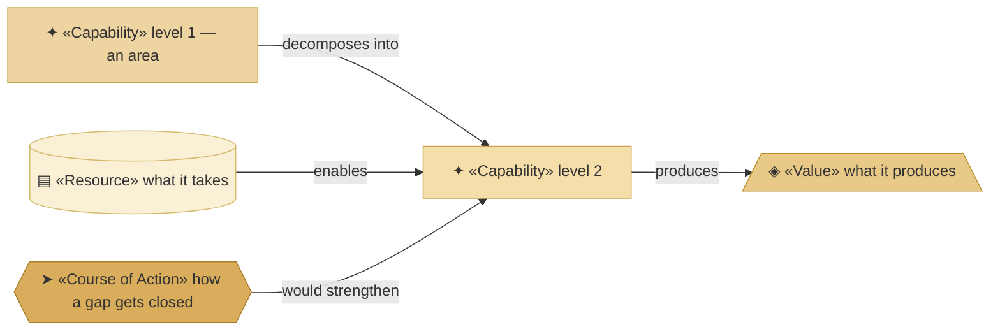
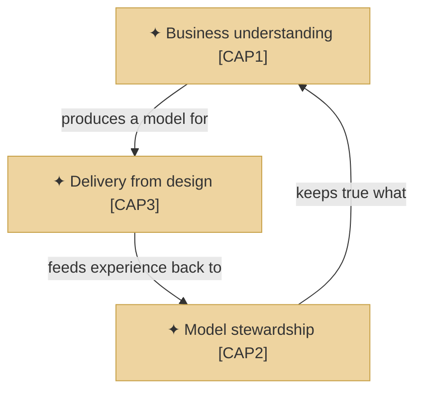
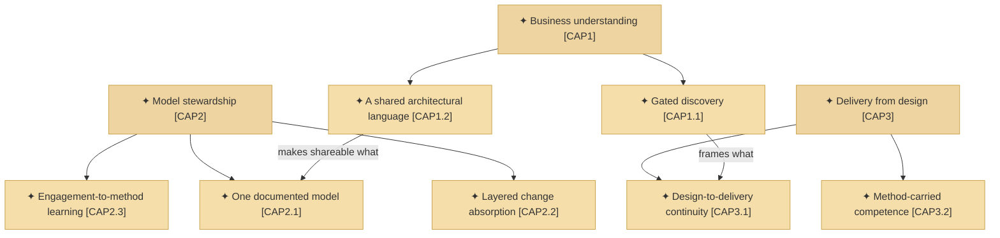
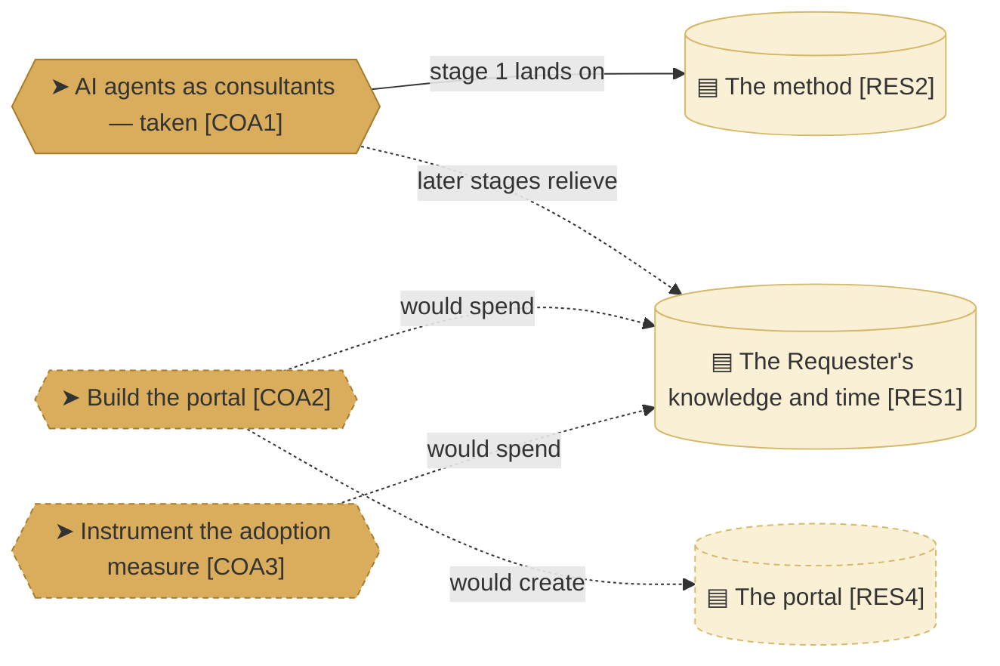

# Capabilities and resources

_[← Strategy layer](./README.md) · [EA home](../README.md)_

**ArchiMate viewpoint:** Strategy. What the organization must be able to do,
the value each ability produces, what it has to work with, and the courses of
action open to it.

**Status:** ● Validated at **Gate 1**, 2026-08-22.

**Capabilities are levelled.** Three areas at level 1, seven capabilities at
level 2, and nothing below — no named pain justifies a third level yet. The
identifier carries the parent, so these tables have no parent column:
`CAP1.2` is the second capability inside area `CAP1`.

## How to read this document

| Glyph | Shape | Element | ID prefix | Reads as |
| ----- | ----- | ------- | --------- | -------- |
| `✦` | Rectangle | «Capability» | `CAP` | `CAP1` = area 1; `CAP1.2` = its second capability |
| `◈` | Trapezoid | «Value» | `VAL` | `VAL1` = Value 1 |
| `▤` | Cylinder | «Resource» | `RES` | `RES1` = Resource 1 |
| `➤` | Hexagon | «Course of Action» | `COA` | `COA1` = Course of Action 1 |

A level-1 area is drawn one tone darker than the capabilities inside it.

## The areas

| ID | Area | What it means | Produces |
| -- | ---- | ------------- | -------- |
| `CAP1` | **Business understanding** | The organization can arrive at what a business actually is, and say it in a form that survives being passed on | `VAL1`, `VAL3` |
| `CAP2` | **Model stewardship** | It can keep that understanding true as time and change act on it, and improve the method that produces it | `VAL3`, `VAL5` |
| `CAP3` | **Delivery from design** | It can turn an approved design into a working solution without an expert in the room | `VAL2`, `VAL4` |

**The areas have no `Realized by`, and that is correct rather than a gap.** An
area is realized by its parts; only the level-2 capabilities point at
something concrete.

## The capabilities

| ID | Capability | What it includes | Realized by | Source |
| -- | ---------- | ---------------- | ----------- | ------ |
| `CAP1.1` | **Gated discovery** | Question-driven discovery that tests the business rather than recording it, with approval gates forcing a complete frame before anything is built | The `align-change-through-layers`, `discover-business-model` and `discover-strategy` skills | `PREL1`, `GCRE1` |
| `CAP1.2` | **A shared architectural language** | Standardised concepts with defined relationships, which is what makes the model mean the same thing to a person and to an agent | ArchiMate-on-Mermaid notation, per the `architecture-document-style` skill | `GCRE4` |
| `CAP2.1` | **One documented model** | Markdown in git, catalogues and diagrams, every element naming what realizes it | The `architecture-document-style` skill and the validators in `plugins/archreator/scaffold/scripts/` | `PREL3`, `GCRE2` |
| `CAP2.2` | **Layered change absorption** | Strategy can change without redoing technology, and the reverse | The numbered layers and the per-layer "no change" verdict | `GCRE6` |
| `CAP2.3` | **Engagement-to-method learning** | What the Requester improvises during an engagement becomes method anyone can use, instead of staying in one person's head | The `run-retrospective` skill and the notes in [`engagements/`](../engagements/README.md) | — added by [decision 1](../decisions/1_take-coa1-staged.md) |
| `CAP3.1` | **Design-to-delivery continuity** | The approved design is the input an agent builds from, so there is no handover | The `align-change-through-layers` and `shard-stories` skills | `PREL2`, `GCRE3` |
| `CAP3.2` | **Method-carried competence** | The expertise sits in the method, so the price of an architecture drops to the price of an agent | The skill corpus as a whole, distributed as a plugin | `PREL4`, `GCRE5` |

**`CAP2.3` is the only capability with no canvas source**, because it answers
a gap the canvases did not name: `CAP3.2` claims the method carries the
competence, and nothing was turning what the Requester knows into method on
purpose. It is the first stage of `COA1`.

**`CAP2.3` currently has no evidence.** The engagements folder is empty — the
notes that existed were not carried through the clean-room rebuild. The
capability is real and the skill exists; what is gone is the record of it
having been exercised.

## Values

| ID | Value | Produced by | For |
| -- | ----- | ----------- | --- |
| `VAL1` | The problem is framed completely before it is answered | `CAP1` | `STK1`, `STK2`, `STK3` |
| `VAL2` | The design produces a working solution rather than a document | `CAP3` | `STK1`, `STK2` |
| `VAL3` | One source that survives people joining and leaving | `CAP1`, `CAP2` | `STK1`, `STK2` |
| `VAL4` | Architectural quality at a price the segment can carry | `CAP3` | `STK2`, `STK3` |
| `VAL5` | A pivot costs a layer, not the project | `CAP2` | `STK3` |

## Resources

| ID | Resource | Kind | State | Source |
| -- | -------- | ---- | ----- | ------ |
| `RES1` | **The Requester's knowledge and time** | People | **Constrained — the binding limit on the whole organization** | `KR1` |
| `RES2` | **The method** — skills, conventions, gates | Knowledge | Held, and improving. All three areas depend on it | `KR2` |
| `RES3` | **The published guidance site** | Asset | Held — realized by `product-archreator/site/` | `KR3` |
| `RES4` | **The portal** | Asset | **Pending — future initiative** (`COA2`) | `KR4` |

## Courses of action

**One solid edge, and it is the whole decision.** `COA1`'s stage 1 lands on
`RES2`, the method — it needs nothing that does not already exist, which is
why it could be taken first. Every dashed edge is still Pending.

| ID | Course of action | Addresses | Requires | State |
| -- | ---------------- | --------- | -------- | ----- |
| `COA1` | **AI agents acting as consultants**, carrying the Requester's knowledge | The `RES1` concentration, and the gap between what `CAP3.2` claims and what consulting still needs a person for | Stage 1 needs nothing; later stages need evidence, then a decision on autonomy, then the ability to hold client data | **Taken, staged** — [decision 1](../decisions/1_take-coa1-staged.md). Stage 1 delivered by `CAP2.3` |
| `COA2` | **Build the portal** (`PROD3`) | `STK2` and `STK3` are reachable today only through a coding agent, and nothing reaches an owner who is not already looking | An application and technology layer this model does not yet have | **Pending — target state** |
| `COA3` | **Instrument the adoption measure** | Only three of seven outcomes are checkable; one is observed but never counted, and three have no collection method at all | A way for adopters to report use — self-reporting is the obvious candidate | **Pending.** Prerequisite for valuing `RS1` or `RS2` |

**`COA2` still pulls the opposite way from `COA1`**: it would spend a great
deal of `RES1` before returning anything. That ordering is settled by
[decision 1](../decisions/1_take-coa1-staged.md), which also records what
would reopen it.

## Relationships

<!-- Transcribed from this document's diagrams. The identifier is
     authoritative; the description beside it is checked against the
     catalogue that defines the element. -->

| From | From element | To | To element | Relationship |
| ---- | ------------ | -- | ---------- | ------------ |
| `CAP1` | «Capability» Business understanding | `CAP3` | «Capability» Delivery from design | produces a model for |
| `CAP2` | «Capability» Model stewardship | `CAP1` | «Capability» Business understanding | keeps true what |
| `CAP3` | «Capability» Delivery from design | `CAP2` | «Capability» Model stewardship | feeds experience back to |
| `CAP1.1` | «Capability» Gated discovery | `CAP3.1` | «Capability» Design-to-delivery continuity | frames what |
| `CAP1.2` | «Capability» A shared architectural language | `CAP2.1` | «Capability» One documented model | makes shareable what |
| `COA1` | «Course of Action» AI agents acting as consultants | `RES2` | «Resource» The method | stage 1 lands on |
| `COA1` | «Course of Action» AI agents acting as consultants | `RES1` | «Resource» The Requester's knowledge and time | later stages relieve |
| `COA2` | «Course of Action» Build the portal | `RES4` | «Resource» The portal | would create |
| `COA2` | «Course of Action» Build the portal | `RES1` | «Resource» The Requester's knowledge and time | would spend |
| `COA3` | «Course of Action» Instrument the adoption measure | `RES1` | «Resource» The Requester's knowledge and time | would spend |
