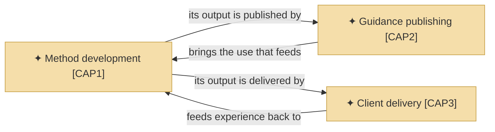
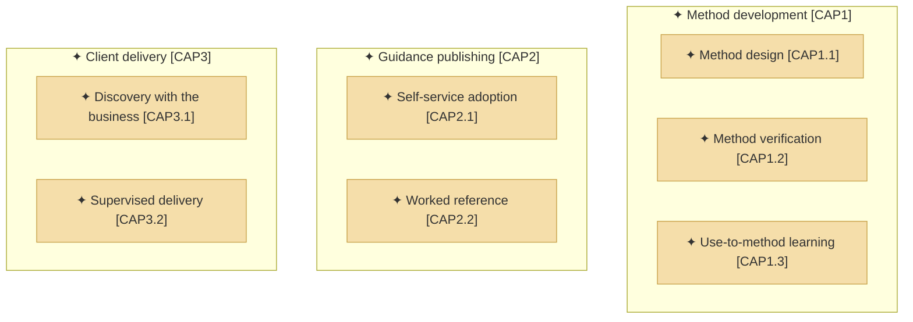
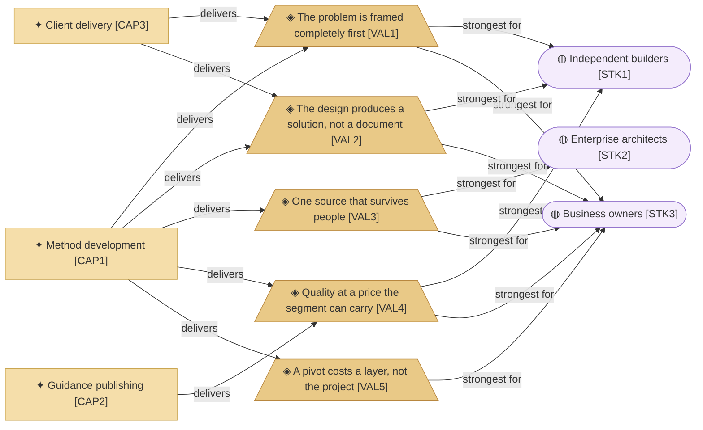
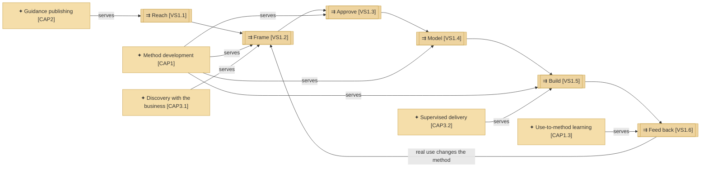

# Capabilities and the value stream

_[← Strategy layer](./README.md) · [Front door](../README.md)_

What the organization can do, the resources it does it with, what that is
worth and to whom, the course it has taken, and the stream from first
contact to a delivered outcome.

**ArchiMate viewpoint:** Strategy: Capability, Resource, Value, Course of
Action, Value Stream.

**Status:** ◐ Draft catalogue, not yet approved at Direction.

## Capabilities

The areas are what the organization itself can do, one per key activity of
[the canvas](../0_business-design/2_business-model-canvas.md#key-activities).
What its method does for adopters lives in
[the product's model](../../../product-archreator/architecture/README.md).

### Level 1 — the capability areas

| ID | Capability area | The organization can | Source |
| -- | --------------- | -------------------- | ------ |
| `CAP1` | **Method development** | Turn architectural practice into an executable, verifiable method, and improve it from real use | [`KA1`] Developing and improving the method |
| `CAP2` | **Guidance publishing** | Make the method findable, learnable and installable without personal contact | [`KA2`] Publishing guidance |
| `CAP3` | **Client delivery** | Run discovery and delivery with a client, using the method end to end | [`KA3`] Running discovery and delivery with clients |

### Level 2 — the capabilities

Seven capabilities, and the area that builds the method holds three of
them. The two areas that carry it outward hold two each: the shape of an
organization that spends most of itself on the product it gives away.

| ID | Capability | It is | Realized by |
| -- | ---------- | ----- | ----------- |
| `CAP1.1` | **Method design** | Encoding discovery, gates, the layered model and its conventions as skills an agent can execute | The skill corpus and the rulebooks |
| `CAP1.2` | **Method verification** | Keeping the method and the models built on it mechanically checkable | The validators and the corpus check |
| `CAP1.3` | **Use-to-method learning** | What real use improvises or exposes becomes method anyone can use | The retrospective skill, triggered after every merged initiative |
| `CAP2.1` | **Self-service adoption** | An adopter finds, evaluates and installs the method without asking anyone | The guidance site, the marketplace listing, the scaffold |
| `CAP2.2` | **Worked reference** | A filled-in model a prospective adopter reads instead of an empty scaffold | The two worked models, the organization's and the product's |
| `CAP3.1` | **Discovery with the business** | Drawing canvases and a strategy out of a real business by question, in person | [`ROLE2`] Consultant, running the method's discovery skills |
| `CAP3.2` | **Supervised delivery** | Building from the approved design with an agent, for a client | [`ROLE2`] Consultant, with the AI agent at co-pilot autonomy |

## Values

Every value passes through `CAP1`, and every value but one is strongest for
the stakeholder [`STK3`] [Business owners](./1_motivation.md#stakeholders).
The organization's whole worth is produced by the area with one person in it
and consumed most by the segment that reaches it through that same person;
`COA1` is staged against that.

| ID | Value |
| -- | ----- |
| `VAL1` | The problem is framed completely before it is answered |
| `VAL2` | The design produces a working solution rather than a document |
| `VAL3` | One source that survives people joining and leaving |
| `VAL4` | Architectural quality at a price the segment can carry |
| `VAL5` | A pivot costs a layer, not the project |

## Resources

| ID | Resource | Kind | State |
| -- | -------- | ---- | ----- |
| `RES1` | **The Requester's knowledge and time** | People | **Constrained**, the binding limit on the whole organization |
| `RES2` | **The method** — skills, conventions, gates | Knowledge | Held, and improving; produced by `CAP1` and worked with by the other two areas |
| `RES3` | **The published guidance site** | Asset | Held; described in [the product's model](../../../product-archreator/architecture/README.md) |

## Course of action

| ID | Course of action | Because | State |
| -- | ---------------- | ------- | ----- |
| `COA1` | **AI agents carrying the Requester's knowledge**, staged: first as co-pilot inside the method's own work, later relieving the constraint on delivery | The concentration in `RES1`, and what `CAP3` still needs a person in the room for | Stage one is how the organization already works; the later stages are not real yet |

## The value stream

### The stream and its stages

| ID | Stage | What happens |
| -- | ----- | ------------ |
| `VS1` | **From first contact to a delivered outcome, and back** | The whole stream |
| `VS1.1` | **Reach** | Someone finds the method through one of the four [channels](../0_business-design/2_business-model-canvas.md#channels), or approaches the Requester directly |
| `VS1.2` | **Frame** | Discovery draws the business model and strategy out by questions, and tests the frame rather than recording it. The method carries it for a self-served adopter, a person in an engagement |
| `VS1.3` | **Approve** | The project's own Requester grants the gate, against documents they were given links to; the gate rules are the method's |
| `VS1.4` | **Model** | The layers are derived from what was approved, in one place and one language |
| `VS1.5` | **Build** | The approved design is what an agent implements from, self-served or supervised for a client |
| `VS1.6` | **Feed back** | Real use exposes what the method gets wrong, and the method changes |

Reach has one capability behind it and serves only someone already looking:
`CAP2` answers a search and approaches nobody. Build is one of two stages
needing a second capability beside the method, because in the consulting
route it consumes the binding resource `RES1`; `COA1` is staged against
that.
