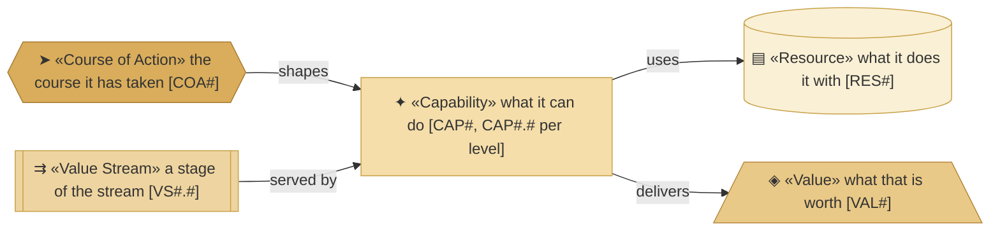
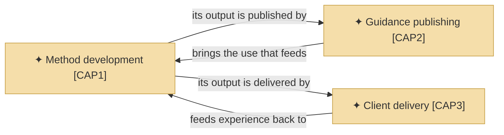
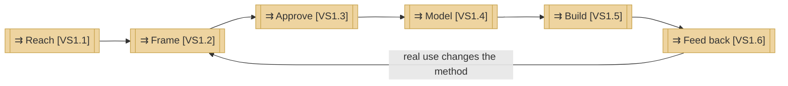

# Capabilities and the value stream

_[← Strategy layer](./README.md) · [Front door](../README.md)_

**ArchiMate viewpoint:** Strategy — Capability, Resource, Value, Course of
Action, Value Stream.

**Status:** ◐ Draft catalogue — not yet approved at a gate. **Direction**
covers this document.

## How to read this document

## Capabilities

**The areas are the organization's, one per key activity of
[the canvas](../0_business-design/2_business-model-canvas.md)** — what this
organization itself can do, not what its method does for adopters; that
lives in [the product's model](../../../product-archreator/architecture/README.md).

### Level 1 — the capability areas

| ID | Capability area | The organization can | Delivers | Source |
| -- | --------------- | -------------------- | -------- | ------ |
| `CAP1` | **Method development** | Turn architectural practice into an executable, verifiable method — and improve it from real use | `VAL1`–`VAL5` | `KA1` |
| `CAP2` | **Guidance publishing** | Make the method findable, learnable and installable without personal contact | `VAL4` | `KA2` |
| `CAP3` | **Client delivery** | Run discovery and delivery with a client, using the method end to end | `VAL1`, `VAL2` | `KA3` |

### Level 2 — the capabilities

| ID | Capability | It is | Realized by | Composed into |
| -- | ---------- | ----- | ----------- | ------------- |
| `CAP1.1` | **Method design** | Encoding discovery, gates, the layered model and its conventions as skills an agent can execute | The skill corpus and the rulebooks | `CAP1` |
| `CAP1.2` | **Method verification** | Keeping the method and the models built on it mechanically checkable | The two validators and the corpus check | `CAP1` |
| `CAP1.3` | **Use-to-method learning** | What real use improvises or exposes becomes method anyone can use | The retrospective skill, triggered after every merged initiative | `CAP1` |
| `CAP2.1` | **Self-service adoption** | An adopter finds, evaluates and installs the method without asking anyone | The guidance site, the marketplace listing, the scaffold | `CAP2` |
| `CAP2.2` | **Worked reference** | A filled-in model a prospective adopter reads instead of an empty scaffold | This repository's two trees | `CAP2` |
| `CAP3.1` | **Discovery with the business** | Drawing canvases and a strategy out of a real business by question, in person | `ROLE2`, running the method's discovery skills | `CAP3` |
| `CAP3.2` | **Supervised delivery** | Building from the approved design with an agent, for a client | `ROLE2`, with the AI agent at co-pilot autonomy | `CAP3` |

## Values

| ID | Value | Delivered by | Strongest for |
| -- | ----- | ------------ | ------------- |
| `VAL1` | The problem is framed completely before it is answered | `CAP1`, `CAP3` | `STK1`, `STK3` |
| `VAL2` | The design produces a working solution rather than a document | `CAP1`, `CAP3` | `STK1`, `STK3` |
| `VAL3` | One source that survives people joining and leaving | `CAP1` | `STK2`, `STK3` |
| `VAL4` | Architectural quality at a price the segment can carry | `CAP1`, `CAP2` | `STK1`, `STK3` |
| `VAL5` | A pivot costs a layer, not the project | `CAP1` | `STK3` |

## Resources

| ID | Resource | Kind | State |
| -- | -------- | ---- | ----- |
| `RES1` | **The Requester's knowledge and time** | People | **Constrained — the binding limit on the whole organization** |
| `RES2` | **The method** — skills, conventions, gates | Knowledge | Held, and improving — produced by Method development [`CAP1`], worked with by the other two areas |
| `RES3` | **The published guidance site** | Asset | Held — modeled in [the product tree](../../../product-archreator/architecture/README.md) |

## Course of action

| ID | Course of action | Because | State |
| -- | ---------------- | ------- | ----- |
| `COA1` | **AI agents carrying the Requester's knowledge**, staged: first as co-pilot inside the method's own work, later relieving the constraint on delivery | The concentration in `RES1`, and what `CAP3` still needs a person in the room for | Stage one is how the organization already works; later stages are not modeled until they are real |

## The value stream

### The stream and its stages — levels 1 and 2

| ID | Stage | What happens | Served by |
| -- | ----- | ------------ | --------- |
| `VS1` | **From first contact to a delivered outcome, and back** | The whole stream | — |
| `VS1.1` | **Reach** | Someone finds the method, or the Requester is approached directly | `CAP2`, through `CH1`–`CH4` |
| `VS1.2` | **Frame** | Discovery draws the business model and strategy out by questions, and tests the frame rather than recording it | `CAP1` carried by the method for a self-served adopter; `CAP3.1` in an engagement |
| `VS1.3` | **Approve** | The project's own Requester grants the gate, against documents they were given links to | `CAP1` — the gate rules are the method's |
| `VS1.4` | **Model** | The layers are derived from what was approved, in one place and one language | `CAP1` |
| `VS1.5` | **Build** | The approved design is what an agent implements from | `CAP1` self-served; `CAP3.2` for a client |
| `VS1.6` | **Feed back** | Real use exposes what the method gets wrong, and the method changes | `CAP1.3` |

**Two findings ride the stream.** Reach is served only for someone already
looking — Guidance publishing [`CAP2`] answers a search and approaches
nobody. And Build in the consulting route consumes the binding resource
[`RES1`], which is what
`AI agents carrying the Requester's knowledge [COA1]` is staged against.
