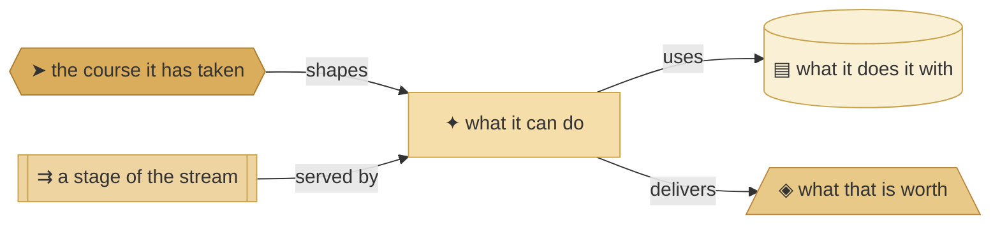
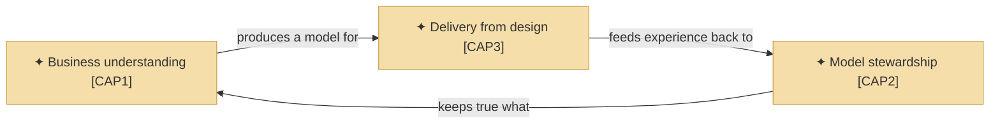
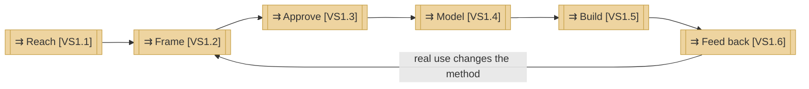

# Capabilities and the value stream

_[← Strategy layer](./README.md) · [Front door](../README.md)_

**ArchiMate viewpoint:** Strategy — Capability, Resource, Value, Course of
Action, Value Stream.

**Status:** ◐ Draft catalogue — rebuilt on method 0.2 from the validated
pre-0.2 layer, not yet re-approved. **Direction** covers this layer.

## How to read this document

| Glyph | Shape | Element | ID prefix | Reads as |
| ----- | ----- | ------- | --------- | -------- |
| `✦` | Rectangle | «Capability» | `CAP` | `CAP#`, `CAP#.#` per level |
| `▤` | Cylinder | «Resource» | `RES` | `RES#` |
| `◈` | Trapezoid | «Value» | `VAL` | `VAL#` |
| `➤` | Hexagon | «Course of Action» | `COA` | `COA#` |
| `⇉` | Rectangle, double bars | «Value Stream» | `VS` | `VS#`, `VS#.#` per stage |

## Capabilities

| ID | Capability area | The organization can | Delivers |
| -- | --------------- | -------------------- | -------- |
| `CAP1` | **Business understanding** | Arrive at what a business actually is, and say it in a form that survives being passed on | `VAL1`, `VAL3` |
| `CAP2` | **Model stewardship** | Keep that understanding true as time and change act on it, and improve the method that produces it | `VAL3`, `VAL5` |
| `CAP3` | **Delivery from design** | Turn an approved design into a working solution without an expert in the room | `VAL2`, `VAL4` |

| ID | Capability | It is | Realized by | Composed into |
| -- | ---------- | ----- | ----------- | ------------- |
| `CAP1.1` | **Gated discovery** | Question-driven discovery that tests the business rather than recording it, with gates forcing a complete frame before anything is built | The discovery and alignment skills of the method | `CAP1` |
| `CAP1.2` | **A shared architectural language** | Standardised concepts with defined relationships — what makes the model mean the same to a person and to an agent | The notation and style rulebooks | `CAP1` |
| `CAP2.1` | **One documented model** | Markdown in git, catalogues and diagrams, every element naming what realizes it | The document conventions and the two validators | `CAP2` |
| `CAP2.2` | **Layered change absorption** | Strategy can change without redoing technology, and the reverse | The numbered layers and the per-layer "no change" verdict | `CAP2` |
| `CAP2.3` | **Engagement-to-method learning** | What is improvised during an engagement becomes method anyone can use | The retrospective skill, now triggered after every merged initiative | `CAP2` |
| `CAP3.1` | **Design-to-delivery continuity** | The approved design is the input an agent builds from, so there is no handover | The alignment and sharding skills | `CAP3` |
| `CAP3.2` | **Method-carried competence** | The expertise sits in the method, so the price of an architecture drops to the price of an agent | The skill corpus as a whole, distributed as a plugin | `CAP3` |

## Values

| ID | Value | Delivered by | Strongest for |
| -- | ----- | ------------ | ------------- |
| `VAL1` | The problem is framed completely before it is answered | `CAP1` | `STK1`, `STK3` |
| `VAL2` | The design produces a working solution rather than a document | `CAP3` | `STK1`, `STK3` |
| `VAL3` | One source that survives people joining and leaving | `CAP1`, `CAP2` | `STK2`, `STK3` |
| `VAL4` | Architectural quality at a price the segment can carry | `CAP3` | `STK1`, `STK3` |
| `VAL5` | A pivot costs a layer, not the project | `CAP2` | `STK3` |

## Resources

| ID | Resource | Kind | State | Source |
| -- | -------- | ---- | ----- | ------ |
| `RES1` | **The Requester's knowledge and time** | People | **Constrained — the binding limit on the whole organization** | `KR1` |
| `RES2` | **The method** — skills, conventions, gates | Knowledge | Held, and improving; all three areas depend on it | `KR2` |
| `RES3` | **The published guidance site** | Asset | Held — modeled in [the product tree](../../../product-archreator/architecture/README.md) | `KR3` |

## Course of action

| ID | Course of action | Because | State |
| -- | ---------------- | ------- | ----- |
| `COA1` | **AI agents carrying the Requester's knowledge**, staged: first as co-pilot inside the method's own work, later relieving the constraint on delivery | The concentration in `RES1`, and the gap between what `CAP3.2` claims and what consulting still needs a person for | Stage one is how the organization already works; later stages are not modeled until they are real |

## The value stream

| ID | Stage | What happens | Served by |
| -- | ----- | ------------ | --------- |
| `VS1` | **From first contact to a delivered outcome, and back** | The whole stream | — |
| `VS1.1` | **Reach** | Someone finds the method, or the Requester is approached directly | `CH1`–`CH4`, and no capability — the honest gap in the stream |
| `VS1.2` | **Frame** | Discovery draws the business model and strategy out by questions, and tests the frame rather than recording it | `CAP1.1` |
| `VS1.3` | **Approve** | The project's own Requester grants the gate, against documents they were given links to | `CAP1.1` |
| `VS1.4` | **Model** | The layers are derived from what was approved, in one place and one language | `CAP1.2`, `CAP2.1` |
| `VS1.5` | **Build** | The approved design is what an agent implements from | `CAP3.1`, `CAP3.2` |
| `VS1.6` | **Feed back** | Real use exposes what the method gets wrong, and the method changes | `CAP2.2`, `CAP2.3` |

**Two stages carry the strategy's open findings**: Reach is served by no
capability — two of three segments arrive only if they were already looking —
and Build consumes the binding resource, which is what
`AI agents carrying the Requester's knowledge [COA1]` is staged against.
