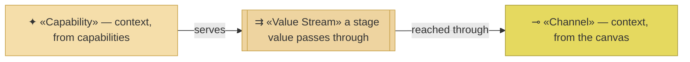
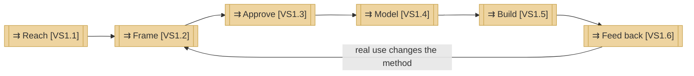

# Value stream

_[← Strategy layer](./README.md) · [EA home](../README.md)_

**ArchiMate viewpoint:** Strategy. How value reaches the people this
organization serves, end to end — and back.

**Status:** ● Validated at **Gate 1**, 2026-08-22.

One stream, six stages, and the sixth returns to the second. **The stream
closes**, which is the one thing worth seeing before the detail: real use is
what improves the method, so the organization's own product is the output of
its own loop.

## How to read this document

| Glyph | Shape | Element | ID prefix | Reads as |
| ----- | ----- | ------- | --------- | -------- |
| `⇉` | Rectangle, double bars | «Value Stream» | `VS` | `VS1` = the stream; `VS1.1` = its first stage |
| `✦` | Rectangle | «Capability» — context, from [2_capabilities-and-resources.md](./2_capabilities-and-resources.md) | `CAP` | `CAP1.1` = capability 1 of area 1 |
| `⊸` | Rectangle (yellow) | «Channel» — context, from [the business model canvas](../0_business-design/2_business-model-canvas.md) | `CH` | `CH1` = Channel 1 |

## The stream

| ID | Stage | What happens | Served by | Reached through |
| -- | ----- | ------------ | --------- | --------------- |
| `VS1` | **From first contact to a delivered outcome, and back** | The whole stream | — | — |
| `VS1.1` | **Reach** | Someone finds the method, or the Requester is approached directly | **Nothing** | `CH1`, `CH2`, `CH3`, `CH4` |
| `VS1.2` | **Frame** | Discovery: the business model and strategy are drawn out by questions, and the frame is tested rather than recorded | `CAP1.1` | `KA1`, `KA3` |
| `VS1.3` | **Approve** | The project's own Requester grants the gate, against documents they were given links to | `CAP1.1` | `KA1`, `KA3` |
| `VS1.4` | **Model** | The layers are derived from what was approved, in one place and one language | `CAP1.2`, `CAP2.1` | `KA1` |
| `VS1.5` | **Build** | The approved design is what an agent implements from | `CAP3.1`, `CAP3.2` | `KA3` |
| `VS1.6` | **Feed back** | Real use exposes what the method gets wrong, and the method changes | `CAP2.2`, `CAP2.3` | `KA1`, `KA2` |

## Where the stream is weak

**`VS1.1` is the only stage no capability serves.** Being found is not
something this organization can currently do — four of its five channels reach
`CS1`, the segment that does not pay and does not need convincing, and the two
segments the portal is for are reached by knowing the Requester personally or
not at all. `COA2` is the course of action pointed at exactly this stage.

**`VS1.6` closes the loop and has no instrumentation.** Feedback arrives when
someone chooses to give it. `RS1` — the improvement that flows back from real
use — is the stream the organization most wants and the one with no collection
method, which is `COA3`.

**`VS1.5` is where `RES1` is actually spent.** Building with a client is
`KA3`, done by the Requester, and it is what makes `PROD2` unable to scale.
`COA1` targets this stage by moving what the consultant knows into the method
that anyone runs.

| Stage | Weakness | Addressed by |
| ----- | -------- | ------------ |
| `VS1.1` | No capability serves it; two of three segments are effectively unreachable | `COA2` — **Pending** |
| `VS1.5` | Consumes the binding resource, and cannot scale past one person | `COA1` — taken, staged |
| `VS1.6` | Closes the loop but is never measured | `COA3` — **Pending** |

Three of six stages carry a named weakness, and each has a course of action
pointed at it. Only one of those courses has been taken.

## Relationships

<!-- Transcribed from this document's diagrams. The identifier is
     authoritative; the description beside it is checked against the
     catalogue that defines the element. -->

| From | From element | To | To element | Relationship |
| ---- | ------------ | -- | ---------- | ------------ |
| `VS1.1` | «Value Stream» Reach | `VS1.2` | «Value Stream» Frame | relates to |
| `VS1.6` | «Value Stream» Feed back | `VS1.2` | «Value Stream» Frame | real use changes the method |
