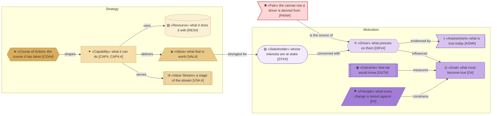
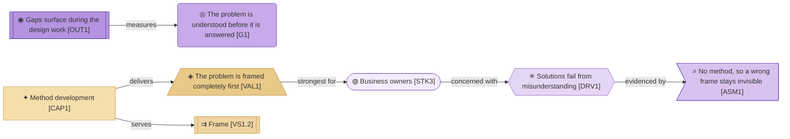

# Strategy

_[← Front door](../README.md)_

Why the organization exists, what presses on it, what must become true, what
it must be able to do, and how value flows from first contact to a delivered
outcome.

**ArchiMate viewpoint:** Motivation and Strategy: Stakeholder, Driver,
Assessment, Goal, Outcome, Principle, Capability, Resource, Value, Course of
Action, Value Stream. Every element is derived from
[the canvases](../0_business-design/README.md); the `Source` column of each
document says from which block.

## Documents

| # | Document | Elements | Question it answers |
| - | -------- | -------- | ------------------- |
| 1 | [Motivation](./1_motivation.md) | Stakeholders, drivers, assessments, goals, outcomes and the eight principles | Who cares, what presses on them, and what must become true? |
| 2 | [Capabilities and the value stream](./2_capabilities-and-value-stream.md) | Capabilities, resources, values, the course of action and the stream from first contact to a delivered outcome | What can the organization do, and how does value flow? |

## Metamodel

Purple is motivation and tan is strategy. The pain keeps the canvas rose: it
is a visitor from the value proposition canvas.

## Layer view

A business owner's pressure is evidenced by an assessment and answered by a
goal an outcome measures. The capability that builds the method delivers the
value that is strongest for that same owner, and serves the stage where the
problem is framed.
