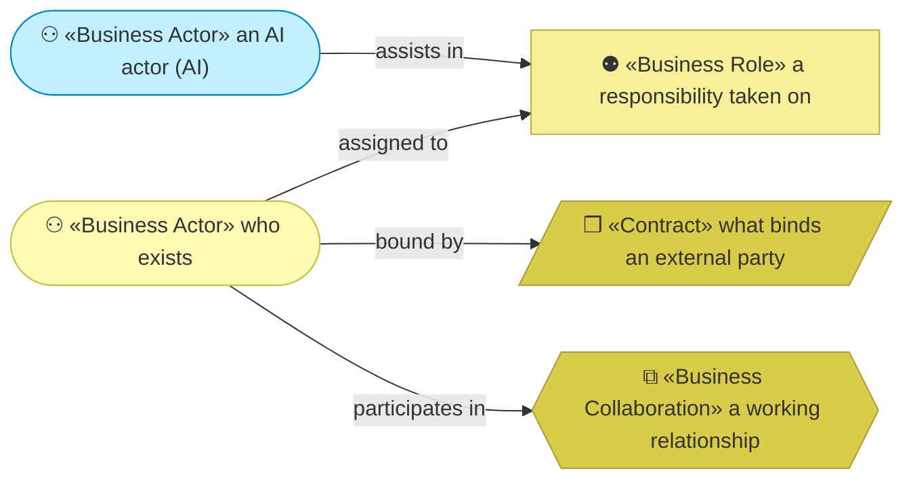
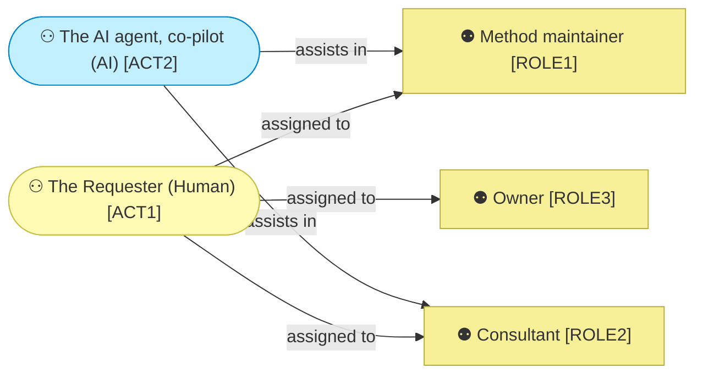
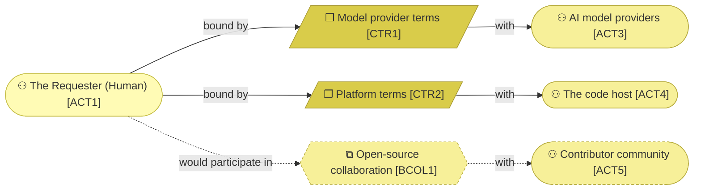

# Business actors and roles

_[← Business layer](./README.md) · [EA home](../README.md)_

**ArchiMate viewpoint:** Business. Who acts inside this organization, who it
depends on outside it, and — for the AI actor — what it may decide alone.

**One person holds every internal role**, and the roles are still modeled
separately: they want different things, are exercised at different moments,
and the day any of them is delegated the model already says what is being
handed over.

## How to read this document

| Glyph | Shape | Element | ID prefix | Reads as |
| ----- | ----- | ------- | --------- | -------- |
| `⚇` | Stadium | «Business Actor» | `ACT` | `ACT1` = Actor 1 |
| `⚉` | Rectangle | «Business Role» | `ROLE` | `ROLE1` = Role 1 |
| `❒` | Parallelogram | «Contract» | `CTR` | `CTR1` = Contract 1 |
| `⧉` | Hexagon | «Business Collaboration» | `BCOL` | `BCOL1` = Collaboration 1 |

## Inside the organization

**`ACT2` assists in two roles and is assigned to none.** That is `P1` drawn:
an agent runs the method, and a person holds the judgement.

| ID | Actor | Kind | Fills | Decides |
| -- | ----- | ---- | ----- | ------- |
| `ACT1` | **The Requester** | Human | `ROLE1`, `ROLE2`, `ROLE3` | Everything: what the method becomes, what is delivered to a client, and what is priced. The only actor who can grant a gate |
| `ACT2` | **The AI agent** | **AI** | Assists in `ROLE1` and `ROLE2` | See below |

### `ACT2` — autonomy, decision rights, escalation

| Column | Value |
| ------ | ----- |
| **Autonomy level** | **Co-pilot** — it acts, and `ACT1` reviews before the result takes effect |
| **Decision rights** | May draft and edit documents, write code, and propose a design within an approved frame |
| **May not** | Grant a gate, decide what the business is, or change a Principle |
| **Escalation path** | `ACT1`, on anything touching strategy, business, or a gate |

**Raising this is a decision, not a preference.** Stage 3 of
[decision 1](../decisions/1_take-coa1-staged.md) raises `ACT2`'s autonomy
inside `ROLE2` for defined parts, and that stage is explicitly recorded as
needing a decision record of its own.

| ID | Role | Held by | Responsibility | Consumes |
| -- | ---- | ------- | -------------- | -------- |
| `ROLE1` | **Method maintainer** | `ACT1`, assisted by `ACT2` | Developing the method and publishing guidance | `KA1`, `KA2` |
| `ROLE2` | **Consultant** | `ACT1`, assisted by `ACT2` | Running discovery and delivery with clients, and capturing afterwards what the method did not cover (`CAP2.3`) | `KA3` |
| `ROLE3` | **Owner** | `ACT1` | Deciding direction, pricing, and what the organization is for | `RES1` |

**`ROLE3` is the role with no product.** Nothing in the portfolio is delivered
by deciding what the organization is for, and it is still the role that
chooses between `COA1`, `COA2` and `COA3`. A model that only listed
value-producing roles would leave the organization's own direction unowned.

## Outside the organization

| ID | External actor | Provides | Bound by | Dependency | Source |
| -- | -------------- | -------- | -------- | ---------- | ------ |
| `ACT3` | **AI model providers** | The inference every product ultimately runs on | `CTR1` | **Substitutable by design**, per `P6`. The method is transferable instructions; only the packaging names a provider | `KP1` |
| `ACT4` | **The code host** | Repository, plugin distribution, site hosting | `CTR2` | Replaceable and free at this scale — but `BIF1`–`BIF3` all run through it, so replacing it means rebuilding every published channel at once | `KP2` |
| `ACT5` | **Contributor community** | Feedback and real-world use, which is `RS1` | `BCOL1` | **Pending** — no contributor base exists yet | `KP3` |

| ID | Binding | Between | State |
| -- | ------- | ------- | ----- |
| `CTR1` | Model provider subscription and usage terms | `ACT1` with `ACT3` | Live. Each adopter holds their own — this organization does not resell inference for `PROD1` |
| `CTR2` | Platform terms | `ACT1` with `ACT4` | Live |
| `BCOL1` | Open-source collaboration around the method | `ACT1` with `ACT5` | **Pending — future initiative.** `RS1` and `STK5` both depend on it |

**`ACT4` is the concentrated dependency, not `ACT3`.** The provider is
genuinely substitutable — swapping it costs a manifest. The code host carries
three of five channels at once, so its replaceability is real in principle and
expensive in practice, and the model says which kind it is.
