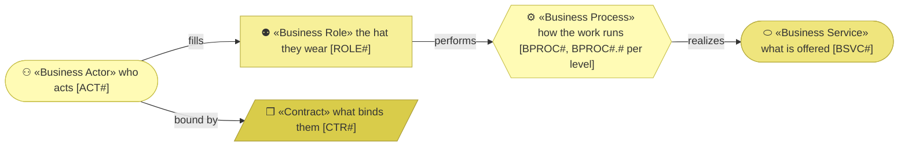
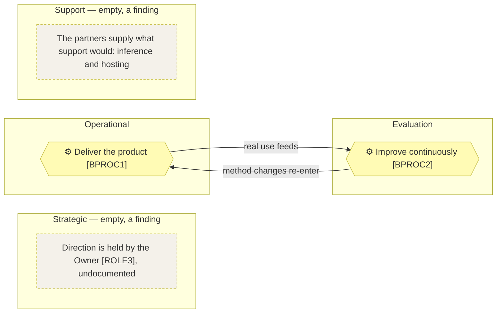

# Business architecture

_[← Business layer](./README.md) · [Front door](../README.md)_

**ArchiMate viewpoint:** Business — Actor, Role, Contract, Business Service,
Business Process.

**Status:** ◐ Draft catalogue — not yet approved at a gate. **Understanding**
covers this document.

## How to read this document

An `(AI)` actor is drawn in the application cyan whatever the diagram, so a
reader never mistakes it for a person.

## Actors

| ID | Actor | Kind | Fills or assists | Decides |
| -- | ----- | ---- | ---------------- | ------- |
| `ACT1` | **The Requester** | Human | `ROLE1`, `ROLE2`, `ROLE3` | Everything: what the method becomes, what is delivered, what is priced. The only actor who can grant a gate |
| `ACT2` | **The AI agent** | **AI** | Assists in `ROLE1` and `ROLE2` | See the autonomy table below |

**The suppliers are not actors here.** AI model providers and the code host
act in nothing — they are the key partners
[the canvas](../0_business-design/2_business-model-canvas.md#key-partners)
already defines, and this layer holds only the contracts that bind them.

**The AI agent [ACT2], precisely** — the row every AI actor owes:

| Concern | For `ACT2` |
| ------- | ---------- |
| Autonomy | **Co-pilot** — drafts, implements and verifies inside an approved scope |
| Decision rights | Anything inside an approved design; consolidation and wording of drafts presented at gates |
| Never decides | What the business is, what a gate approves, what is priced — `P1` |
| Escalates to | The Requester [ACT1], as an unscheduled stop when materially uncertain |

## Roles

| ID | Role | Filled by | Does |
| -- | ---- | --------- | ---- |
| `ROLE1` | **Method maintainer** | `ACT1`, assisted by `ACT2` | Develops the method and publishes guidance |
| `ROLE2` | **Consultant** | `ACT1`, assisted by `ACT2` | Runs discovery and delivery with clients, and captures afterwards what the method did not cover |
| `ROLE3` | **Owner** | `ACT1` | Decides direction, pricing, and what the organization is for |

## Contracts

| ID | Contract | Between | State |
| -- | -------- | ------- | ----- |
| `CTR1` | Model provider subscription and usage terms | The Requester [`ACT1`] and AI model providers [`KP1`] | Live — each adopter holds their own; the provider is substitutable by design, per `P6` |
| `CTR2` | Platform terms | The Requester [`ACT1`] and The code host [`KP2`] | Live — replaceable, and free at this scale |

## Business services

| ID | Service | Delivers | Realized by | Reached through |
| -- | ------- | -------- | ----------- | --------------- |
| `BSVC1` | **The method, published and installable** — obtainable and usable without asking anyone | `CAP1` | The [product](../../../product-archreator/architecture/README.md), self-served; `BPROC1` | The repository, the marketplace |
| `BSVC2` | **Guidance and worked reference** — how to start, what the method is for, and models a reader can inspect | `CAP2` | The guidance site and this repository; `BPROC1` | The site, the repository |
| `BSVC3` | **Advisory and delivery with the method** — the Requester runs discovery and delivery personally | `CAP3` | `ROLE2`, in person | Referral and direct approach |

## The process map

### Level 1 — the landscape

**This organization runs on two processes** — it is one person and a
product, with no sales, administrative or other enterprise machinery around
them — and the map's four bands say so rather than hiding it: an empty band
is a finding to explain, not a blank to fill.

| ID | Process | Category | Purpose | Owner | Composed of |
| -- | ------- | -------- | ------- | ----- | ----------- |
| `BPROC1` | **Deliver the product** | Operational | Turns a change the Requester wants into a published, installable method whose documents are still true | `ROLE1` | `BPROC1.1`, `BPROC1.2`, `BPROC1.3` |
| `BPROC2` | **Improve continuously** | Evaluation | Turns real use — the organization's own and its clients' — into method changes | `ROLE1` | `BPROC2.1`, `BPROC2.2` |

**Delivering with a client is not a third process.** An engagement runs the
method's own process model — the one in the archreator repository, beside
the skills that realize it — and this organization adds nothing to it; what
an engagement teaches enters at
`Capture what real use exposed [BPROC2.1]`.

### Level 2 — the contract

| ID | Process | Purpose | Trigger | Supplier | Output | Customer | Owner | Realized by |
| -- | ------- | ------- | ------- | -------- | ------ | -------- | ----- | ----------- |
| `BPROC1.1` | **Frame the change** | Turns a wish into an approved scope, aligned through the layers and stopped at the gates | A requirement, or a method change arriving from `BPROC2.2` | `ROLE3`; `BPROC2.2` | An approved scope document | `BPROC1.2` | `ROLE1` | The method's own alignment and scope skills |
| `BPROC1.2` | **Build and validate** | Turns an approved scope into a merged change whose documents are still true | An approved scope | `BPROC1.1` | A merged pull request, validators green | `BPROC1.3` | `ROLE1` | `ACT2` within the approved scope, `ACT1` reviewing |
| `BPROC1.3` | **Publish** | Turns a merged change into something an adopter can install and read | A merged change | `BPROC1.2` | The plugin in the marketplace, the site deployed | The adopters | `ROLE1` | The manifests and the site workflow |
| `BPROC2.1` | **Capture what real use exposed** | Turns a finished initiative or engagement into a recorded lesson before it evaporates | An initiative merging, or an engagement closing | `BPROC1.3`; `ROLE2` | An engagement note naming what the method did not cover | `BPROC2.2` | `ROLE1` | The retrospective skill |
| `BPROC2.2` | **Fold it back into the method** | Turns a recorded lesson into a method change worth an initiative — or an explicit decision that it is not | An engagement note | `BPROC2.1` | A method initiative, entering `BPROC1.1` | `BPROC1.1` | `ROLE1` | The alignment skills, on the method's own model |

### Where depth stops

Levels 1 and 2 are complete above; level 3 is drawn only where a flow's
sequence is contested, and nowhere here is it — each contract above is a
straight line with one supplier and one customer:

| Level-2 process | Level 3? |
| --------------- | -------- |
| `BPROC1.1` Frame the change | — the sequence is the layer numbering, owned by the method |
| `BPROC1.2` Build and validate | — one actor drafting, one reviewing |
| `BPROC1.3` Publish | — mechanical: merge, and the workflows run |
| `BPROC2.1` Capture what real use exposed | — six questions with no order between them |
| `BPROC2.2` Fold it back into the method | — it is `BPROC1.1` applied to the method itself |
