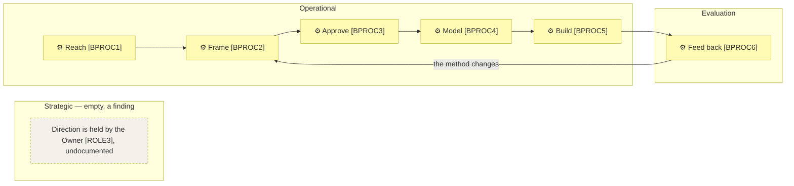

# Business architecture

_[← Business layer](./README.md) · [Front door](../README.md)_

**ArchiMate viewpoint:** Business — Actor, Role, Contract, Business Service,
Business Process.

**Status:** ◐ Draft catalogue — rebuilt on method 0.2 from the validated
pre-0.2 layer, not yet re-approved. **Understanding** covers this layer.

## How to read this document

| Glyph | Shape | Element | ID prefix | Reads as |
| ----- | ----- | ------- | --------- | -------- |
| `⚇` | Stadium | «Business Actor» | `ACT` | `ACT#` |
| `⚉` | Rectangle | «Business Role» | `ROLE` | `ROLE#` |
| `❒` | Parallelogram | «Contract» | `CTR` | `CTR#` |
| `⬭` | Stadium | «Business Service» | `BSVC` | `BSVC#` |
| `⚙` | Hexagon | «Business Process» | `BPROC` | `BPROC#` |

An `(AI)` actor is drawn in the application cyan whatever the diagram, so a
reader never mistakes it for a person.

## Actors and roles

| ID | Actor | Kind | Fills or assists | Decides |
| -- | ----- | ---- | ---------------- | ------- |
| `ACT1` | **The Requester** | Human | `ROLE1`, `ROLE2`, `ROLE3` | Everything: what the method becomes, what is delivered, what is priced. The only actor who can grant a gate |
| `ACT2` | **The AI agent** | **AI** | Assists in `ROLE1` and `ROLE2` | See the autonomy table below |
| `ACT3` | **AI model providers** | External | The inference everything runs on | Bound by `CTR1`; substitutable by design, per `P6` |
| `ACT4` | **The code host** | External | Repository, plugin distribution, site hosting | Bound by `CTR2`; replaceable and free at this scale |

**The AI agent [ACT2], precisely** — the row every AI actor owes:

| Concern | For `ACT2` |
| ------- | ---------- |
| Autonomy | **Co-pilot** — drafts, implements and verifies inside an approved scope |
| Decision rights | Anything inside an approved design; consolidation and wording of drafts presented at gates |
| Never decides | What the business is, what a gate approves, what is priced — `P1` |
| Escalates to | The Requester [ACT1], as an unscheduled stop when materially uncertain |

| ID | Role | Filled by | Does |
| -- | ---- | --------- | ---- |
| `ROLE1` | **Method maintainer** | `ACT1`, assisted by `ACT2` | Develops the method and publishes guidance |
| `ROLE2` | **Consultant** | `ACT1`, assisted by `ACT2` | Runs discovery and delivery with clients, and captures afterwards what the method did not cover |
| `ROLE3` | **Owner** | `ACT1` | Decides direction, pricing, and what the organization is for |

| ID | Contract | Between | State |
| -- | -------- | ------- | ----- |
| `CTR1` | Model provider subscription and usage terms | `ACT1`, `ACT3` | Live — each adopter holds their own; this organization does not resell inference |
| `CTR2` | Platform terms | `ACT1`, `ACT4` | Live |

## Business services

| ID | Service | Delivers | Realized by | Reached through |
| -- | ------- | -------- | ----------- | --------------- |
| `BSVC1` | **The method, published and installable** — obtainable and usable without asking anyone | `CAP1`, `CAP2`, `CAP3` | The [product](../../../product-archreator/architecture/README.md), self-served | The repository, the marketplace |
| `BSVC2` | **Guidance and worked reference** — how to start, what the method is for, and models a reader can inspect | `CAP1` | The guidance site and this repository | The site, the repository |
| `BSVC3` | **Advisory and delivery with the method** — the Requester runs discovery and delivery personally | `CAP1`, `CAP3` | `ROLE2`, in person | Referral and direct approach |

## The process map

The four bands, with two reported empty — an empty band is a finding to
explain, not a blank to fill.

| ID | Process | Purpose | Trigger | Supplier | Output | Customer | Owner | Realized by |
| -- | ------- | ------- | ------- | -------- | ------ | -------- | ----- | ----------- |
| `BPROC1` | **Reach** | Turns a search, a referral or a link into a person who knows the method exists | Someone looks, or someone is approached | The channels | An arriving adopter or client | `BPROC2` | `ROLE1` | The published channels; `ROLE2` for referral |
| `BPROC2` | **Frame** | Turns a subject nobody has modeled into canvases and a strategy, tested by question rather than recorded | An adopter or client with a subject | `BPROC1` | Draft catalogues, unapproved | `BPROC3` | `ROLE2` | The discovery skills |
| `BPROC3` | **Approve** | Turns a presented draft into a granted gate | A layer ready to be shown | `BPROC2` | An Approvals row — which gate, who, when, what was shown | `BPROC4` | The project's own Requester | The gate rules of the method |
| `BPROC4` | **Model** | Turns what was approved into layer documents that pass both validators | An approved gate | `BPROC3` | A model a change can be judged against | `BPROC5` | `ROLE2` | `ACT2` drafting, `ACT1` accepting |
| `BPROC5` | **Build** | Turns an approved design into merged code whose documents are still true | An approved design | `BPROC4` | A delivered outcome | The adopter or client | `ROLE2` | `ACT2`, within the approved design |
| `BPROC6` | **Feed back** | Turns real use into an engagement note, and eventually a method change | An initiative or engagement finishing | `BPROC5` | A retrospective, then a method initiative | `ROLE1` | `ROLE1` | The retrospective skill |

**Deliberate depth** — every process stops at level 1, and each stop is a
decision:

| Process | Detailed to | Justified by | Note |
| ------- | ----------- | ------------ | ---- |
| `BPROC1` Reach | Level 1 | — | Also the process no capability serves — the strategy's open finding |
| `BPROC2` Frame | Level 1 | — | The conversation's shape belongs to the method's discovery skills, not to this organization |
| `BPROC3` Approve | Level 1 | — | One step and one table |
| `BPROC4` Model | Level 1 | — | The sequence is the layer numbering, already written down once |
| `BPROC5` Build | Level 1 | — | Varies entirely by the project's stack; detailing it would model the client's work |
| `BPROC6` Feed back | Level 1 | — | Six questions with no sequence between them |
