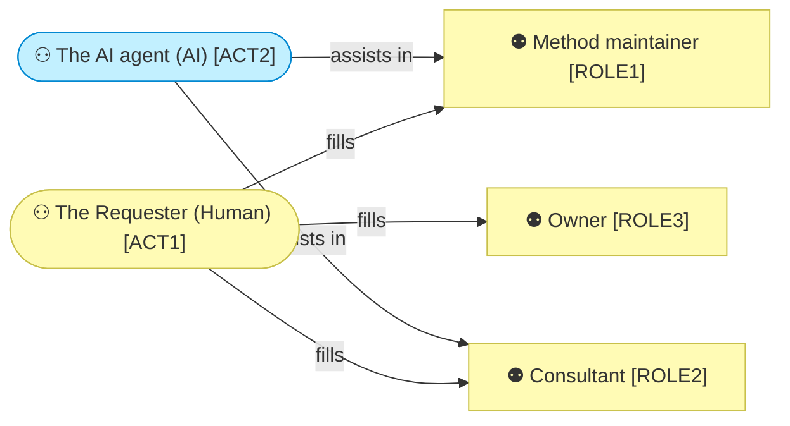
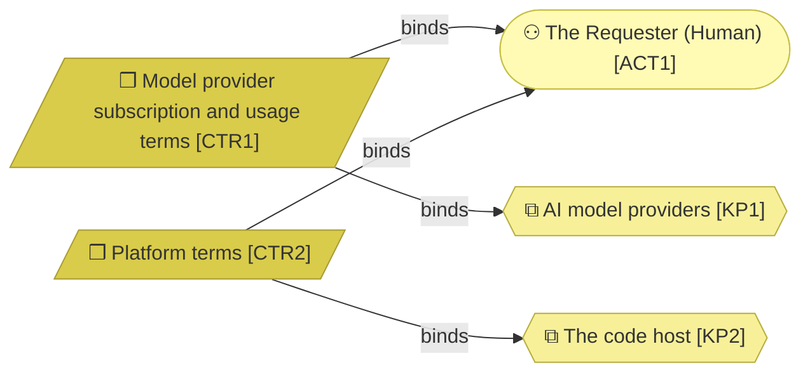
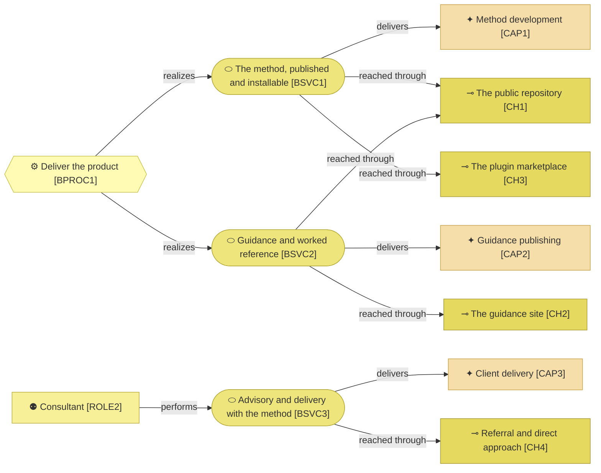
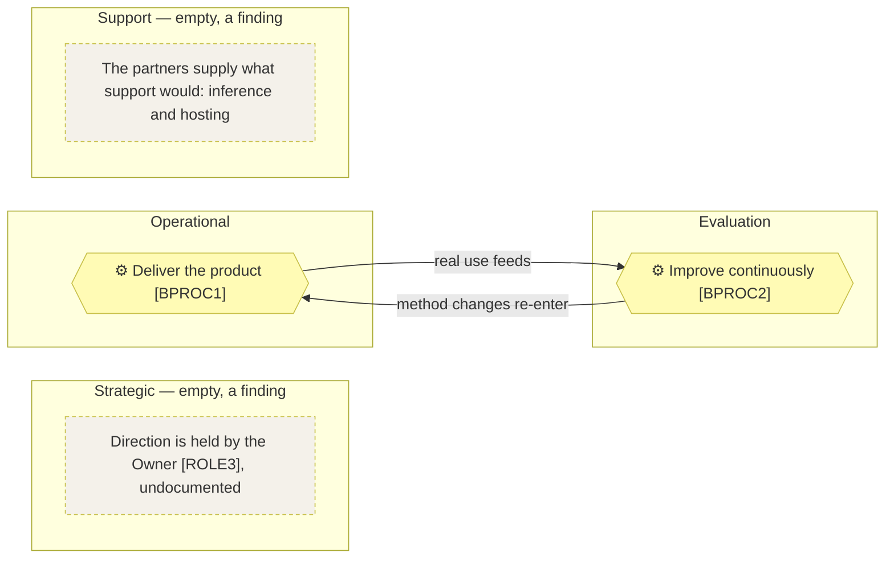
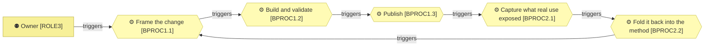

# Business architecture

_[← Business layer](./README.md) · [Front door](../README.md)_

Who does what, which services the organization offers, and how the work
flows.

**ArchiMate viewpoint:** Business: Business Actor, Business Role, Contract,
Business Service, Business Process.

**Status:** ◐ Draft catalogue, not yet approved at Understanding.

## Actors

| ID | Actor | Kind | Decides |
| -- | ----- | ---- | ------- |
| `ACT1` | **The Requester** | Human | Everything: what the method becomes, what is delivered, what is priced |
| `ACT2` | **The AI agent** | AI | See the autonomy table below |

The AI actor is drawn in the application cyan, so a reader never mistakes it
for a person. The suppliers are not actors: AI model providers and the code
host act in nothing. They are the key partners
[the canvas](../0_business-design/2_business-model-canvas.md#key-partners)
defines, and the contracts below bind them.

The AI agent `ACT2`, precisely:

| Concern | For `ACT2` |
| ------- | ---------- |
| Autonomy | **Co-pilot**: drafts, implements and verifies inside an approved scope |
| Decision rights | Anything inside the approved scope, and the wording of drafts presented at gates. A call left open is taken, applied and recorded as adopted, per the principle [`P8`] [Interrupt only for what a person alone can settle](../1_strategy/1_motivation.md#principles) |
| Never decides | What the business is, what a gate approves, what is priced, per the principle [`P1`] Humans hold strategy and business judgement; AI assists and executes |
| Escalates to | `ACT1`, when the answer changes what gets built now and nothing already settles it |

## Roles

| ID | Role | Filled by | Does |
| -- | ---- | --------- | ---- |
| `ROLE1` | **Method maintainer** | `ACT1`, assisted by `ACT2` | Develops the method and publishes guidance |
| `ROLE2` | **Consultant** | `ACT1`, assisted by `ACT2` | Runs discovery and delivery with clients, and captures afterwards what the method did not cover |
| `ROLE3` | **Owner** | actor `ACT1` | Decides direction, pricing, and what the organization is for |

## Contracts

Two contracts, and one person on this side of both, are the whole of what
the organization depends on from outside.

| ID | Contract | Between | State |
| -- | -------- | ------- | ----- |
| `CTR1` | Model provider subscription and usage terms | `ACT1` and the key partner [`KP1`] [AI model providers](../0_business-design/2_business-model-canvas.md#key-partners) | Live; each adopter holds their own, and the provider is substitutable by design, per the principle [`P6`] Generic by design, one implementation at a time |
| `CTR2` | Platform terms | `ACT1` and the key partner [`KP2`] The code host | Live; replaceable, and free at this scale |

## Business services

Two services come out of a process and one out of a person. What a process
realizes reaches three channels and scales; what a role performs reaches one
channel and does not.

| ID | Service | Realized by |
| -- | ------- | ----------- |
| `BSVC1` | **The method, published and installable**: obtainable and usable without asking anyone | The [product](../../../product-archreator/architecture/README.md), self-served, through `BPROC1` |
| `BSVC2` | **Guidance and worked reference**: how to start, what the method is for, and models a reader can inspect | The guidance site and the worked models, through `BPROC1` |
| `BSVC3` | **Advisory and delivery with the method**: the Requester runs discovery and delivery personally, in person | role `ROLE2` |

## The process map

### Level 1 — the landscape

The organization runs on two processes: it is one person and a product, with
no sales, administrative or other enterprise machinery around them. An empty
band is a finding to explain, not a blank to fill.

| ID | Process | Category | Purpose | Owner |
| -- | ------- | -------- | ------- | ----- |
| `BPROC1` | **Deliver the product** | Operational | Turns a change the Requester wants into a published, installable method whose documents are still true | role `ROLE1` |
| `BPROC2` | **Improve continuously** | Evaluation | Turns real use — the organization's own and its clients' — into method changes | role `ROLE1` |

Delivering with a client is not a third process. An engagement runs the
method's own process model, and the organization adds nothing to it; what an
engagement teaches enters at `BPROC2.1`.

### Level 2 — the processes

A request enters at the Owner's wish, value leaves as something an adopter
can install, and the loop closes through the retrospective.

| ID | Process | Purpose | Owner | Realized by |
| -- | ------- | ------- | ----- | ----------- |
| `BPROC1.1` | **Frame the change** | Turns a requirement or a lesson into a scope document aligned through the layers and approved at its gate | role `ROLE1` | The method's own alignment and scope skills |
| `BPROC1.2` | **Build and validate** | Turns an approved scope into a merged pull request whose documents are still true, the validators green | role `ROLE1` | `ACT2` within the approved scope, `ACT1` reviewing |
| `BPROC1.3` | **Publish** | Turns a merged change into what an adopter installs and reads — the plugin in the marketplace, the site deployed | role `ROLE1` | The manifests and the site workflow |
| `BPROC2.1` | **Capture what real use exposed** | Turns a finished initiative or engagement into an engagement note naming what the method did not cover | role `ROLE1` | The retrospective skill |
| `BPROC2.2` | **Fold it back into the method** | Turns an engagement note into a method initiative — or an explicit decision that none is needed | role `ROLE1` | The alignment skills, on the method's own model |

### Where depth stops

No process has a level 3. Each one is a straight line with one supplier and
one customer.

| Process | Why it stops at level 2 |
| ------- | ----------------------- |
| `BPROC1.1` Frame the change | The sequence is the layer numbering, owned by the method |
| `BPROC1.2` Build and validate | One actor drafting, one reviewing |
| `BPROC1.3` Publish | Mechanical: merge, and the workflows run |
| `BPROC2.1` Capture what real use exposed | Six questions with no order between them |
| `BPROC2.2` Fold it back into the method | It is `BPROC1.1` applied to the method itself |
