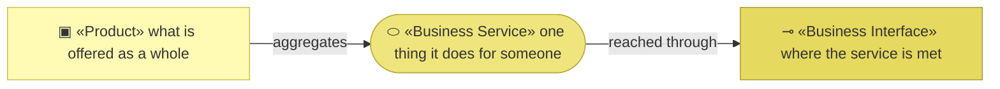
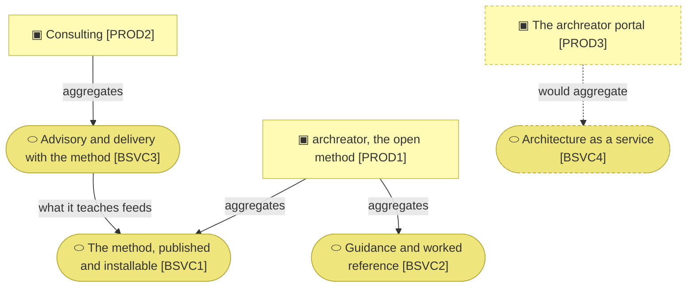

# Products and business services

_[← Business layer](./README.md) · [EA home](../README.md)_

**ArchiMate viewpoint:** Business. What the organization offers, to whom, and
through which channel each offering reaches them.

**Status:** ● Validated at **Gate 2**, 2026-08-22.

**The products are defined on the canvases, not here.** They first exist as
canvas blocks at Gate 0, so that is where they are assigned an identifier;
this document references them and adds what the canvases do not carry — the
service behind each one and the interface it is met through.

## How to read this document

| Glyph | Shape | Element | ID prefix | Reads as |
| ----- | ----- | ------- | --------- | -------- |
| `▣` | Rectangle | «Product» | `PROD` | `PROD1` = Product 1 |
| `⬭` | Stadium | «Business Service» | `BSVC` | `BSVC1` = Business Service 1 |
| `⊸` | Rectangle | «Business Interface» | `BIF` | `BIF1` = Business Interface 1 |

## The portfolio

| Product | Services | Interfaces | Revenue |
| ------- | -------- | ---------- | ------- |
| `PROD1` archreator, the open method | `BSVC1`, `BSVC2` | `BIF1`, `BIF2`, `BIF3` | `RS1`, `RS2` — both non-monetary |
| `PROD2` Consulting | `BSVC3` | `BIF4` | `RS3` — monetary, hourly |
| `PROD3` The archreator portal — **Pending** | `BSVC4` | `BIF5` | `RS4` — monetary, per use |

| ID | Business service | What is delivered | Realizes | Realized by |
| -- | ---------------- | ----------------- | -------- | ----------- |
| `BSVC1` | **The method, published and installable** — the skills, the conventions, the gates, obtainable and usable without asking anyone | `CAP1`, `CAP2`, `CAP3` — all three areas | The `archreator` repository: its skills, scaffold, validators and plugin manifest |
| `BSVC2` | **Guidance and worked reference** — how to start, what the method is for, and models built with it that a reader can inspect | `CAP3` | `product-archreator/site/`, `product-archreator/`, and this tree |
| `BSVC3` | **Advisory and delivery with the method** — the Requester runs discovery and delivery personally, and what the method did not cover is captured afterwards | `CAP1`, `CAP3`, `CAP2.3` | `ROLE2`, in person |
| `BSVC4` | **Architecture as a service** — an owner supplies what they have and receives a working architecture repository | `CAP1`, `CAP3` | **Pending — future initiative** (`COA2`) |

**`BSVC3` is realized by a person, and that is the whole strategic problem.**
It is the only service earning money and the only one that cannot scale,
because its realizing artifact is somebody's hours. `COA1` exists to move what
that person knows into `BSVC1`, where it costs nothing to serve the next
adopter — which is why the diagram draws an edge from `BSVC3` back into
`BSVC1` rather than treating them as separate lines.

**`BSVC2` is realized partly by this document.** The worked models *are* the
guidance: a reader who wants to know what a filled-in model looks like is
handed one rather than described one. That makes the models a deliverable, not
an internal artifact, and it is why they are public.

### Relationships

<!-- Transcribed from this document's diagrams. The identifier is
     authoritative; the description beside it is checked against the
     catalogue that defines the element. -->

| From | From element | To | To element | Relationship |
| ---- | ------------ | -- | ---------- | ------------ |
| `PROD1` | «Product» archreator, the open method | `BSVC1` | «Business Service» The method, published and installable | aggregates |
| `PROD1` | «Product» archreator, the open method | `BSVC2` | «Business Service» Guidance and worked reference | aggregates |
| `PROD2` | «Product» Consulting | `BSVC3` | «Business Service» Advisory and delivery with the method | aggregates |
| `PROD3` | «Product» The archreator portal | `BSVC4` | «Business Service» Architecture as a service | would aggregate |
| `BSVC3` | «Business Service» Advisory and delivery with the method | `BSVC1` | «Business Service» The method, published and installable | what it teaches feeds |

## Channels

| ID | Interface | Who meets it | Relationship | Cost to serve | Source |
| -- | --------- | ------------ | ------------ | ------------- | ------ |
| `BIF1` | The public repository | `STK1` | Self-service | Zero | `CH1` |
| `BIF2` | The guidance site | `STK1`, and any owner evaluating the method | Self-service | Zero — free hosting | `CH2` |
| `BIF3` | The plugin marketplace | `STK1`, already working inside an agent | Self-service | Zero | `CH3` |
| `BIF4` | Referral and direct approach | `STK2` | Personal and direct — the Requester individually | Their whole available time | `CH4` |
| `BIF5` | The web, self-serve | `STK2`, `STK3` | Self-service | **Pending** — inference dominates, and it scales with use | `CH5` |

**Three interfaces cost nothing and reach the segment that does not pay; one
costs everything and reaches the segment that does.** `BIF5` is the only
interface that would reach `STK2` and `STK3` at zero marginal attention, and
it does not exist. Stated plainly, that is this organization's distribution
problem in one table.

**All three zero-cost interfaces run through `ACT4`.** They are cheap because
somebody else operates them, which is the trade `CTR2` records.
