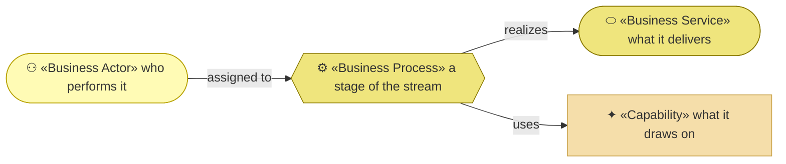
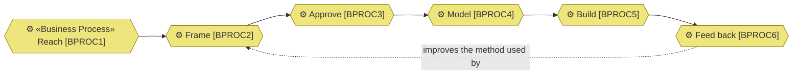

# Business Processes — the organization behind archreator

_[← Business layer](./README.md) · [EA home](../README.md)_

**ArchiMate elements:** Business Process, Business Service, Business Actor.

Derived from [`VS1`](../1_strategy/3_value-stream.md), the organization's one
value stream. **One process per stage**, and no more: the stream is where the
work was already described end to end, and a process catalogue that invented a
different decomposition would be a second answer to the same question.

These are **enterprise-tier** processes — they say *that* the work happens,
who does it and what it realizes. How any one of them is carried out is a tier
down, in the model of whatever performs it.

## How to read this document

| Glyph | Shape | Element | ID prefix | Reads as |
| ----- | ----- | ------- | --------- | -------- |
| `⚙` | Hexagon | «Business Process» | `BPROC` | `BPROC1` = Business Process 1 |
| `⬭` | Stadium | «Business Service» — context, from [2_business-services.md](./2_business-services.md) | `BSVC` | `BSVC1` = Business Service 1 |
| `⚇` | Stadium | «Business Actor» — context, from [1_business-actors-and-roles.md](./1_business-actors-and-roles.md) | `ACT` | `ACT1` = Business Actor 1 |
| `✦` | Rectangle (sand) | «Capability» — context, from [layer 1](../1_strategy/2_capabilities-and-resources.md) | `CAP` | `CAP1` = Capability 1 |

**The glyph rides on every node; the «stereotype» word appears once** — on the
first node of each type in a diagram, dropped on the rest.

## The six processes, in stream order

**The loop is the point, and it is the only dashed edge.** Five stages run
forwards; the sixth returns to the second, because what an engagement teaches
changes how the next one is framed. That edge is `COA1` stage 1 drawn as a
process, and it is dashed because it is the newest and least exercised — the
mechanism exists and has run twice.

| ID | Process | Stage | Realizes | Assigned to | Uses | Realized by |
| -- | ------- | ----- | -------- | ----------- | ---- | ----------- |
| `BPROC1` | **Reach** — someone finds the method, or the Requester is approached | 1 | `BSVC1`, `BSVC2` | `ROLE1` for the published channels, `ROLE2` for referral | — | `ACMP1`, `ACMP2`, and `ROLE2` in person |
| `BPROC2` | **Frame** — discovery draws out the business model and strategy by question, and tests the frame rather than recording it | 2 | `BSVC1`, `BSVC3` | `ACT1` deciding, `ACT2` asking and drafting | `CAP4` | `ACMP1` — the discovery skills |
| `BPROC3` | **Approve** — the Requester of that project grants the gate against documents they were given links to | 3 | `BSVC1`, `BSVC3` | `ACT1`, or `ROLE3` on a client engagement | `CAP4` | `ACMP1` — the gates, and the Approvals table that records them |
| `BPROC4` | **Model** — the layers are derived from what was approved, in one place, in one language | 4 | `BSVC1`, `BSVC2` | `ACT2` drafting, `ACT1` accepting | `CAP5`, `CAP6` | `ACMP1`, checked by `ACMP3` |
| `BPROC5` | **Build** — the approved design is what an agent implements from | 5 | `BSVC1` | `ACT2`, within an approved design | `CAP8`, `CAP9` | `ACMP1`; the built thing belongs to the project, not to this organization |
| `BPROC6` | **Feed back** — real use exposes what the method gets wrong, and the method changes | 6 | `BSVC1` | `ROLE1`, from `ROLE2`'s engagements | `CAP7`, `CAP10` | `ACMP1` — the retrospective and restatement skills |

## What the catalogue shows that the stream did not

**Every process but one is assigned to two actors, and the split is always the
same.** `ACT1` decides and `ACT2` drafts. That is `P1` — humans hold strategy
and business judgment, AI assists and executes — visible as a staffing pattern
rather than as a principle, across the whole stream.

**`BPROC1` uses no capability.** Reach is the only stage the organization does
not do anything skilful in: the channels are passive, and someone either finds
them or does not. That is the same weakness [the value
stream](../1_strategy/3_value-stream.md#where-the-stream-is-weak) records at
stage 1 and the business model canvas records as four of five interfaces
reaching only people already looking.

**`BPROC5` is the one process whose output this organization does not own.**
What gets built belongs to the adopter or the client. The organization's
interest ends at the design being buildable, which is why `CAP9` —
method-carried competence — is the capability it draws on rather than any
delivery capability of its own.

## Retired

None. This document is new as of
[initiative 4](../scope/4_completing-the-business-layer.md).
