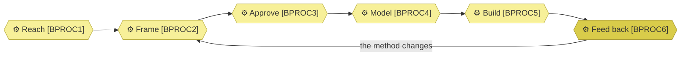

# Business processes

_[← Business layer](./README.md) · [EA home](../README.md)_

**ArchiMate viewpoint:** Business. How the services are actually delivered.

**Status:** ● Validated at **Gate 2**, 2026-08-22.

Six processes, classified into the four macro bands. They are the
[value stream](../1_strategy/3_value-stream.md)'s six stages seen as work
rather than as flow: the stream says where value moves, this says who does
what and what comes out.

**None is decomposed to level 2**, and the focus table below says why for each
one. A branch left undetailed states so rather than looking forgotten.

## How to read this document

| Glyph | Shape | Element | ID prefix | Reads as |
| ----- | ----- | ------- | --------- | -------- |
| `⚙` | Hexagon | «Business Process» | `BPROC` | `BPROC1` = Process 1 |
| `⬭` | Stadium | «Business Service» — context, from [2_business-services.md](./2_business-services.md) | `BSVC` | `BSVC1` = Business Service 1 |
| `⚉` | Rectangle | «Business Role» — context, from [1_business-actors-and-roles.md](./1_business-actors-and-roles.md) | `ROLE` | `ROLE1` = Role 1 |

## The macro process map

`BPROC6` is drawn a tone darker because it sits in a different band: it does
not deliver, it judges.

| Band | Processes |
| ---- | --------- |
| **Strategic** — setting direction | **None documented** |
| **Operational** — delivering the service | `BPROC1` · `BPROC2` · `BPROC3` · `BPROC4` · `BPROC5` |
| **Support** — enabling the operation | **None documented** |
| **Evaluation** — checking and improving | `BPROC6` |

**Two of four bands are empty, and that is a finding about the organization
rather than about the model.** `ROLE3` decides direction, pricing and what the
organization is for, and no process describes how — the deciding happens, it is
simply not written down. There is likewise no support process: nothing
describes keeping the tooling working, and at one person's scale nothing has
needed to. The bands are what make both absences visible; before them, a flat
list of six looked complete.

| ID | Process | Trigger | Output | Realizes | Performed by | Serves |
| -- | ------- | ------- | ------ | -------- | ------------ | ------ |
| `BPROC1` | **Reach** — someone finds the method, or the Requester is approached | A search, a referral, a link | A person who knows the method exists | `BSVC1`, `BSVC2` | `ROLE1` for the published channels, `ROLE2` for referral | — |
| `BPROC2` | **Frame** — discovery draws out the business model and strategy by question, and tests the frame rather than recording it | An adopter or client with a subject to model | Canvases and a strategy layer, unapproved | `BSVC1`, `BSVC3` | `ACT1` deciding, `ACT2` asking and drafting | `CAP1.1` |
| `BPROC3` | **Approve** — the project's Requester grants the gate against documents they were given links to | A layer ready to be shown | An Approvals row: which gate, who, when, what was shown | `BSVC1`, `BSVC3` | `ACT1`, or the client's own Requester on an engagement | `CAP1.1` |
| `BPROC4` | **Model** — the layers are derived from what was approved, in one place and one language | An approved gate | Layer documents that pass both validators | `BSVC1`, `BSVC2` | `ACT2` drafting, `ACT1` accepting | `CAP1.2`, `CAP2.1` |
| `BPROC5` | **Build** — the approved design is what an agent implements from | An approved design | Merged code whose documents are still true | `BSVC1` | `ACT2`, within an approved design | `CAP3.1`, `CAP3.2` |
| `BPROC6` | **Feed back** — real use exposes what the method gets wrong, and the method changes | An initiative or engagement finishing | An engagement note, and eventually a method change | `BSVC1` | `ROLE1`, from `ROLE2`'s engagements | `CAP2.2`, `CAP2.3` |

**`BPROC5`'s output belongs to the project, not to this organization.** What
gets built is the adopter's or the client's; what this organization keeps is
whether the method held while it was built.

### Relationships

<!-- Transcribed from this document's diagrams. The identifier is
     authoritative; the description beside it is checked against the
     catalogue that defines the element. -->

| From | From element | To | To element | Relationship |
| ---- | ------------ | -- | ---------- | ------------ |
| `BPROC1` | «Business Process» Reach | `BPROC2` | «Business Process» Frame | relates to |
| `BPROC6` | «Business Process» Feed back | `BPROC2` | «Business Process» Frame | the method changes |

## Focus table

Which branches are detailed, and why the rest are not.

| Process | Detailed to | Justified by | Note |
| ------- | ----------- | ------------ | ---- |
| `BPROC1` Reach | Level 1 | — | No pain raised. It is also the process no capability serves — see the value stream |
| `BPROC2` Frame | Level 1 | — | The conversation's shape is the discovery skills' subject, not a sequence this organization owns |
| `BPROC3` Approve | Level 1 | — | One step and one table |
| `BPROC4` Model | Level 1 | — | The sequence is the layer numbering, which is already written down once |
| `BPROC5` Build | Level 1 | — | Varies entirely by the project's stack. Detailing it would model the client's work rather than this organization's |
| `BPROC6` Feed back | Level 1 | — | Six questions with no sequence between them |

**Nothing is at level 2, and no branch has raised a pain yet.** That is the
breadth-first, depth-on-pain rule producing its expected result on a small
organization: the map is complete across the whole business, and no branch has
earned decomposition.

**Where this differs from the method's own process model.** The method
decomposes one of its ten level-2 processes to level 3, because its own flow
was unreadable without it. This organization has hit no such wall. The two
models use the same rule and reach different answers, which is the rule
working.
