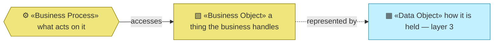
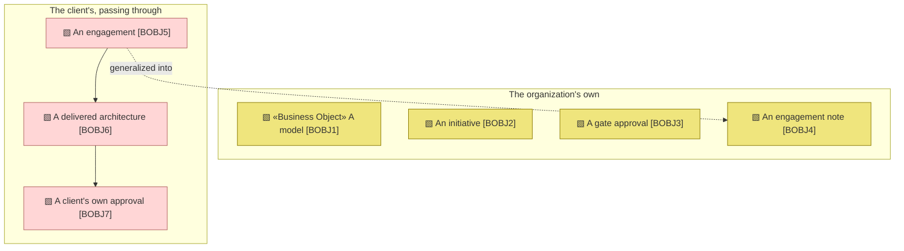

# Business Objects — the organization behind archreator

_[← Business layer](./README.md) · [EA home](../README.md)_

**ArchiMate elements:** Business Object, Business Process.

What the [processes](./3_business-processes.md) handle. Two groups, and the
split matters more than the count: some of these objects belong to a **client**
and pass through this organization, and some are the organization's **own**.
Confusing the two is how a consultancy ends up holding material it should not.

A business object is a thing the business talks about. Its file, if it has
one, is a **data object** in [layer 3](../3_information/1_data-objects.md) —
`BOBJ` is the concept, `DOBJ` is the representation, and one may exist without
the other.

## How to read this document

| Glyph | Shape | Element | ID prefix | Reads as |
| ----- | ----- | ------- | --------- | -------- |
| `▧` | Rectangle | «Business Object» | `BOBJ` | `BOBJ1` = Business Object 1 |
| `⚙` | Hexagon | «Business Process» — context, from [3_business-processes.md](./3_business-processes.md) | `BPROC` | `BPROC1` = Business Process 1 |
| `▦` | Rectangle | «Data Object» — context, from [layer 3](../3_information/1_data-objects.md) | `DOBJ` | `DOBJ1` = Data Object 1 |

`▧` is new to the palette as of this document — the notation table carried no
glyph for «Business Object». It is deliberately a near-neighbour of `▦`, the
Data Object glyph, because the two are usually the same thing seen from two
layers.

**The glyph rides on every node; the «stereotype» word appears once.**

## Whose object is it?

**The single dashed edge is the confidentiality boundary**, and it is the only
place the two groups touch. An engagement produces a pattern note, and the
crossing is one-directional and lossy by design: the pattern travels, the
client does not. Everything else in the rose box stays with whoever owns it.

| ID | Business object | Owned by | Handled in | Represented by | Realized by |
| -- | --------------- | -------- | ---------- | -------------- | ----------- |
| `BOBJ1` | **A model** — an organization or application described in numbered layers | This organization, per project | `BPROC4` | `DOBJ3` for its own; the adopter's repository otherwise | `ACMP4` — the scaffold defines its shape |
| `BOBJ2` | **An initiative** — one change to a model, from framing to delivery | This organization, per project | `BPROC2`–`BPROC5` | A scope document in `architecture/scope/` | `ACMP1` — `scope-doc` defines its shape |
| `BOBJ3` | **A gate approval** — a named human accepting a named document on a date | This organization, per project | `BPROC3` | The Approvals table inside `BOBJ2` | `ACMP1` — the gates |
| `BOBJ4` | **An engagement note** — what the method failed to cover, generalized past the case | This organization | `BPROC6` | `DOBJ7` | `ACMP1` — `engagement-retrospective` |
| `BOBJ5` | **An engagement** — a client's problem, their people, their constraints | **The client** | `BPROC2`, `BPROC3`, `BPROC5` | `DOBJ4` — held by one person, outside any system | `ROLE2`, in person |
| `BOBJ6` | **A delivered architecture** — the model a client receives and owns afterwards | **The client** | `BPROC4`, `BPROC5` | The client's repository, which this organization does not keep | `ROLE2`, with `ACT2` |
| `BOBJ7` | **A client's own approval** — their Requester granting their gate | **The client** | `BPROC3` | The Approvals table in their repository | `ROLE3` in that engagement |

## What this makes visible

**Three of seven objects are not this organization's.** That is unusual for a
business object catalogue and it is the honest shape of a consultancy: most of
what the work touches belongs to whoever commissioned it. `BOBJ5`–`BOBJ7`
appear here because the processes handle them, not because anything is stored.

**`BOBJ3` and `BOBJ7` are the same concept at two tiers**, and both are listed
deliberately. A gate approval this organization grants itself and one a client
grants in their own repository are the same object with different owners — and
the method's claim is precisely that the second is what the first is *for*.

**`BOBJ1` has no single representation**, which is `DOBJ5` restated as a
business fact: this organization does not hold adopters' models. The concept is
central to everything it does and the artifact lives somewhere it cannot see.

## Retired

None. This document is new as of
[initiative 4](../scope/4_completing-the-business-layer.md).
